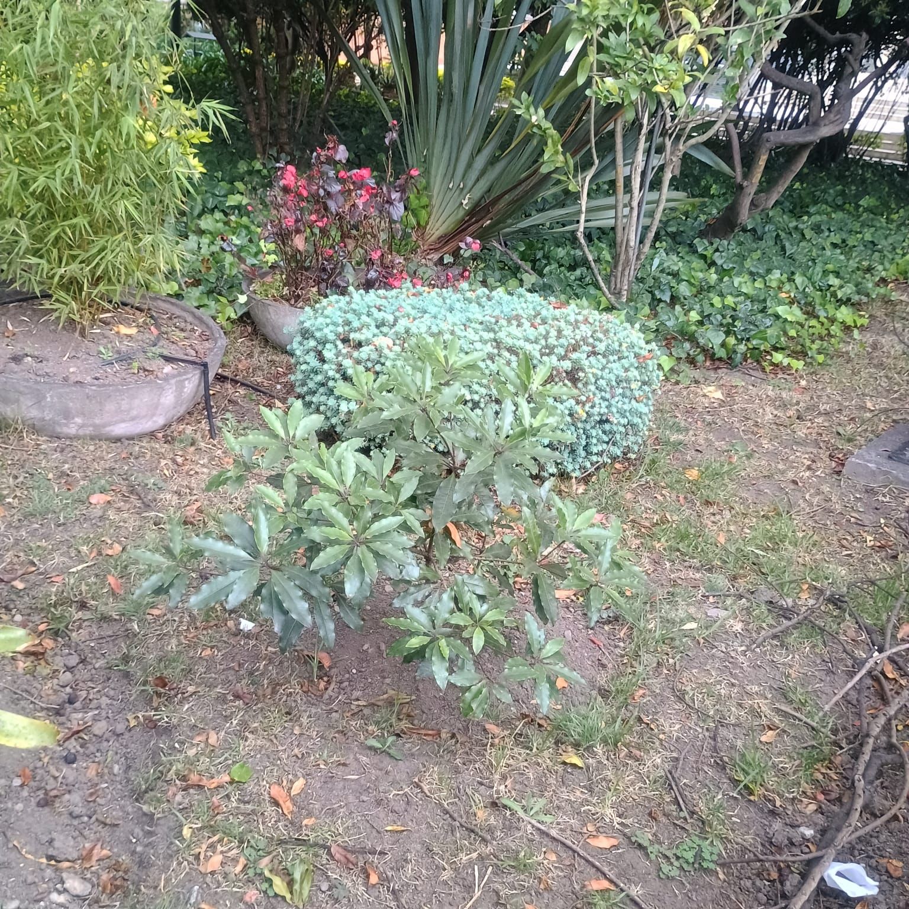

<style>
/* Scoped entirely to this article — never touches Home, Articles, About or CV. */
#title-block-header { display: none; }

.gerardo-editorial {
  --ge-read: min(700px, 100%);
  --ge-ink: var(--lf-ink, #1A1A1A);
  --ge-body: var(--lf-body, #33333A);
  --ge-muted: var(--lf-muted, #6B7280);
  --ge-line: var(--lf-line, #E2E8F0);
  --ge-blue: var(--lf-blue, #1D4E89);
  --ge-navy: var(--lf-navy, #0B1E3D);
  --ge-forest: #33513E;
  --ge-serif: var(--lf-serif, Georgia, "Iowan Old Style", "Palatino Linotype", "Book Antiqua", "Times New Roman", serif);

  display: grid;
  grid-template-columns: 1fr var(--ge-read) 1fr;
  column-gap: clamp(1rem, 3vw, 2.5rem);
  color: var(--ge-body);
  font-size: 1.06rem;
  line-height: 1.75;
}

.gerardo-editorial > * { grid-column: 2; }
.gerardo-editorial p { margin: 0 0 1.15rem; }
.gerardo-editorial img { display: block; width: 100%; height: auto; border-radius: 2px; }

.gerardo-editorial .bleed-left,
.gerardo-editorial .bleed-right,
.gerardo-editorial .bleed-full,
.gerardo-editorial .editorial-duo {
  margin: clamp(2rem, 6vw, 3.5rem) 0;
}

.gerardo-editorial .bleed-left  { grid-column: 1 / 3; justify-self: start; width: min(560px, 100%); }
.gerardo-editorial .bleed-right { grid-column: 2 / 4; justify-self: end;   width: min(620px, 100%); }
.gerardo-editorial .bleed-full  { grid-column: 1 / 4; justify-self: stretch; max-width: 1080px; margin-inline: auto; }
.gerardo-editorial .editorial-duo { grid-column: 1 / 4; }

.gerardo-editorial .editorial-offset { margin-top: clamp(3rem, 8vw, 5rem); }

/* Hero */
.ge-hero {
  display: grid;
  grid-template-columns: 1.15fr 0.85fr;
  align-items: start;
  gap: clamp(1.5rem, 4vw, 3rem);
}
.ge-hero.bleed-full { margin: clamp(1rem, 4vw, 2.5rem) 0 clamp(3rem, 8vw, 5.5rem); }
.ge-eyebrow {
  font-size: .78rem;
  font-weight: 600;
  letter-spacing: .14em;
  text-transform: uppercase;
  color: var(--ge-blue);
  margin-bottom: .9rem;
}
.ge-hero__text h1 {
  font-family: var(--ge-serif);
  font-size: clamp(2.3rem, 1.8rem + 3vw, 3.7rem);
  font-weight: 600;
  line-height: 1.08;
  color: var(--ge-ink);
  margin: 0 0 1rem;
}
.ge-hero__subtitle {
  font-family: var(--ge-serif);
  font-size: clamp(1.1rem, 1rem + .5vw, 1.35rem);
  font-style: italic;
  color: var(--ge-body);
  margin-bottom: .75rem;
}
.ge-hero__meta { font-size: .92rem; color: var(--ge-muted); }
.ge-hero__portrait { margin-top: clamp(2rem, 8vw, 5rem); justify-self: end; max-width: 380px; }

/* Section headings */
.gerardo-editorial h2 {
  font-family: var(--ge-serif);
  font-size: clamp(1.5rem, 1.3rem + 1vw, 1.9rem);
  font-weight: 600;
  color: var(--ge-ink);
  margin: clamp(2.5rem, 6vw, 4rem) 0 1.25rem;
  line-height: 1.25;
}

.article-lead {
  font-size: 1.18rem;
  line-height: 1.75;
  color: var(--ge-body);
  margin: 0 0 2rem;
}

.milestone {
  font-size: .78rem;
  letter-spacing: .12em;
  text-transform: uppercase;
  font-weight: 700;
  color: var(--ge-forest);
  margin-bottom: .6rem;
}

.photo-note {
  font-size: .85rem;
  color: var(--ge-muted);
  line-height: 1.55;
  margin: .65rem 0 0;
  max-width: 34rem;
}

.editorial-duo {
  display: grid;
  grid-template-columns: 1.15fr .85fr;
  gap: clamp(1rem, 3vw, 2rem);
  align-items: end;
}
.editorial-duo > *:nth-child(2) { margin-top: clamp(2rem, 6vw, 3.5rem); }

.tree-line {
  text-align: center;
  font-family: var(--ge-serif);
  font-style: italic;
  font-size: 1.08rem;
  color: var(--ge-body);
  margin: 1.75rem 0 2.5rem;
}

/* The one true quote — the narrative heart */
.ge-quote-block {
  position: relative;
  text-align: center;
}
.ge-quote-block.bleed-full { margin: clamp(3rem, 8vw, 6rem) 0; padding: clamp(2rem, 6vw, 3.5rem) 1rem; }
.ge-quote-graphic {
  position: absolute;
  inset: 0;
  z-index: 0;
  display: flex;
  align-items: center;
  justify-content: center;
  pointer-events: none;
}
.ge-quote-graphic svg { width: min(720px, 90%); height: auto; opacity: .16; }
.ge-quote {
  position: relative;
  z-index: 1;
  max-width: 46rem;
  margin: 0 auto;
  font-family: var(--ge-serif);
  font-size: clamp(1.6rem, 1.25rem + 2.2vw, 2.6rem);
  font-style: italic;
  line-height: 1.35;
  color: var(--ge-navy);
}
.ge-quote__author {
  display: block;
  margin-top: 1.4rem;
  font-size: .82rem;
  font-style: normal;
  letter-spacing: .06em;
  color: var(--ge-forest);
  text-transform: uppercase;
}

/* Narrator's own reflective emphasis — visually distinct from the real quote above */
.ge-emphasis {
  font-family: var(--ge-serif);
  font-style: italic;
  font-size: clamp(1.25rem, 1.05rem + 1vw, 1.6rem);
  color: var(--ge-ink);
  line-height: 1.4;
  margin: 1.75rem 0;
}
.ge-emphasis strong { font-style: normal; }

.ge-aside {
  font-family: var(--ge-serif);
  font-style: italic;
  font-size: 1.1rem;
  color: var(--ge-body);
  border-left: 2px solid var(--ge-line);
  padding-left: 1rem;
  margin: 1.75rem 0;
}

.ge-quote-echo {
  font-family: var(--ge-serif);
  font-style: italic;
  font-size: 1.02rem;
  color: var(--ge-muted);
  text-align: center;
  margin: 1.5rem auto 2rem;
  max-width: 30rem;
}

.closing {
  margin: clamp(3rem, 8vw, 5rem) auto 1rem;
  max-width: 640px;
  padding: clamp(1.5rem, 4vw, 2.5rem) 0 0;
  text-align: center;
  border-top: 1px solid var(--ge-line);
}
.closing p { margin: 0 0 .6rem; }
.closing strong { font-family: var(--ge-serif); font-size: 1.3rem; font-weight: 600; color: var(--ge-navy); }

/* Motion — subtle, reversible, safe without JS */
.ge-reveal { transition: opacity .7s ease, transform .7s ease; }
.ge-reveal.ge-pre { opacity: 0; transform: translateY(14px); }
.ge-reveal.ge-pre.is-visible { opacity: 1; transform: none; }

@media (hover: hover) {
  .gerardo-editorial img { transition: filter .3s ease; }
  .gerardo-editorial img:hover { filter: brightness(1.03); }
}

@media (prefers-reduced-motion: reduce) {
  .ge-reveal, .gerardo-editorial img { transition: none !important; }
}

@media (max-width: 768px) {
  .gerardo-editorial { grid-template-columns: 1fr; row-gap: 0; }
  .gerardo-editorial > * { grid-column: 1; }
  .gerardo-editorial .bleed-left,
  .gerardo-editorial .bleed-right,
  .gerardo-editorial .bleed-full,
  .gerardo-editorial .editorial-duo {
    grid-column: 1;
    justify-self: stretch;
    width: 100%;
    max-width: 100%;
  }
  .ge-hero { grid-template-columns: 1fr; }
  .ge-hero__portrait { justify-self: stretch; max-width: 320px; margin: 1.75rem auto 0; }
  .editorial-duo { grid-template-columns: 1fr; }
  .editorial-duo > *:nth-child(2) { margin-top: 1.25rem; }
  .article-lead { font-size: 1.08rem; }
  .ge-quote { font-size: 1.5rem; }
}
</style>

:::::: {.gerardo-editorial}

::::: {.ge-hero .bleed-full}
:::: {.ge-hero__text}
::: {.ge-eyebrow}
Fronteras Latentes · Primer artículo
:::

# Raíces que siguen creciendo

::: {.ge-hero__subtitle}
Un agradecimiento al Dr. Gerardo Aristizábal Aristizábal
:::

::: {.ge-hero__meta}
Diez años de enseñanzas, confianza y crecimiento.
:::
::::

:::: {.ge-hero__portrait .ge-reveal}
{fig-alt="Retrato del Dr. Gerardo Aristizábal Aristizábal"}

::: {.photo-note}
Dr. Gerardo Aristizábal Aristizábal.
:::
::::
:::::

::: {.article-lead}
Mi primer artículo en **Fronteras Latentes** quiero dedicarlo a una persona que ha dejado una huella profunda en mi formación académica y personal.

Hay personas que conocemos durante nuestra formación y recordamos por una clase, una conversación o un consejo. Hay otras que, con el paso de los años, terminan convirtiéndose en parte de nuestra propia historia. Para mí, el Dr. Gerardo pertenece a ese segundo grupo.
:::

## Una vida dedicada al conocimiento

Hablar del Dr. Gerardo es hablar de una vida dedicada al conocimiento, a la educación y al servicio de los demás. Es médico neurocirujano de la **Universidad Nacional de Colombia**, especialista en **Filosofía de la Ciencia**, fundador de la **Universidad El Bosque** y profesor universitario desde 1965.

A lo largo de su carrera recibió, entre otros reconocimientos, el **Premio Nacional de Ciencias Alejandro Ángel Escobar en 1972**. En la Universidad El Bosque fue **decano de la Facultad de Medicina entre 1986 y 1990** y **Vicerrector Académico entre 2002 y 2006**, y hoy continúa aportando a la formación de nuevas generaciones desde la **Facultad de Ciencias**.

[Consultar perfil institucional del Dr. Gerardo Aristizábal Aristizábal](https://www.unbosque.edu.co/directorio/dr-gerardo-aristizabal-aristizabal){target="_blank"}

:::: {.bleed-left .editorial-offset .ge-reveal}
{fig-alt="Dr. Gerardo Aristizábal leyendo con atención"}

::: {.photo-note}
El conocimiento como una tarea permanente: leer, cuestionar, enseñar y continuar aprendiendo.
:::
::::

Más allá de sus títulos, cargos y reconocimientos, para mí el Dr. Gerardo representa algo mucho más cercano: un maestro, un mentor y una de esas personas que aparecen en nuestro camino y terminan transformándolo para siempre.

Este año se cumplen aproximadamente **diez años desde que nos conocimos**. Al mirar hacia atrás, siento una enorme gratitud por su orientación, sus consejos, su confianza y su apoyo en distintos momentos de mi vida académica.

Y algunas fotografías permiten regresar, aunque sea por unos segundos, a esos momentos.

## Un primer gran paso

::: {.milestone}
Estadística
:::

:::: {.bleed-right .ge-reveal}
{fig-alt="Entrega del diploma de Estadística a Juan Sebastián Laverde"}

::: {.photo-note}
Uno de los momentos que marcaron el comienzo de mi camino profesional.
:::
::::

Esta fotografía representa uno de esos momentos: mi formación como **estadístico**. Recibir aquel diploma significaba cerrar una etapa muy importante, pero también comenzar muchas otras. Hoy, al verla nuevamente, su significado es distinto: ya no representa únicamente una graduación, sino también a las personas que estuvieron presentes durante el camino.

Después vendría la **maestría**, con nuevos retos académicos y una forma diferente de aproximarme al conocimiento. Y hoy ese recorrido continúa con mis estudios de **Doctorado en Ciencia de Datos e Inteligencia Artificial**.

Cada etapa ha sido distinta, pero todas comparten algo esencial: detrás de cada logro existen personas que enseñan, orientan, confían y, muchas veces, logran ver posibilidades en nosotros antes de que nosotros mismos podamos verlas.

## Una frase que se convirtió en símbolo

Entre todos esos recuerdos existe uno que ocupa un lugar especialmente importante para mí. En algún momento, el Dr. Gerardo me dijo unas palabras que nunca olvidé.

::::: {.ge-quote-block .bleed-full .ge-reveal}
:::: {.ge-quote-graphic}
```{=html}
<svg viewBox="0 0 600 200" aria-hidden="true" focusable="false">
  <path d="M300 8 C 288 55, 248 66, 214 108 C 194 132, 154 140, 112 168" fill="none" stroke="#33513E" stroke-width="1.4"/>
  <path d="M300 8 C 312 55, 352 66, 386 108 C 406 132, 446 140, 488 168" fill="none" stroke="#33513E" stroke-width="1.4"/>
  <path d="M300 8 C 300 62, 300 118, 300 188" fill="none" stroke="#33513E" stroke-width="1.4"/>
  <path d="M262 82 C 250 94, 234 96, 216 110" fill="none" stroke="#33513E" stroke-width="1"/>
  <path d="M338 82 C 350 94, 366 96, 384 110" fill="none" stroke="#33513E" stroke-width="1"/>
</svg>
```
::::

:::: {.ge-quote}
"Selle su pacto con el bosque.<br>
Siembre un árbol en su campus."

::: {.ge-quote__author}
Dr. Gerardo Aristizábal Aristizábal
:::
::::
:::::

En ese momento podía parecer simplemente una invitación a sembrar un árbol. Con los años comprendí que aquellas palabras podían significar mucho más.

## Sellar un pacto con el bosque

::::: {.editorial-duo .bleed-full .ge-reveal}
{fig-alt="Dr. Gerardo Aristizábal durante la actividad de siembra en el campus"}

{fig-alt="Actividad de siembra de un árbol en el campus de la Universidad El Bosque"}
:::::

::: {.photo-note}
Sembrar un árbol fue también una manera de dejar una pequeña huella en el lugar donde ocurrió una parte importante de mi formación.
:::

Ese día, aquellas palabras dejaron de ser solamente una frase: se convirtieron en una acción. Con el tiempo, aquella experiencia adquirió para mí un significado mucho más profundo — empecé a entenderla como una metáfora de lo que significa educar.

::: {.tree-line}
Sembrar conocimiento · Cultivar la curiosidad · Cuidar las raíces · Tener paciencia · Confiar en el crecimiento
:::

## Volver a mirar lo sembrado

:::: {.bleed-left .ge-reveal}
{fig-alt="Juan Sebastián Laverde junto al árbol sembrado en el campus, tiempo después de la siembra"}
::::

Tiempo después regresé a verlo. Quizá una de las cosas más bonitas de sembrar algo es precisamente esa: después de hacerlo, comienza una historia que ya no depende solamente de nosotros.

::: {.ge-emphasis}
El árbol siguió creciendo.<br>
**Y yo también.**
:::

Los años fueron pasando. Llegaron nuevos estudios, nuevos proyectos, nuevas personas, nuevas preguntas y nuevos horizontes. Hasta llegar a esta fotografía.

## Así va el árbol

:::: {.bleed-right .ge-reveal}
{fig-alt="Estado del árbol sembrado en el campus, fotografiado el 10 de septiembre de 2026"}

::: {.photo-note}
Estado del árbol. Fotografía tomada el 10 de septiembre de 2026.
:::
::::

Hoy el árbol ya no es aquel pequeño ejemplar que comenzó su historia años atrás. Tiene nuevas ramas y nuevas hojas; ha atravesado distintas temporadas y continúa encontrando la manera de crecer.

Cuando lo observo, no veo solamente un árbol dentro del campus de la Universidad El Bosque. Veo también una parte de mi propia historia: el estudiante que fui, las decisiones que he tomado, las personas que me han acompañado y todo lo que todavía queda por aprender.

::: {.ge-aside}
Las cosas importantes necesitan tiempo para echar raíces.
:::

Pero la historia tampoco termina allí.

## Nuevos horizontes

::: {.milestone}
Doctorado en Ciencia de Datos e Inteligencia Artificial
:::

:::: {.bleed-full .ge-reveal}
{fig-alt="Fotografía grupal al inicio del Doctorado en Ciencia de Datos e Inteligencia Artificial"}

::: {.photo-note}
El inicio de una nueva etapa académica y, al mismo tiempo, la continuación de un camino construido durante años.
:::
::::

Hoy comienza otra etapa: el **Doctorado en Ciencia de Datos e Inteligencia Artificial**. Cambian los retos, cambian las preguntas y cambia nuestra manera de comprender el mundo. Sin embargo, algunas cosas permanecen: la curiosidad, el deseo de aprender y la fortuna de seguir encontrando maestros con quienes compartir el conocimiento.

Estas fotografías no son simplemente un recorrido por diferentes momentos académicos. **Juntas cuentan una historia**: la de un estudiante que recibió un diploma, continuó estudiando, sembró un árbol, regresó años después para verlo crecer y hoy comienza una nueva etapa de formación. Pero también cuentan la historia de quienes estuvieron allí durante ese recorrido. Y entre esas personas ocupa un lugar muy especial el Dr. Gerardo.

## Gracias, Dr. Gerardo

Gracias, Dr. Gerardo, por estos años de enseñanzas. Gracias por sus consejos, por su generosidad, por su confianza y por haber contribuido a sembrar en mí la curiosidad y el deseo permanente de seguir aprendiendo.

Gracias también por aquella frase que con los años terminó adquiriendo un significado que probablemente yo no alcanzaba a comprender cuando la escuché por primera vez:

::: {.ge-quote-echo}
"Selle su pacto con el bosque. Siembre un árbol en su campus."
:::

Hoy puedo mirar ese árbol y comprender mejor aquellas palabras.

::: {.closing}
Algunas personas enseñan durante una clase.

**Otras enseñan durante toda una vida.**

Y algunas, además, dejan raíces que continúan creciendo con nosotros.
:::

::::::

```{=html}
<script>
(function () {
  if (window.matchMedia('(prefers-reduced-motion: reduce)').matches) return;
  if (!('IntersectionObserver' in window)) return;
  var items = document.querySelectorAll('.gerardo-editorial .ge-reveal');
  if (!items.length) return;
  items.forEach(function (el) { el.classList.add('ge-pre'); });
  var io = new IntersectionObserver(function (entries) {
    entries.forEach(function (entry) {
      if (entry.isIntersecting) {
        entry.target.classList.add('is-visible');
        io.unobserve(entry.target);
      }
    });
  }, { threshold: 0.15 });
  items.forEach(function (el) { io.observe(el); });
})();
</script>
```
