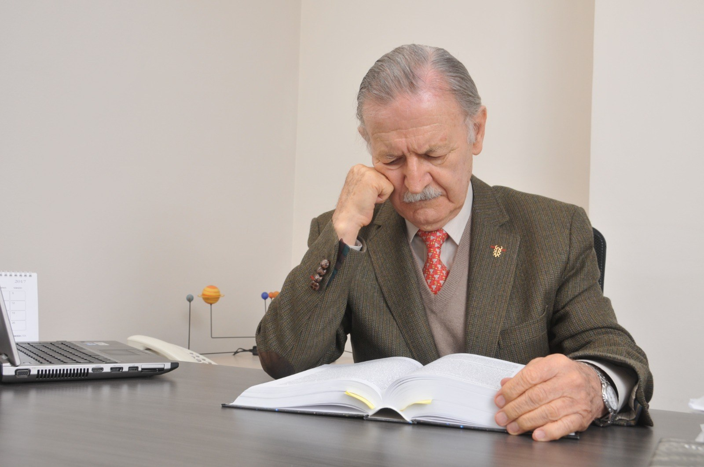
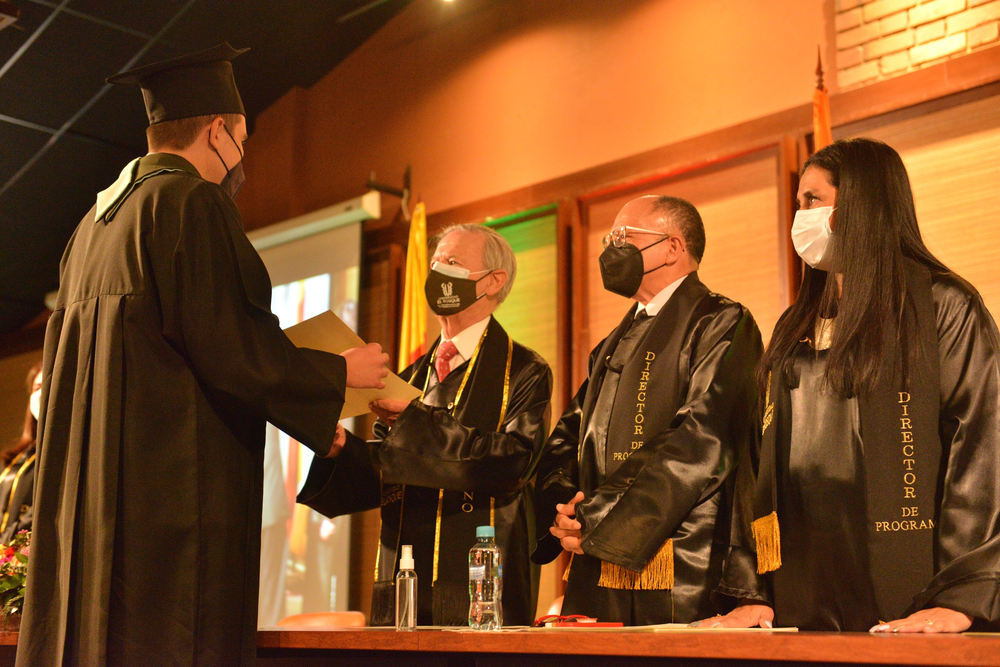
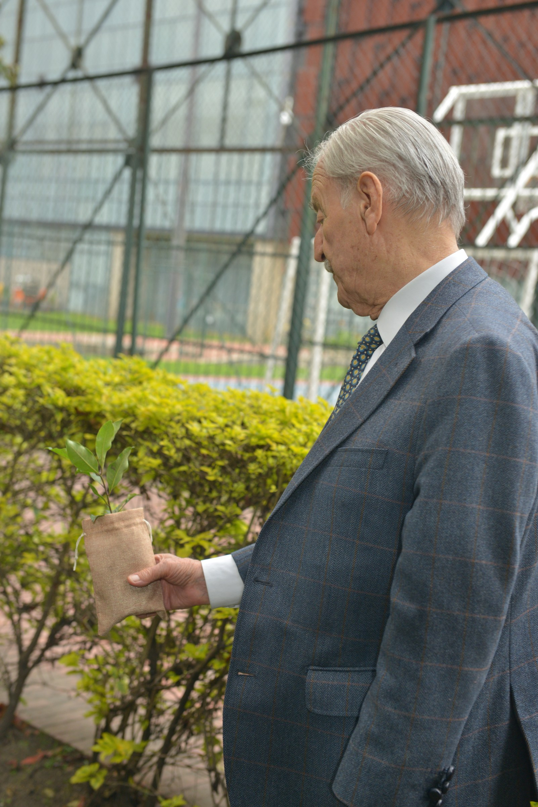
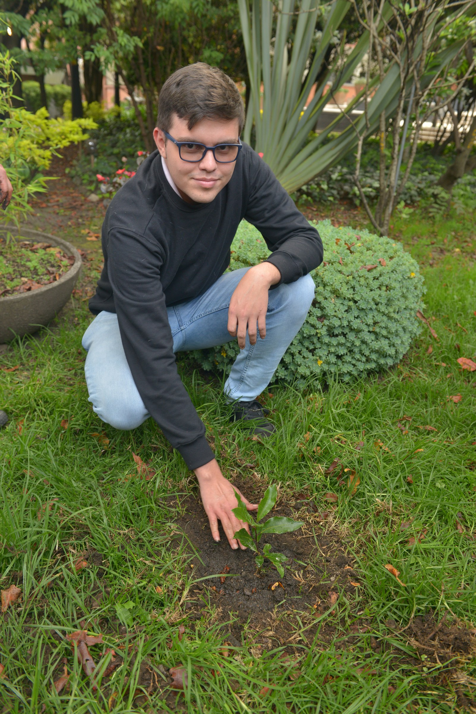
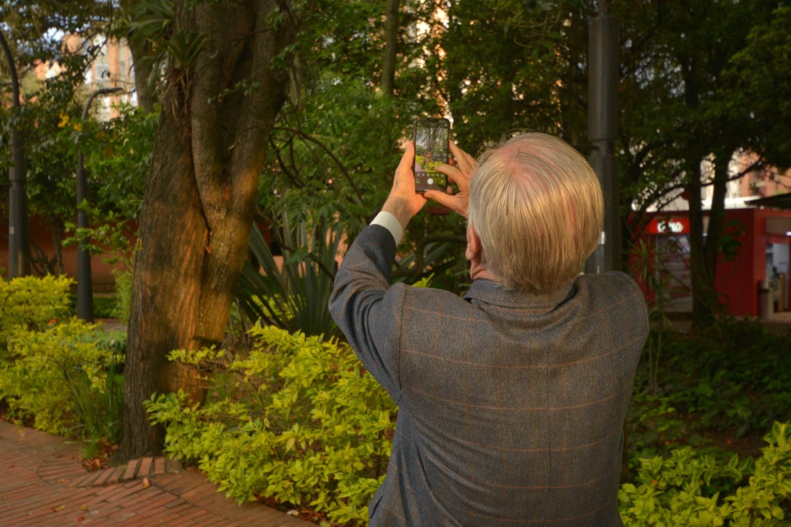
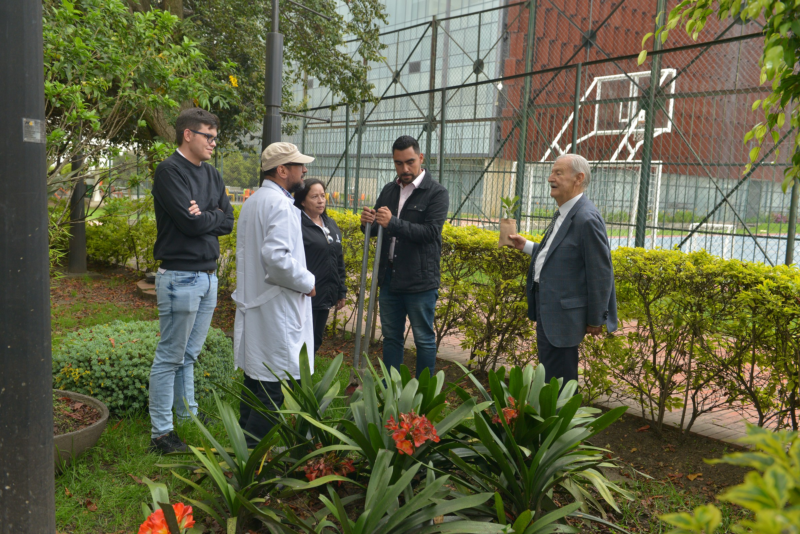
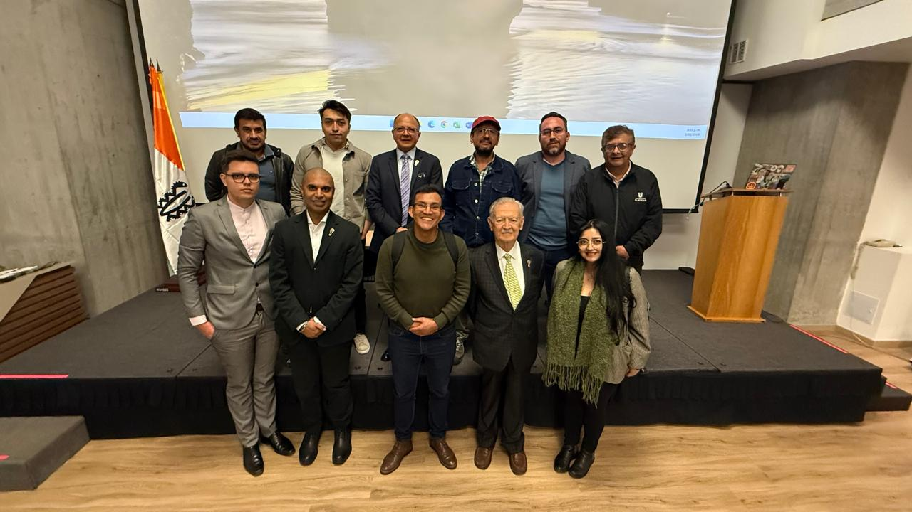
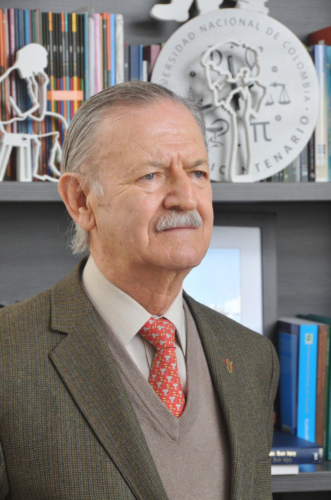

:::: {.gerardo-word}

::: {.gw-title}
::: {.gw-eyebrow}
Fronteras Latentes · Primer artículo
:::

# Raíces que siguen creciendo

::: {.gw-subtitle}
*Un agradecimiento al Dr. Gerardo Aristizábal Aristizábal*
:::
:::

<!-- =====================================================
     APERTURA: MISMA LÓGICA VISUAL DEL WORD
     Foto izquierda + texto que fluye a la derecha y debajo.
     ===================================================== -->

:::: {.gw-float-copy .gw-clear}

::: {.gw-float-photo .left}
{fig-alt="Dr. Gerardo Aristizábal leyendo"}
:::

Mi primer artículo en **Fronteras Latentes** quiero dedicarlo al Dr. Gerardo Aristizábal Aristizábal. El Dr. Gerardo es médico neurocirujano de la **Universidad Nacional de Colombia**, especialista en **Filosofía de la Ciencia**, fundador de la **Universidad El Bosque** y docente universitario desde 1965 en la Universidad Nacional de Colombia y en la Universidad El Bosque.

Ha participado en diferentes publicaciones y recibió, entre otros reconocimientos, el **Premio Nacional de Ciencias Alejandro Ángel Escobar en 1972**. En la Universidad El Bosque fue **decano de la Facultad de Medicina entre 1986 y 1990** y **Vicerrector Académico entre 2002 y 2006**. Actualmente continúa vinculado a la **Facultad de Ciencias**.

::: {.gw-link-block}
[Consultar el perfil institucional del Dr. Gerardo Aristizábal Aristizábal](https://www.unbosque.edu.co/directorio/dr-gerardo-aristizabal-aristizabal){target="_blank"}
:::

Este año se cumplen aproximadamente **diez años desde que nos conocimos**. Estoy profundamente agradecido por su orientación, su apoyo y su confianza durante todo este tiempo, que han sido fundamentales en mi crecimiento académico y personal. A través de estas imágenes comparto algunos momentos que representan una parte de este camino, lleno de aprendizaje, confianza y significado.

Más allá de sus títulos, cargos y reconocimientos, para mí el Dr. Gerardo representa algo mucho más cercano: un maestro, un mentor y una de esas personas que aparecen en nuestro camino y terminan transformándolo para siempre. Al mirar hacia atrás, siento una enorme gratitud por su orientación, sus consejos, su confianza y su apoyo en distintos momentos de mi vida académica. Algunas fotografías permiten regresar, aunque sea por unos segundos, a esos momentos.

::::

## El inicio de un camino transformador

:::: {.gw-float-copy .gw-clear}

::: {.gw-float-photo .right}
{fig-alt="Entrega del diploma de Estadística a Juan Sebastián Laverde"}
:::

Esta fotografía representa uno de esos momentos que permanecen en la memoria: la culminación de mi formación como **estadístico**. Recibir aquel diploma significó cerrar una etapa fundamental de mi vida académica y, al mismo tiempo, abrir el camino hacia muchas otras. Hoy, al volver a verla, su significado es diferente. Ya no representa únicamente una graduación o la obtención de un título, sino también el recorrido que hizo posible llegar hasta allí y, especialmente, a las personas que estuvieron presentes durante ese camino.

Los años **2020 y 2021** fueron particularmente difíciles. La pandemia transformó profundamente nuestra forma de estudiar, trabajar y relacionarnos, y estuvo acompañada de incertidumbre, pérdidas y enormes desafíos para muchas personas. En medio de ese contexto, continuar avanzando académicamente también significó aprender a adaptarnos, perseverar y valorar aún más cada encuentro, cada enseñanza y cada logro alcanzado.

::::

::: {.gw-kicker--display}
Maestría en Estadística Aplicada y Ciencia de Datos
:::

:::: {.gw-media-row}

::: {.gw-photo-pair}
{fig-alt="Dr. Gerardo Aristizábal en el campus de la Universidad El Bosque"}

{fig-alt="Juan Sebastián Laverde junto al lugar de la siembra"}
:::

::: {.gw-media-copy}
Durante mi paso por la **Maestría en Estadística Aplicada y Ciencia de Datos**, el Dr. Gerardo continuó siendo una persona muy importante en mi formación. A lo largo de esta etapa siempre estuvo dispuesto a aconsejarme, orientarme y ayudarme a tomar decisiones sobre el camino que debía seguir, tanto en lo académico como en lo profesional.
:::

::::

::: {.gw-kicker}
2 de diciembre de 2024 · Campus de Bogotá
:::

:::: {.gw-media-row}

::: {.gw-photo-stack}
{fig-alt="Dr. Gerardo Aristizábal fotografiando el árbol de la familia en el campus"}

{fig-alt="Actividad de siembra en el campus de la Universidad El Bosque"}
:::

::: {.gw-media-copy}
Después de culminar la maestría, tuve la oportunidad de vivir un momento que conservo con especial cariño. El **2 de diciembre de 2024** me convertí en el primer egresado en sembrar un árbol en el campus de Bogotá de la Universidad El Bosque. Para mí, aquel acto representó mucho más que sembrar un árbol: significó dejar una pequeña huella en la universidad que ha sido parte fundamental de mi historia académica y personal.

Mi árbol fue sembrado al pie de otro árbol que el Dr. Gerardo había denominado **“el árbol de la familia”**. Poder hacerlo en ese lugar hizo que aquel momento adquiriera para mí un significado aún más especial, pues representaba mi vínculo con la Universidad, con las personas que han acompañado mi formación y con una institución en la que he vivido algunas de las etapas más importantes de mi vida.
:::

::::

::: {.gw-prose}
Después de sembrarlo, el Dr. Gerardo me dejó unas palabras que aún conservo y que, con el paso del tiempo, han adquirido un significado todavía más profundo:
:::

::: {.gw-quote}
“Selle su pacto con el bosque.  
Siembre un árbol en su campus.”

Dr. Gerardo Aristizábal Aristizábal
:::

::: {.gw-prose}
Aquellas palabras terminaron convirtiendo la siembra en algo más que un acto simbólico. Para mí representaron una forma de reafirmar mi vínculo con la **Universidad El Bosque** y de dejar allí una pequeña parte de una historia que había comenzado muchos años atrás.

Me siento profundamente orgulloso y agradecido de contar en mi vida con una persona como el Dr. Gerardo. Desde la **Facultad de Ciencias**, ha sido una figura muy importante a lo largo de mi trayectoria académica, siempre dispuesto a escucharme, orientarme y aconsejarme en distintas etapas y decisiones de mi formación. Su cercanía, confianza y acompañamiento han significado mucho para mí y han dejado una huella que trasciende lo académico.
:::

::: {.gw-kicker--display}
Una nueva etapa
:::

::: {.gw-wide-photo}
{fig-alt="Fotografía grupal al inicio del Doctorado en Ciencia de Datos e Inteligencia Artificial"}
:::

::: {.gw-doctorado}
Y para cerrar este capítulo de agradecimientos, llego a la que quizá sea la última gran etapa de mi formación académica: el **Doctorado en Ciencia de Datos e Inteligencia Artificial**.

El Dr. Gerardo tuvo mucho que ver con que hoy esté recorriendo este camino. Fue él quien me habló de este nuevo programa y quien, con ese entusiasmo que lo caracteriza, me lo presentó como **“el Doctorado de los Doctorados”**. Aquella conversación terminó convirtiéndose en el comienzo de una nueva etapa que hoy representa uno de los retos más importantes de mi vida académica.

También quiero agradecerle profundamente por acompañarme en los primeros pasos de mi tesis doctoral, por ayudarme a encontrar y acercarme a las personas adecuadas y por comprender desde el comienzo el propósito que quiero darle a esta investigación. Recuerdo especialmente cuando le dije que quería utilizar la **inteligencia artificial** no para reemplazar personas o quitar empleos, sino para intentar **salvar vidas**. Esa idea terminó marcando el rumbo que quiero seguir: poner la ciencia de datos y la inteligencia artificial al servicio de la investigación en salud y, especialmente, del cáncer.

Gracias también por ayudar a que en este nuevo camino pudiera contar con la mentoría del **Dr. Ravi Kalia**, cuya orientación está siendo fundamental en esta etapa de mi formación y en la construcción de mi proyecto doctoral.
:::

<!-- =====================================================
     CIERRE: composición única en una sola columna —
     texto, retrato integrado y despedida final.
     ===================================================== -->

:::: {.gw-closing}

::: {.gw-closing-copy}
Después de tantos años, resulta difícil resumir en unas pocas páginas todo lo que significa agradecer a una persona que ha estado presente en momentos tan importantes de mi recorrido. Por eso, este artículo no pretende ser un punto final. Es simplemente una pausa para mirar hacia atrás, reconocer el camino recorrido y decir gracias.

**Gracias, Dr. Gerardo Aristizábal Aristizábal, por la confianza, los consejos, las oportunidades y por acompañarme en tantas etapas de este camino.**
:::

::: {.gw-portrait}
{fig-alt="Retrato del Dr. Gerardo Aristizábal Aristizábal"}
:::

::: {.gw-closing-copy}
Tal vez dentro de cuatro años vuelva a este mismo espacio para escribir otro artículo. Entonces podré mirar nuevamente hacia atrás, recordar estas palabras y comprobar, una vez más, lo rápido que pasa el tiempo.

**Nos volveremos a encontrar aquí en cuatro años.**
:::

::::

::: {.gw-credits}
**Fotografías y edición fotográfica:** Rafael Antonio Laverde Orjuela.

Todas las fotografías que aparecen en este artículo fueron tomadas y editadas por **Rafael Antonio Laverde Orjuela**.
:::

::::
