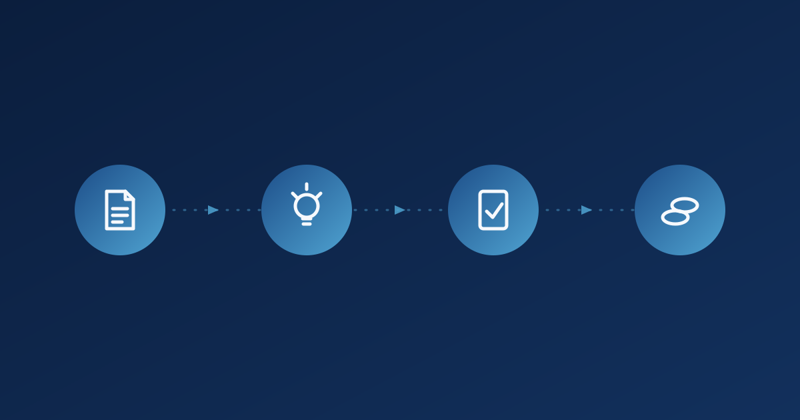

:::: {.scholarship-article}

::: {.scholarship-cover}
{fig-alt="Ilustración conceptual de un recorrido que va de un paper científico a una idea de investigación, una propuesta y una convocatoria de financiación"}
:::

Quiero comenzar este artículo agradeciendo al profesor Andrés por la orientación que nos brindó recientemente sobre la búsqueda y aplicación a becas que puedan ayudarnos a cubrir los gastos asociados al doctorado. Fue una conversación breve, pero dejó varias ideas que vale la pena escribir mientras siguen frescas, no tanto como una guía técnica sobre becas, sino como una reflexión sobre cómo empezar a pensar en la financiación doctoral desde el inicio, y no solo cuando aparece una convocatoria. Estas líneas también quieren servir como una nota personal a la que volver más adelante, y quizás como algo útil para otros estudiantes que apenas están empezando a pensar en este tema.

## No basta con encontrar una convocatoria

Una de las primeras cosas que quedó clara en la orientación es que buscar becas no se trata únicamente de identificar qué convocatorias existen en un momento dado. Se trata, sobre todo, de aprender a estructurar y delimitar una propuesta de investigación de manera que responda a los intereses, necesidades y prioridades de las entidades que financian este tipo de proyectos, tanto a nivel nacional como internacional. Una convocatoria no es un formulario que se llena al final del proceso; es un criterio que debería empezar a moldear la investigación mucho antes de que ese formulario exista. Pensarlo así cambia el orden en el que se aborda el trabajo: en lugar de definir primero la investigación y buscar después dónde encaja, conviene tener presente desde el principio qué tipo de proyectos suelen apoyar las entidades financiadoras.

## Empezar por los papers

En este punto fue especialmente útil la recomendación de concentrarnos, en las primeras etapas de la búsqueda, en la lectura de papers y artículos científicos relacionados directamente con el tema de interés. Revisar la literatura con cuidado permite identificar con mayor claridad qué problemas se han estudiado, qué metodologías se han utilizado, qué resultados se han obtenido y, sobre todo, qué vacíos o limitaciones siguen abiertos. Esa revisión hace que la búsqueda de financiación sea mucho más enfocada, porque ya no se parte de una idea general, sino de una pregunta de investigación con un vacío identificable detrás.

Es una idea sencilla, pero que resume bien el espíritu de la orientación:

> Antes de pensar en una convocatoria, conviene entender muy bien el problema que se quiere investigar.

## Del problema de investigación a una necesidad del país

Un ejemplo que surgió durante la conversación, y que conecta directamente con mi propio interés doctoral, es el de la inteligencia artificial aplicada al cáncer en Colombia. En un escenario como ese, tendría sentido revisar qué investigaciones y aplicaciones se han desarrollado en el país en áreas como la detección, el diagnóstico, la clasificación, el pronóstico o el apoyo al tratamiento clínico. A partir de ese panorama, sería posible identificar qué problemas todavía no han sido suficientemente abordados y pensar de qué manera una propuesta de investigación podría generar un impacto científico, social y tecnológico relevante para el país, no como un ejercicio retórico, sino como el punto de partida real de una propuesta. Este tipo de revisión no busca anticipar resultados ni prometer hallazgos; simplemente busca mapear con honestidad qué terreno ya ha sido explorado y en dónde podría aportar algo adicional una nueva investigación.

## Alinear la investigación con la convocatoria

Ese ejercicio de revisión permite acotar mejor el problema de investigación, definir objetivos más concretos y alinear el proyecto con las líneas estratégicas y los componentes que exigen las distintas convocatorias. En términos simples, el camino se puede resumir así:

  Literatura
  →
  Vacío de investigación
  →
  Problema concreto
  →
  Impacto esperado
  →
  Convocatoria

Siguiendo ese camino sería posible construir propuestas más sólidas, tanto para aplicar a oportunidades de financiación del Ministerio de Ciencia, Tecnología e Innovación (Minciencias), como para becas, fondos y convocatorias internacionales.

## Prepararse antes de que abra la convocatoria

Una de las recomendaciones que surgió durante la orientación fue comenzar la preparación con anticipación, ya que numerosas convocatorias concentran sus aperturas o procesos de inscripción en los primeros meses del año. Esto no significa que todas las becas sigan ese mismo calendario, pero sí sugiere que conviene revisar desde finales del año anterior los requisitos, la documentación, las líneas temáticas, las fechas estimadas y, cuando aplique, posibles supervisores o instituciones, además de ir avanzando en una estructura preliminar de la propuesta. De esa manera, cuando una convocatoria se abre, ya existe una base sobre la cual trabajar, en lugar de empezar desde cero bajo presión de tiempo. En la práctica, esto también implica ir guardando enlaces, plantillas y notas sueltas a medida que se encuentran, en lugar de intentar reunir todo de golpe cuando la convocatoria ya está abierta.

También quedó claro algo que parece obvio pero es fácil de olvidar: antes de escribir la propuesta hay que entender bien los intereses de cada convocatoria, para poder presentar la investigación de una manera que evidencie su pertinencia, su impacto, su innovación y su potencial de aplicación.

## Una idea que me llevo para el doctorado

Si tuviera que resumir en una sola idea lo que me llevo de esta orientación, sería esta: la búsqueda de financiación no debería empezar únicamente cuando aparece una convocatoria. Puede, y probablemente debería, empezar mucho antes, leyendo, entendiendo el problema, identificando vacíos en la literatura y construyendo, poco a poco, una investigación que realmente valga la pena financiar.

Gracias de nuevo, profe Andrés. Esta orientación no solo ayuda a pensar en cómo financiar el doctorado, sino también en cómo convertir una idea de investigación en una propuesta competitiva, respaldada por evidencia y con posibilidades reales de generar impacto, en Colombia y más allá.

::::
