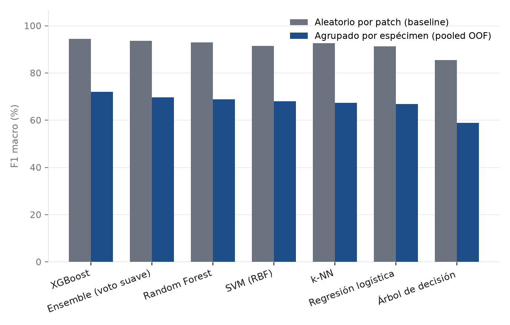
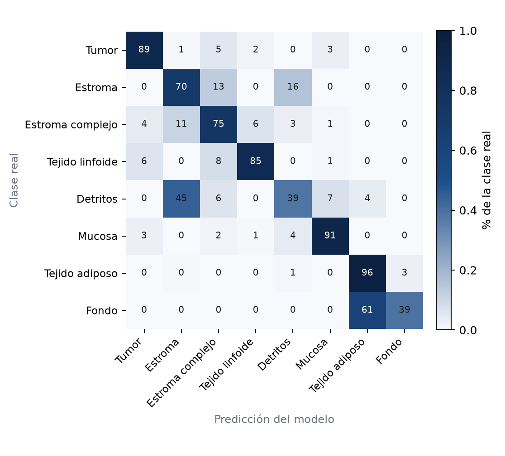
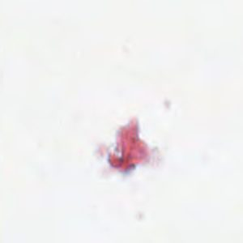
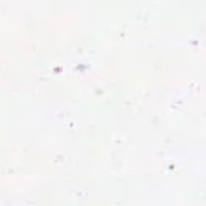
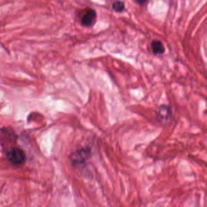
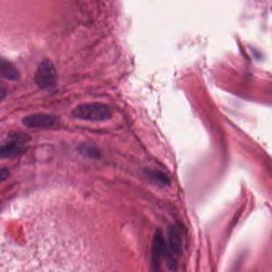
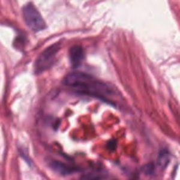
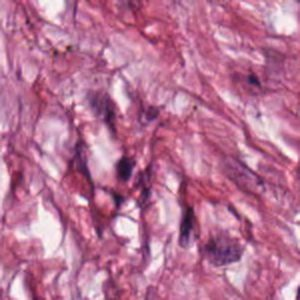

:::: {.crc-article}

<section class="crc-hero">
<div class="crc-hero__eyebrow">Machine Learning · Histopatología digital</div>
<h1 class="crc-hero__title">¿Puede una máquina distinguir tejidos colorrectales?</h1>
<p class="crc-hero__subtitle">Una comparación rápida de modelos de clasificación sobre imágenes histológicas H&amp;E.</p>
<div class="crc-hero__grid">
<figure class="crc-hero__item">

<figcaption class="crc-hero__label">Tumor</figcaption>
</figure>
<figure class="crc-hero__item">

<figcaption class="crc-hero__label">Estroma</figcaption>
</figure>
<figure class="crc-hero__item">

<figcaption class="crc-hero__label">Estroma complejo</figcaption>
</figure>
<figure class="crc-hero__item">

<figcaption class="crc-hero__label">Tejido linfoide</figcaption>
</figure>
<figure class="crc-hero__item">

<figcaption class="crc-hero__label">Detritos</figcaption>
</figure>
<figure class="crc-hero__item">

<figcaption class="crc-hero__label">Mucosa</figcaption>
</figure>
<figure class="crc-hero__item">

<figcaption class="crc-hero__label">Tejido adiposo</figcaption>
</figure>
<figure class="crc-hero__item">

<figcaption class="crc-hero__label">Fondo</figcaption>
</figure>
</div>
<div class="crc-hero__question">
Dada una pequeña región de una imagen histológica colorrectal, ¿puede un modelo reconocer automáticamente qué tipo de tejido está observando? ¿Y cambia la respuesta según qué tan estricta sea la forma de medirlo?
<div class="crc-io">
<span class="crc-io__tag">Input: <strong>imagen histológica</strong></span>
<span class="crc-io__arrow">→</span>
<span class="crc-io__tag">Output: <strong>1 de 8 clases</strong></span>
</div>
</div>
<div class="crc-stats">
<div class="crc-stat"><div class="crc-stat__value">5.000</div><div class="crc-stat__label">imágenes</div></div>
<div class="crc-stat"><div class="crc-stat__value">8</div><div class="crc-stat__label">tipos de tejido</div></div>
<div class="crc-stat"><div class="crc-stat__value">150×150</div><div class="crc-stat__label">píxeles</div></div>
<div class="crc-stat"><div class="crc-stat__value">10</div><div class="crc-stat__label">especímenes de origen</div></div>
</div>
<div class="crc-result">
<div class="crc-result__label">Resultado principal (evaluación agrupada por espécimen)</div>
<div class="crc-result__value" id="crc-hero-result">XGBoost <span>71,9&nbsp;% F1 macro — out-of-fold</span></div>
</div>
</section>

::: {.crc-credit}
[Datos: Kather-CRC-2016 [@kather2016zenodo], CC BY 4.0.]{.crc-hero__label}
:::

<div class="crc-flow">
<div class="crc-flow__step">Imagen H&amp;E</div>
<div class="crc-flow__arrow">→</div>
<div class="crc-flow__step">Color y textura</div>
<div class="crc-flow__arrow">→</div>
<div class="crc-flow__step">Clasificador</div>
<div class="crc-flow__arrow">→</div>
<div class="crc-flow__step">Tipo de tejido</div>
<div class="crc-flow__arrow">→</div>
<div class="crc-flow__step">Evaluación</div>
</div>

## ¿Qué características usa el modelo? {#sec-features}

<span class="crc-badge">Metodología</span>

Decir simplemente "color y textura" no es suficiente para poder reproducir este experimento. Cada imagen (150×150 píxeles RGB) se convierte en un vector de **45 números** mediante cuatro familias de descriptores, tomadas literalmente de `extract_features()` en [`analysis/train_models.py`](https://github.com/Laverde97/latent-frontiers/blob/main/posts/clasificacion-histologia-colorrectal/analysis/train_models.py) — no se usa ningún descriptor adicional a estos:

<div class="crc-features">
<div class="crc-feature-card"><div class="crc-feature-card__dims">24</div><div class="crc-feature-card__name">Histograma de color RGB</div><p>8 bins por canal (rojo, verde, azul), normalizados. Captura la distribución global de color de la imagen.</p></div>
<div class="crc-feature-card"><div class="crc-feature-card__dims">6</div><div class="crc-feature-card__name">Media y desviación por canal</div><p>Intensidad promedio y dispersión de cada canal RGB. Resume brillo y contraste de color.</p></div>
<div class="crc-feature-card"><div class="crc-feature-card__dims">10</div><div class="crc-feature-card__name">Local Binary Pattern uniforme</div><p>Histograma de micro-patrones de textura locales (8 vecinos, radio 1) sobre la imagen en escala de grises.</p></div>
<div class="crc-feature-card"><div class="crc-feature-card__dims">5</div><div class="crc-feature-card__name">Descriptores GLCM/Haralick</div><p>Contraste, disimilitud, homogeneidad, energía y correlación de la matriz de co-ocurrencia de niveles de gris, promediados en 4 orientaciones.</p></div>
</div>

Ese vector de 45 dimensiones —nunca los píxeles crudos— es lo que reciben XGBoost y el resto de modelos clásicos comparados en este artículo.

::: {.crc-repro}
**Código y reproducibilidad.** Todo el pipeline (extracción de características, split aleatorio, split agrupado, entrenamiento, métricas y figuras) es público en el repositorio del sitio: [`train_models.py`](https://github.com/Laverde97/latent-frontiers/blob/main/posts/clasificacion-histologia-colorrectal/analysis/train_models.py) y [`grouped_evaluation.py`](https://github.com/Laverde97/latent-frontiers/blob/main/posts/clasificacion-histologia-colorrectal/analysis/grouped_evaluation.py). Por ejemplo, así se extrae el identificador de espécimen/lámina desde el nombre de archivo (`CRC-Prim-HE-<NN>`), la pieza clave de la evaluación agrupada de este artículo:

```python
GROUP_ID_PATTERN = re.compile(r"CRC-Prim-HE-(\d{2})")

def extract_group_id(img_path: Path) -> str:
    return GROUP_ID_PATTERN.search(img_path.name).group(1)
```
:::

## Compara los modelos {#sec-comparacion}

<span class="crc-badge">Resultado calculado aquí</span>

Este problema tiene 8 clases balanceadas (625 imágenes cada una), y no hay razón para darle más peso a una que a otra. Por eso la métrica **primaria** de este experimento es el **F1 macro**: combina precision y recall, y los promedia con el mismo peso entre las 8 clases. Accuracy se reporta siempre como dato secundario, pero no decide qué modelo es "el mejor" en este artículo. (F1 macro tampoco es una métrica clínicamente óptima de forma universal — la sección [Métricas según el objetivo clínico](#sec-explora) profundiza en eso.)

<div class="crc-figure">

</div>

Bajo el **split aleatorio por patch** —el protocolo más simple, donde las imágenes se reparten al azar entre entrenamiento y prueba sin restricción alguna— XGBoost obtiene el mejor resultado: **94,42&nbsp;% de F1 macro** (94,40&nbsp;% de accuracy). Random Forest (92,90&nbsp;%) y k-NN (92,70&nbsp;%) quedan cerca; el árbol de decisión individual es el más débil (85,47&nbsp;%). También se evaluó un ensemble de voto suave (XGBoost + Random Forest + SVM + regresión logística): no superó a XGBoost bajo este protocolo (93,60&nbsp;% de F1 macro) — se reporta aquí como un experimento ya realizado, no como una línea de trabajo pendiente.

Llamamos a esto **baseline** a propósito: como se muestra en la siguiente sección, este número es demasiado optimista.

### El problema: el split aleatorio no separa especímenes

El split aleatorio reparte imágenes al azar, pero **no** controla de qué espécimen (lámina de tejido) proviene cada una. Verificado directamente sobre el split real de este experimento: los nombres de archivo codifican 10 especímenes de origen (`CRC-Prim-HE-01` a `CRC-Prim-HE-10`), y **el 100&nbsp;% de las 1.000 imágenes de prueba (1.000/1.000) provienen de un espécimen que también tiene imágenes en entrenamiento**. Un modelo podría estar aprendiendo, en parte, características específicas de cada espécimen (tinción, iluminación, ruido del escáner) en vez de solo el tipo de tejido — y el split aleatorio no puede detectarlo. La siguiente sección mide, con datos reales, cuánto pesa eso.

## Evaluación agrupada por espécimen {#sec-grouped}

<span class="crc-badge">Resultado calculado aquí</span>

Para medir el problema anterior, se repitió la comparación completa de modelos usando **LeaveOneGroupOut (LOGO)**: cada uno de los 10 especímenes se usa como conjunto de evaluación exactamente una vez, entrenando cada vez con los otros 9. Ningún grupo aparece nunca simultáneamente en entrenamiento y evaluación.

**¿Por qué LOGO y no otra estrategia?** La elección es programática, no manual: se descartó de antemano elegir a mano qué especímenes van a prueba. Con solo 10 especímenes, y con clases muy concentradas en unos pocos de ellos —la clase **Fondo** solo tiene ejemplos en 2 de los 10 especímenes; **Tejido adiposo** falta en 4—, ni `StratifiedGroupKFold` ni `GroupKFold` con menos de 10 folds garantizan que cada fold contenga las 8 clases, y `GroupShuffleSplit` obligaría a fijar arbitrariamente cuántos especímenes van a prueba. LOGO usa los 10 especímenes como 10 folds naturales, sin ningún parámetro libre.

**Métrica primaria de este protocolo: F1 macro *pooled out-of-fold*.** Acumulando las predicciones de los 10 folds, cada una de las 5.000 imágenes recibe exactamente una predicción de un modelo que nunca vio su espécimen durante el entrenamiento. El F1 macro sobre ese conjunto acumulado —las 8 clases, las 5.000 imágenes— es la cifra que se usa para comparar modelos y elegir el mejor en esta sección. El F1 macro calculado por separado en cada uno de los 10 folds es mucho más inestable (la mayoría de los folds no tiene ningún ejemplo de "Fondo", por ejemplo, así que ese F1 por fold se calcula solo sobre las clases realmente presentes en cada fold, para no arrastrar a cero clases sin ningún ejemplo real) y se reporta únicamente como diagnóstico secundario de variabilidad, nunca como sustituto de la cifra pooled.

| Modelo | F1 macro (aleatorio, baseline) | F1 macro (agrupado, pooled OOF) | Diferencia | F1 macro por fold (media ± DE, secundario) |
|---|---:|---:|---:|---:|
| **XGBoost** | 94,42&nbsp;% | **71,94&nbsp;%** | −22,48&nbsp;pp | 71,96&nbsp;% ± 9,61 |
| Random Forest | 92,90&nbsp;% | 68,77&nbsp;% | −24,13&nbsp;pp | 70,55&nbsp;% ± 9,90 |
| Ensemble | 93,60&nbsp;% | 69,63&nbsp;% | −23,97&nbsp;pp | 71,17&nbsp;% ± 10,56 |
| SVM (RBF) | 91,38&nbsp;% | 67,96&nbsp;% | −23,42&nbsp;pp | 68,18&nbsp;% ± 11,43 |
| k-NN | 92,70&nbsp;% | 67,32&nbsp;% | −25,38&nbsp;pp | 64,44&nbsp;% ± 12,93 |
| Regresión logística | 91,30&nbsp;% | 66,85&nbsp;% | −24,45&nbsp;pp | 68,51&nbsp;% ± 9,20 |
| Árbol de decisión | 85,47&nbsp;% | 58,81&nbsp;% | −26,66&nbsp;pp | 59,21&nbsp;% ± 9,81 |

<div class="crc-figure">

</div>

El resultado es contundente y consistente entre los 7 modelos: **todos** pierden entre 22 y 27 puntos porcentuales de F1 macro al evitar que el mismo espécimen aparezca en entrenamiento y evaluación. No es un efecto aislado de un modelo — es un efecto del protocolo. Esto no significa que el 94,4&nbsp;% del baseline esté "inflado" por definición (esa palabra no se usa aquí a la ligera); significa, medido directamente, que ese número describe qué tan bien un modelo reconoce parches de especímenes que ya conoce parcialmente, no qué tan bien generalizaría a tejido de un espécimen completamente nuevo.

**XGBoost sigue siendo el mejor modelo individual bajo el protocolo agrupado** (71,94&nbsp;% F1 macro pooled OOF) — este resultado se recalculó de forma independiente bajo este protocolo, no se asumió. El ensemble agrupado (69,63&nbsp;%) tampoco supera aquí a XGBoost; como en el baseline, se reporta como dato adicional, no como el mejor modelo. De aquí en adelante, **"el mejor modelo" bajo evaluación agrupada se refiere siempre al mejor modelo individual** entre los 6 comparados — el ensemble se evaluó bajo este mismo protocolo pero nunca se compara contra el baseline como si compartieran esquema.

## ¿Dónde se equivoca el mejor modelo? {#sec-confusion}

<span class="crc-badge">Resultado calculado aquí</span>

El análisis de errores que sigue usa las predicciones **out-of-group** de XGBoost bajo la evaluación agrupada de la sección anterior —el protocolo más riguroso disponible— y no las del split aleatorio (ese análisis, más optimista, queda documentado solo en `analysis/error_analysis.json` como referencia).

| Clase | Precision | Recall | F1 | Soporte |
|---|---:|---:|---:|---:|
| Tejido adiposo | 59,8&nbsp;% | 96,0&nbsp;% | 73,7&nbsp;% | 625 |
| Mucosa | 88,0&nbsp;% | 90,7&nbsp;% | 89,4&nbsp;% | 625 |
| Tumor | 87,3&nbsp;% | 89,3&nbsp;% | 88,3&nbsp;% | 625 |
| Tejido linfoide | 90,8&nbsp;% | 85,3&nbsp;% | 88,0&nbsp;% | 625 |
| Estroma complejo | 68,5&nbsp;% | 74,9&nbsp;% | 71,6&nbsp;% | 625 |
| Estroma | 55,2&nbsp;% | 69,9&nbsp;% | 61,7&nbsp;% | 625 |
| Fondo | 93,9&nbsp;% | 39,4&nbsp;% | 55,5&nbsp;% | 625 |
| Detritos | 62,0&nbsp;% | 38,6&nbsp;% | 47,5&nbsp;% | 625 |

<div class="crc-figure">

</div>

**Tumor** se mantiene relativamente sólido incluso bajo este protocolo más estricto (88,3&nbsp;% F1). Las clases que más se deterioran son **Detritos** (47,5&nbsp;% F1, recall de solo 38,6&nbsp;%), **Fondo** (55,5&nbsp;% F1, recall de 39,4&nbsp;%) y **Estroma** (61,7&nbsp;% F1). Los tres pares de confusión más frecuentes, en número real de imágenes:

1. **Fondo → Tejido adiposo**: 379 imágenes (60,6&nbsp;% de todo el "Fondo" real).
2. **Detritos → Estroma**: 279 imágenes (44,6&nbsp;% de todo "Detritos" real).
3. **Estroma → Detritos**: 99 imágenes (15,8&nbsp;% de todo "Estroma" real).

Que "Fondo → Tejido adiposo" sea, por lejos, la confusión más frecuente es coherente con lo que ya sabíamos del dataset: la clase "Fondo" solo tiene ejemplos reales en 2 de los 10 especímenes (ver [Evaluación agrupada](#sec-grouped)), así que en 8 de los 10 folds el modelo tuvo que reconocer "Fondo" en especímenes donde nunca vio un solo ejemplo de esa clase durante el entrenamiento de ese fold.

### Ejemplos reales de errores del modelo

<div class="crc-error-gallery">
<figure class="crc-error-card">

<figcaption><strong>Real: Fondo</strong> → Predicho: Tejido adiposo<br>Probabilidad estimada por el modelo: 100,0&nbsp;%<span class="crc-error-card__note">Probabilidad no necesariamente calibrada.</span></figcaption>
</figure>
<figure class="crc-error-card">

<figcaption><strong>Real: Fondo</strong> → Predicho: Tejido adiposo<br>Probabilidad estimada por el modelo: 50,4&nbsp;% (caso límite, casi empatado con Fondo: 49,1&nbsp;%)<span class="crc-error-card__note">Probabilidad no necesariamente calibrada.</span></figcaption>
</figure>
<figure class="crc-error-card">

<figcaption><strong>Real: Detritos</strong> → Predicho: Estroma<br>Probabilidad estimada por el modelo: 100,0&nbsp;%<span class="crc-error-card__note">Probabilidad no necesariamente calibrada.</span></figcaption>
</figure>
<figure class="crc-error-card">

<figcaption><strong>Real: Detritos</strong> → Predicho: Estroma<br>Probabilidad estimada por el modelo: 49,6&nbsp;% (caso límite, casi empatado con Detritos: 49,6&nbsp;%)<span class="crc-error-card__note">Probabilidad no necesariamente calibrada.</span></figcaption>
</figure>
<figure class="crc-error-card">

<figcaption><strong>Real: Estroma</strong> → Predicho: Detritos<br>Probabilidad estimada por el modelo: 100,0&nbsp;%<span class="crc-error-card__note">Probabilidad no necesariamente calibrada.</span></figcaption>
</figure>
<figure class="crc-error-card">

<figcaption><strong>Real: Estroma</strong> → Predicho: Detritos<br>Probabilidad estimada por el modelo: 45,6&nbsp;% (caso límite, casi empatado con Estroma: 43,3&nbsp;%)<span class="crc-error-card__note">Probabilidad no necesariamente calibrada.</span></figcaption>
</figure>
</div>

Mirando las imágenes con cautela, sin sobreinterpretar un patrón a partir de 6 ejemplos: los pares Estroma↔Detritos comparten una textura fibrosa y granular difícil de separar incluso para un ojo no entrenado, consistente con que ambas clases dependen de descriptores de textura (LBP, GLCM) que capturan patrones similares en tejido conectivo desorganizado. El caso Fondo→Tejido adiposo es distinto: en las imágenes de alta confianza, el color y la iluminación de "Fondo" en el espécimen evaluado se parecen más al aspecto típico de "Tejido adiposo" en los especímenes de entrenamiento que al aspecto de "Fondo" en esos mismos especímenes — una ilustración directa de por qué depender de un solo tipo de dependencia entre imagen y espécimen (tinción, iluminación) puede fallar al cambiar de lámina.

### ¿Qué podría significar esto clínicamente?

Este clasificador opera sobre parches de tejido que **ya fue extraído** — no decide si tomar una biopsia, así que estos errores no se traducen en procedimientos adicionales sobre el paciente. El marco más realista es el de un futuro sistema de apoyo en patología digital computacional, donde un modelo como este podría, por ejemplo, priorizar regiones de una lámina completa para revisión por un especialista o cuantificar la composición de tejido en una región.

En ese marco:

- **Tumor → no-tumor** (5,9&nbsp;% de las imágenes de Tumor real, según la matriz de arriba) podría hacer que una región tumoral recibiera **menor prioridad de revisión** o quedara subestimada por un sistema automatizado.
- **No-tumor → Tumor** podría generar una **alerta innecesaria** y aumentar la carga de revisión del especialista, sin poner en riesgo directo al paciente.
- Las confusiones entre tejidos no tumorales (Estroma↔Detritos, Fondo→Tejido adiposo, que son la mayoría de los errores aquí) podrían afectar tareas *downstream* que dependan de cuantificar composición tisular — por ejemplo, el **tumor-stroma ratio** (proporción de tumor frente a estroma en una región), un factor pronóstico documentado en cáncer colorrectal [@mesker2007]. Confundir Estroma con Detritos en una proporción no trivial de parches podría sesgar una estimación automática de ese ratio, aunque este artículo no calcula ni valida esa métrica — se menciona únicamente como ejemplo de por qué el tipo de tejido, y no solo la etiqueta final, importa.

Deliberadamente **no se afirma** que estos errores impliquen un cambio de estadio, de pronóstico, de esquema de quimioterapia o de márgenes quirúrgicos: no hay literatura citada aquí que conecte este experimento concreto con esas decisiones, y afirmarlo sería especulación.

## Métricas según el objetivo clínico {#sec-explora}

<div class="crc-switcher">
<select id="crc-model-select" class="crc-switcher__select" aria-label="Seleccionar modelo"></select>
<div class="crc-switcher__head">
<span class="crc-switcher__name" id="crc-switcher-name">—</span>
<span class="crc-switcher__badge" id="crc-switcher-badge">Mejor resultado</span>
</div>
<div class="crc-switcher__metrics">
<div class="crc-metric-tile"><div class="crc-metric-tile__value" id="crc-metric-accuracy">—</div><div class="crc-metric-tile__label">Accuracy</div></div>
<div class="crc-metric-tile"><div class="crc-metric-tile__value" id="crc-metric-precision">—</div><div class="crc-metric-tile__label">Precision macro</div></div>
<div class="crc-metric-tile"><div class="crc-metric-tile__value" id="crc-metric-recall">—</div><div class="crc-metric-tile__label">Recall macro</div></div>
<div class="crc-metric-tile"><div class="crc-metric-tile__value" id="crc-metric-f1">—</div><div class="crc-metric-tile__label">F1 macro</div></div>
</div>
<p class="crc-switcher__desc" id="crc-switcher-desc">—</p>
<noscript>
<p>El selector interactivo requiere JavaScript. La gráfica de la sección "Compara los modelos" muestra la comparación completa entre modelos bajo el split aleatorio.</p>
</noscript>
</div>

<p style="max-width:640px;margin:-1.5rem auto 2rem;font-size:0.85rem;color:var(--crc-muted);text-align:center;">Este selector explora los 7 modelos bajo el <strong>split aleatorio por patch</strong> (el baseline de la sección "Compara los modelos") — no bajo la evaluación agrupada, que solo se calculó para el resumen de la tabla de arriba, no para cada combinación de precision/recall/F1 individual.</p>

<div class="crc-metric-defs">
<div class="crc-metric-def"><span class="crc-metric-def__term">Accuracy</span><p>Proporción de imágenes que el modelo clasifica correctamente, sobre el total.</p></div>
<div class="crc-metric-def"><span class="crc-metric-def__term">Precision macro</span><p>De lo que el modelo asigna a una clase, qué proporción realmente pertenece a ella, promediado por igual entre las 8 clases.</p></div>
<div class="crc-metric-def"><span class="crc-metric-def__term">Recall macro</span><p>De lo que realmente pertenece a una clase, qué proporción detecta el modelo, promediado por igual entre las 8 clases.</p></div>
<div class="crc-metric-def"><span class="crc-metric-def__term">F1 macro</span><p>Un solo número que resume el equilibrio entre precision y recall, promediado por igual entre las 8 clases.</p></div>
</div>

::: {.crc-lit-card}
[Referencia publicada (no calculada en este análisis)]{.crc-lit-card__label}

Kather et al. (2016) reportaron 87,4&nbsp;% de exactitud para el problema de las ocho clases en su protocolo experimental original, usando 10 láminas H&E anonimizadas del archivo del Instituto de Patología de la Universidad de Heidelberg [@kather2016]. El resumen del artículo no especifica un único clasificador para esa cifra, por lo que no se atribuye aquí a un modelo concreto, y su protocolo de validación tampoco se describe con el detalle suficiente para saber si separó especímenes entre entrenamiento y prueba. Esta cifra se muestra únicamente como contexto histórico.
:::

<div class="crc-metric-focus">
<p class="crc-kicker">¿Qué métrica usamos para comparar modelos?</p>
<p>Para elegir el mejor modelo <strong>en este experimento</strong>, tanto en el split aleatorio como en la evaluación agrupada, el criterio fue siempre el mismo: <strong>F1 macro</strong>, porque las 8 clases están balanceadas y queremos darles el mismo peso. Pero F1 macro no es la métrica óptima para todo objetivo — depende de qué error nos preocupa más en un uso concreto.</p>
<p>Para un futuro escenario clínico (recordando que este experimento no decide nada sobre un paciente), la métrica relevante depende de la pregunta:</p>
<ul>
<li><strong>Minimizar regiones tumorales no detectadas</strong> → recall de Tumor. Bajo la evaluación agrupada, XGBoost detecta el 89,3&nbsp;% de las regiones de Tumor reales.</li>
<li><strong>Reducir falsas alertas de Tumor</strong> → precision de Tumor. Bajo la evaluación agrupada: 87,3&nbsp;%.</li>
<li><strong>Equilibrar ambos tipos de error en Tumor</strong> → F1 de Tumor: 88,3&nbsp;%.</li>
<li><strong>Evaluación equilibrada de las 8 clases a la vez</strong> → F1 macro: 71,9&nbsp;% (evaluación agrupada) frente a 94,4&nbsp;% (split aleatorio) — la diferencia entre ambos números es, en sí misma, la lección metodológica central de este artículo.</li>
</ul>
<p>No existe una única métrica universalmente "correcta": la elección depende del uso clínico específico, y ningún número de esta lista debe leerse como una validación de que el modelo esté listo para ese uso.</p>
</div>

## Lo importante

<div class="crc-conclusions">
<div class="crc-conclusion">
<div class="crc-conclusion__num">1</div>
<h3>Sí existe señal discriminante, pero es más modesta de lo que parecía</h3>
<p>Los patrones de color y textura permiten separar buena parte de los ocho tipos de tejido incluso bajo el protocolo más estricto (71,9&nbsp;% F1 macro agrupado), aunque muy por debajo del 94,4&nbsp;% que sugería el split aleatorio.</p>
</div>
<div class="crc-conclusion">
<div class="crc-conclusion__num">2</div>
<h3>El protocolo de evaluación cambia la conclusión, no solo el número</h3>
<p>Los 7 modelos, sin excepción, pierden entre 22 y 27 puntos de F1 macro al evaluarse sobre especímenes nunca vistos. XGBoost sigue siendo el mejor modelo individual en ambos protocolos, pero "el mejor modelo" y "qué tan bien generaliza" son preguntas distintas.</p>
</div>
<div class="crc-conclusion">
<div class="crc-conclusion__num">3</div>
<h3>Esto todavía no es una herramienta clínica</h3>
<p>El resultado demuestra capacidad de clasificación sobre este conjunto de imágenes bajo dos protocolos distintos, no diagnóstico de pacientes ni validación en especímenes, centros o escáneres externos.</p>
</div>
</div>

<div class="crc-callout">
<p>Este análisis clasifica regiones histológicas en tipos de tejido. No predice si una persona desarrollará cáncer, no estima pronóstico y no sustituye la valoración de un patólogo.</p>
</div>

## Conclusión

Bajo el **split aleatorio por patch**, XGBoost obtuvo el mejor resultado individual con 94,42&nbsp;% de F1 macro; el ensemble de voto suave alcanzó 93,60&nbsp;% sin superarlo. Al separar especímenes por completo con **LeaveOneGroupOut**, el F1 macro pooled out-of-fold de XGBoost —que sigue siendo el mejor modelo individual bajo este protocolo, recalculado de forma independiente— pasa a **71,94&nbsp;%**, con una variabilidad entre folds de ±9,6 puntos (dato secundario; la cifra pooled sigue siendo la primaria). El F1 macro de XGBoost pasó, entonces, de 94,42&nbsp;% con el split aleatorio por parches a 71,94&nbsp;% con evaluación out-of-group por espécimen —una diferencia de aproximadamente 22,5 puntos porcentuales, replicada de forma consistente en los 7 modelos comparados (entre 22 y 27 puntos cada uno). Esto muestra que la estimación de desempeño es altamente sensible al protocolo de partición, y refuerza la necesidad de separar los especímenes durante la evaluación; no es evidencia, por sí sola, de qué mecanismo específico produce esa diferencia (p. ej. no se ha probado que el modelo esté memorizando color o tinción de cada espécimen — esa sería una hipótesis a probar en un experimento aparte, no una conclusión de esta comparación).

Dicho de otro modo: **en qué protocolo se mide importa tanto como qué modelo se usa.** Ningún algoritmo es necesariamente el más adecuado para todos los escenarios, y ninguna de las dos cifras —94,4&nbsp;% o 71,9&nbsp;%— debe presentarse sola sin decir bajo qué protocolo se obtuvo.

Con solo 10 especímenes disponibles, esta evaluación agrupada es más rigurosa que un split aleatorio, pero sigue siendo una estimación con incertidumbre considerable (la variabilidad de ±9,6 puntos entre folds lo refleja) y proveniente de una sola institución. La siguiente sección detalla exactamente qué queda sin resolver.

## Limitaciones metodológicas {#sec-limitations}

::: {.crc-limitation}
**Problema A — Dependencia entre especímenes (medida arriba, no eliminada del todo).** La evaluación agrupada de este artículo evita que el mismo espécimen aparezca en entrenamiento y evaluación, pero los 10 especímenes provienen de una sola institución (Universidad de Heidelberg, Mannheim) y el artículo original no confirma que cada uno corresponda a un paciente distinto [@kather2016] — por eso este texto habla siempre de "espécimen/lámina", nunca de "paciente". Con solo 10 grupos, la variabilidad entre folds (hasta ±12,9 puntos de F1 macro en algún modelo) indica que la cifra pooled, aunque es la mejor estimación disponible con estos datos, no debe tratarse como una medición precisa y estable.
:::

::: {.crc-limitation}
**Problema B — Ausencia de un conjunto de desarrollo/validación independiente.** Ni el split aleatorio ni la evaluación agrupada de este artículo reservan un conjunto de *development/validation* separado del conjunto de evaluación final. Comparar varios modelos directamente sobre el mismo hold-out (o el mismo conjunto out-of-fold) para elegir "el mejor" significa que ese conjunto participa, indirectamente, en la selección del modelo — un problema distinto del de especímenes compartidos, y que persiste incluso si el Problema A se resolviera por completo.
:::

La siguiente iteración metodológicamente ideal combinaría ambos arreglos: **train** (ajuste de cada modelo) → **dev/validation** (selección de modelo e hiperparámetros) → **test** (evaluación final, una sola vez) — con los tres conjuntos separados **por espécimen/lámina**, no solo por parche, seguido de validación externa en especímenes de otro centro o laboratorio [@stacke2021].

## ¿Qué seguiría?

<ol class="crc-next-steps">
<li class="crc-next-step"><span class="crc-next-step__num">01</span><strong>Ampliar la validación agrupada</strong><p>Repetir este análisis con más especímenes, idealmente de más de una institución — 10 especímenes de una sola fuente siguen siendo pocos para una estimación estable.</p></li>
<li class="crc-next-step"><span class="crc-next-step__num">02</span><strong>Train / dev / test group-disjoint</strong><p>Separar los tres conjuntos por espécimen/lámina, no solo por parche, para resolver a la vez los Problemas A y B de la sección anterior.</p></li>
<li class="crc-next-step"><span class="crc-next-step__num">03</span><strong>Validación externa</strong><p>Evaluar sobre imágenes de otros laboratorios, escáneres, protocolos de tinción y resoluciones — el domain shift entre centros es una causa documentada de caída de desempeño en patología digital [@stacke2021].</p></li>
<li class="crc-next-step"><span class="crc-next-step__num">04</span><strong>Misclassifications con especialistas</strong><p>Contrastar los errores de este modelo (Estroma↔Detritos, Fondo→Tejido adiposo) con el criterio de patólogos, para saber cuáles son clínicamente relevantes y cuáles son ambigüedades esperables incluso para un observador humano.</p></li>
<li class="crc-next-step"><span class="crc-next-step__num">05</span><strong>Revisar la taxonomía de clases</strong><p>Evaluar si las 8 categorías de este dataset son la división más útil para un objetivo clínico concreto, o si deberían redefinirse según el contexto de uso.</p></li>
<li class="crc-next-step"><span class="crc-next-step__num">06</span><strong>Calibración e incertidumbre</strong><p>Las probabilidades reportadas en este artículo no están necesariamente calibradas; explorar calibración y la opción de que el modelo "se abstenga" en casos de baja confianza.</p></li>
<li class="crc-next-step"><span class="crc-next-step__num">07</span><strong>CNN con más datos o transferencia de aprendizaje</strong><p>La CNN pequeña entrenada en este artículo (ver siguiente sección) quedó por debajo de XGBoost bajo exactamente el mismo split de 2 especímenes de prueba; probar arquitecturas preentrenadas o más especímenes podría cambiar esa conclusión.</p></li>
</ol>

### ¿Y si dejamos que el modelo aprenda directamente de los píxeles? {#sec-cnn}

<span class="crc-badge">Resultado calculado aquí — opcional</span>

XGBoost usa 45 descriptores manuales de color y textura (ver [¿Qué características usa el modelo?](#sec-features)). Una CNN, en cambio, aprendería sus propias representaciones directamente de los píxeles H&E — sin ningún descriptor manual —, lo que en principio podría capturar patrones espaciales que un histograma o un descriptor GLCM promediado no distinguen [@kather2019survival]. Esa es la pregunta que intenta responder esta sección, no si "el deep learning es mejor" en abstracto.

**Metodología.** Framework: PyTorch (TensorFlow no tiene distribución disponible para Python 3.14 en este entorno). Arquitectura deliberadamente pequeña — 3×(Conv2D+ReLU+MaxPooling) → GlobalAveragePooling2D → Dense(64) → Dropout(0.3) → 8 clases —, **28.264 parámetros** en total, sin búsqueda de hiperparámetros. Igual que con los modelos clásicos, se intentó independencia por espécimen: un split fijo train/validación/test por `GroupShuffleSplit` (semilla 42, programático), distinto en mecánica al `LeaveOneGroupOut` usado para XGBoost pero igualmente group-disjoint —3.131 imágenes de entrenamiento (6 especímenes), 1.243 de validación (2 especímenes), 626 de prueba (2 especímenes: 02 y 09)—. Augmentation moderado (flips, rotaciones ≤15°, traslaciones ≤5&nbsp;%) solo en entrenamiento. *Early stopping* sobre la pérdida de validación únicamente (paciencia de 8 epochs, mejores pesos restaurados): se detuvo en la epoch 30, con el mejor punto en la epoch 22. El conjunto de test no participó en el entrenamiento ni en esa decisión, y se evaluó una sola vez. Semillas fijas para Python, NumPy y PyTorch; aun así, el entrenamiento en GPU puede introducir variaciones numéricas menores entre hardware o backends (operaciones no completamente deterministas en cuDNN), así que repetir este entrenamiento podría dar una cifra ligeramente distinta, no idéntica. Entrenamiento completo: 195,9&nbsp;s en GPU (NVIDIA RTX 4060 Laptop).

**Resultado principal: F1 macro de test = 27,06&nbsp;% (accuracy 40,42&nbsp;%).** Esta es la cifra oficial de la CNN — mantiene la misma definición global de 8 clases usada en todo el artículo, sobre las 626 imágenes de los especímenes 02 y 09.

Sobre esa misma cifra hay un matiz necesario, **no una corrección**: los especímenes 02 y 09 —elegidos de forma programática para este split, no a mano— no tienen ningún ejemplo real de "Tejido adiposo" ni de "Fondo", así que esas 2 de las 8 clases entran al 27,06&nbsp;% oficial con un F1 de 0 sin ninguna evidencia real detrás (no porque el modelo fallara en reconocerlas, sino porque no había ningún ejemplo que evaluar). Como **análisis auxiliar**, condicionado explícitamente a las 6 clases que sí tenían soporte en este holdout — no como sustituto ni como "F1 macro corregido" — ese subconjunto da 36,08&nbsp;%.

**Comparación directa con XGBoost, bajo exactamente el mismo split.** El número de XGBoost que aparece en el resto del artículo (71,94&nbsp;%, LOGO pooled out-of-fold sobre los 10 especímenes) **no** es comparable a la cifra de la CNN: proviene de un esquema de validación distinto (acumulado sobre las 5.000 imágenes, no del mismo conjunto de 626 imágenes de prueba). Para una comparación válida, se entrenó y evaluó XGBoost sobre **exactamente el mismo split group-disjoint** que usó la CNN (mismos especímenes de entrenamiento —01, 03, 04, 05, 06, 07, 08, 10— y de prueba —02, 09—):

| | CNN | XGBoost (mismo split) |
|---|---:|---:|
| F1 macro (8 clases, cifra oficial) | 27,06&nbsp;% | 58,60&nbsp;% |
| F1 macro auxiliar (6 clases con soporte real) | 36,08&nbsp;% | 78,14&nbsp;% |
| Accuracy | 40,42&nbsp;% | 79,87&nbsp;% |
| Parámetros | 28.264 pesos | ~300 árboles |

Bajo este split idéntico, XGBoost supera claramente a la CNN. Vale la pena notar, además, que el propio XGBoost rinde distinto según qué especímenes le toquen de prueba: 58,60&nbsp;% aquí (solo especímenes 02 y 09) frente a 71,94&nbsp;% en el pooled out-of-fold de los 10 especímenes — otra ilustración de por qué un solo holdout de 1-2 especímenes es una estimación ruidosa, y por qué ninguno de los números de esta sección debe tratarse como una medición precisa.

**Por qué, probablemente.** Con solo 4.374 imágenes disponibles para XGBoost (train+val combinados) y 3.131 para la CNN (sin usar el conjunto de validación para ajustar pesos), la CNN tiene que aprender representaciones espaciales desde cero; los descriptores manuales (histogramas de color, LBP, GLCM) le dan a XGBoost un fuerte sesgo inductivo que ayuda precisamente cuando hay pocos datos y un cambio de distribución entre especímenes. Esto **no** significa que las CNN sean inherentemente peores para este problema — con más especímenes o una arquitectura preentrenada el resultado podría revertirse —, sino que esta CNN pequeña y sin preentrenar, con estos datos, no lo logra bajo este split. Se reporta así, sin maquillar el resultado, porque es la respuesta real a la pregunta que se hizo.

Igual que con los modelos clásicos: esto sigue sin ser evidencia de generalización clínica, y la limitación de solo 10 especímenes de una institución (ver [Limitaciones metodológicas](#sec-limitations)) aplica exactamente igual aquí. Los detalles completos de arquitectura, split, curva de entrenamiento y métricas están en [`analysis/cnn_metrics.json`](https://github.com/Laverde97/latent-frontiers/blob/main/posts/clasificacion-histologia-colorrectal/analysis/cnn_metrics.json) y [`analysis/train_cnn.py`](https://github.com/Laverde97/latent-frontiers/blob/main/posts/clasificacion-histologia-colorrectal/analysis/train_cnn.py).

<script src="crc-metrics.js"></script>
<script src="crc-histologia.js"></script>

::::

## Referencias
