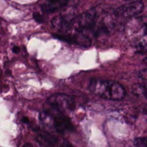
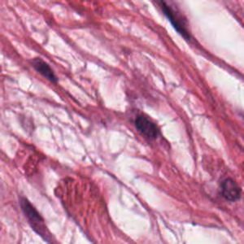
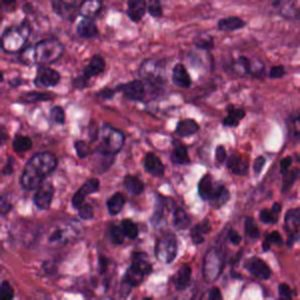
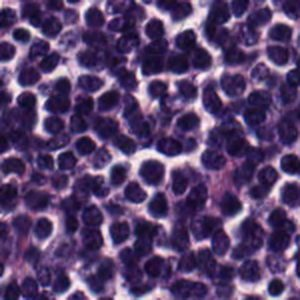
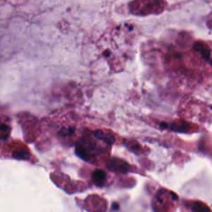
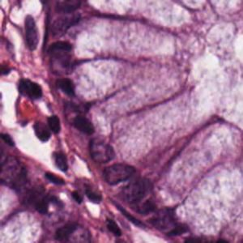
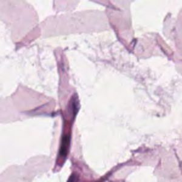
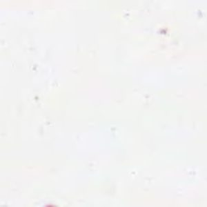
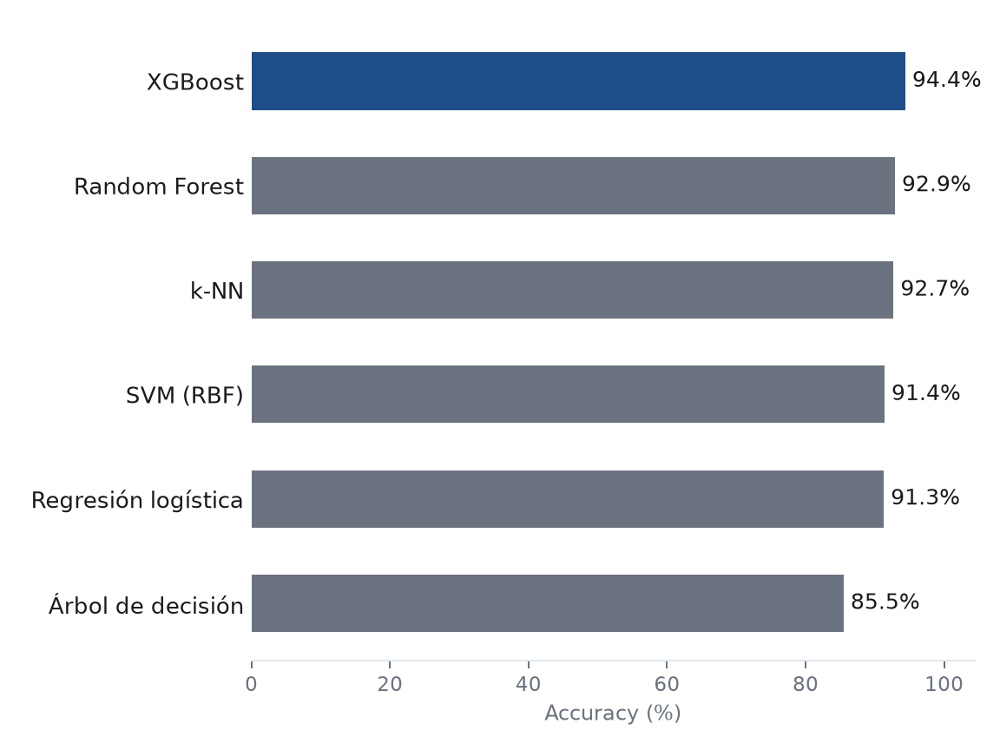
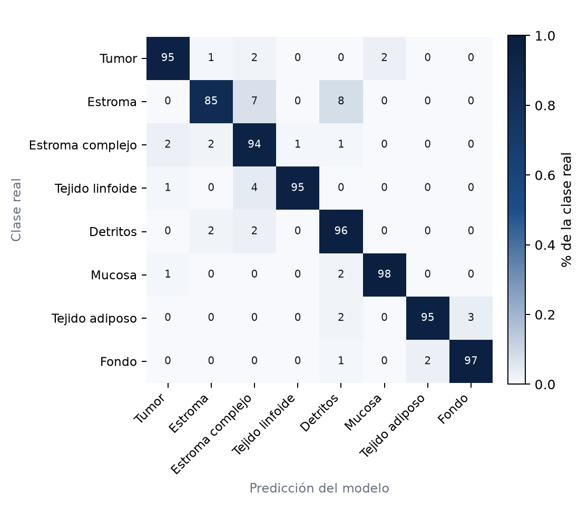

:::: {.crc-article}

<section class="crc-hero">

Machine Learning · Histopatología digital

<h1 class="crc-hero__title">¿Puede una máquina distinguir tejidos colorrectales?</h1>

Una comparación rápida de modelos de clasificación sobre imágenes histológicas H&amp;E.

<figure class="crc-hero__item">

<figcaption class="crc-hero__label">Tumor</figcaption>
</figure>
<figure class="crc-hero__item">

<figcaption class="crc-hero__label">Estroma</figcaption>
</figure>
<figure class="crc-hero__item">

<figcaption class="crc-hero__label">Estroma complejo</figcaption>
</figure>
<figure class="crc-hero__item">

<figcaption class="crc-hero__label">Tejido linfoide</figcaption>
</figure>
<figure class="crc-hero__item">

<figcaption class="crc-hero__label">Detritos</figcaption>
</figure>
<figure class="crc-hero__item">

<figcaption class="crc-hero__label">Mucosa</figcaption>
</figure>
<figure class="crc-hero__item">

<figcaption class="crc-hero__label">Tejido adiposo</figcaption>
</figure>
<figure class="crc-hero__item">

<figcaption class="crc-hero__label">Fondo</figcaption>
</figure>

Dada una pequeña región de una imagen histológica colorrectal, ¿puede un modelo reconocer automáticamente qué tipo de tejido está observando?

Input: <strong>imagen histológica</strong>
→
Output: <strong>1 de 8 clases</strong>

5.000

imágenes

8

tipos de tejido

150×150

píxeles

625

imágenes por clase

Resultado principal

XGBoost 94,4&nbsp;% accuracy

</section>

::: {.crc-credit}
[Datos: Kather-CRC-2016 [@kather2016zenodo], CC BY 4.0.]{.crc-hero__label}
:::

Imagen H&amp;E

→

Color y textura

→

Clasificador

→

Tipo de tejido

→

Evaluación

## Compara los modelos {#sec-comparacion}

Resultado calculado aquí

XGBoost obtiene el mejor resultado: 94,4&nbsp;% de *accuracy* sobre un hold-out estratificado a nivel de imagen. Esto indica una fuerte capacidad de discriminación dentro de este conjunto de datos bajo el protocolo utilizado —no equivale a validación externa ni a eficacia clínica—. Random Forest y k-NN quedan cerca (~93&nbsp;%); los modelos basados en árboles y ensambles superan de forma consistente al árbol de decisión individual, el más débil del grupo (85,5&nbsp;%).

Nota metodológica: el split separa imágenes de forma aleatoria y estratificada, pero los nombres de archivo del dataset indican que las imágenes provienen de 10 especímenes, y el mismo espécimen puede tener imágenes tanto en entrenamiento como en prueba —esta cifra no refleja independencia a nivel de paciente o lámina.

## Explora los modelos {#sec-explora}

<select id="crc-model-select" class="crc-switcher__select" aria-label="Seleccionar modelo"></select>

—
Mejor resultado

—

Accuracy

—

Precision macro

—

Recall macro

—

F1 macro

—

<noscript>

El selector interactivo requiere JavaScript. La gráfica de la sección anterior muestra la comparación completa entre modelos.

</noscript>

::: {.crc-lit-card}
[Referencia publicada (no calculada en este análisis)]{.crc-lit-card__label}

Kather et al. (2016) reportaron 87,4&nbsp;% de exactitud para el problema de las ocho clases en su protocolo experimental original [@kather2016]. El resumen del artículo no especifica un único clasificador para esa cifra, por lo que no se atribuye aquí a un modelo concreto. Esta cifra se muestra únicamente como contexto histórico y no constituye una comparación directa con el hold-out utilizado en este análisis (representación de características y esquema de validación distintos).
:::

## ¿Dónde se equivoca el mejor modelo? {#sec-confusion}

Resultado calculado aquí

XGBoost distingue con claridad 7 de las 8 clases (94&nbsp;% o más de aciertos cada una); **mucosa** es la mejor separada (98&nbsp;%). La excepción es **estroma** (85&nbsp;%), que se confunde principalmente con **detritos** y **estroma complejo** —tejidos con texturas fibrosas similares entre sí.

## Lo importante

1

<h3>Sí existe señal discriminante</h3>

Los patrones de color y textura de estas imágenes permiten separar una parte importante de los ocho tipos de tejido, sin usar los píxeles crudos.

2

<h3>Algunos modelos generalizan mejor</h3>

Los modelos basados en árboles y ensambles (XGBoost, Random Forest) superaron a los modelos lineales y al árbol individual en este análisis, lo que sugiere relaciones no lineales entre color, textura y tipo de tejido.

3

<h3>Esto todavía no es una herramienta clínica</h3>

El resultado demuestra capacidad de clasificación sobre este conjunto de imágenes, no diagnóstico de pacientes.

Este análisis clasifica regiones histológicas en tipos de tejido. No predice si una persona desarrollará cáncer, no estima pronóstico y no sustituye la valoración de un patólogo.

## ¿Qué seguiría?

<ol class="crc-next-steps">
<li class="crc-next-step">01<strong>Validación externa</strong>
Evaluar el modelo sobre imágenes de pacientes, láminas o centros no utilizados durante el entrenamiento.
</li>
<li class="crc-next-step">02<strong>Modelos profundos</strong>
Evaluar representaciones aprendidas (CNNs) frente a los descriptores manuales usados aquí.
</li>
<li class="crc-next-step">03<strong>Evaluación con especialistas</strong>
Contrastar los errores del modelo con el criterio de patólogos expertos.
</li>
</ol>

::::

## Referencias
