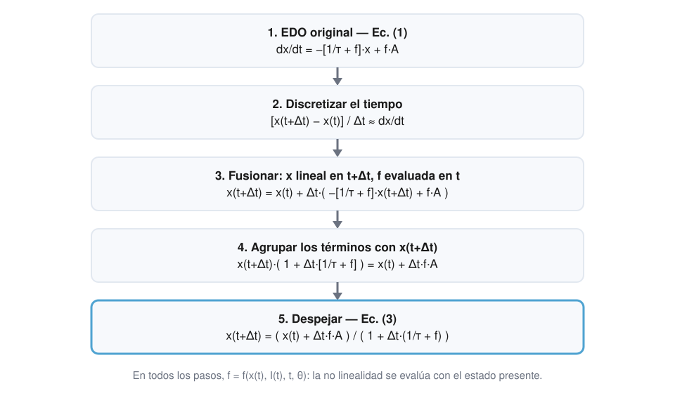
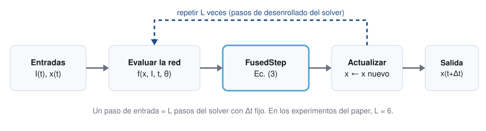

<section class="ltc-hero">
<div class="ltc-hero__eyebrow">Paper review · Deep Learning y sistemas dinámicos</div>
<h1 class="ltc-hero__title">Liquid Time-Constant Networks: de las ecuaciones diferenciales a una implementación moderna</h1>
<p class="ltc-hero__subtitle">Lectura guiada de Hasani et al.: fundamentos matemáticos, Fused ODE Solver, BPTT, estabilidad, experimentos y reproducción actual.</p>
<p class="ltc-hero__meta"><strong>Paper original:</strong> Ramin Hasani, Mathias Lechner, Alexander Amini, Daniela Rus y Radu Grosu. <em>Liquid Time-constant Networks</em>. Proceedings of the AAAI Conference on Artificial Intelligence, 35(9), 7657–7666, 2021. arXiv:2006.04439 · doi:10.1609/aaai.v35i9.16936</p>
<div class="ltc-stats">
<div class="ltc-stat"><div class="ltc-stat__value">2</div><div class="ltc-stat__label">algoritmos</div></div>
<div class="ltc-stat"><div class="ltc-stat__value">5</div><div class="ltc-stat__label">teoremas</div></div>
<div class="ltc-stat"><div class="ltc-stat__value">32</div><div class="ltc-stat__label">unidades ocultas por modelo</div></div>
<div class="ltc-stat"><div class="ltc-stat__value">6</div><div class="ltc-stat__label">pasos de solver por entrada</div></div>
</div>
<div class="ltc-actions">
<a class="lf-btn lf-btn--primary" href="#abstract">Leer el análisis</a>
<a class="lf-btn" href="#video">Ver el video</a>
<a class="lf-btn" href="slides.html">Abrir presentación</a>
<a class="lf-btn" href="https://arxiv.org/pdf/2006.04439">Paper (PDF)</a>
</div>
</section>

Este texto recorre, casi sección por sección, el artículo *Liquid Time-constant Networks* [@hasani2021ltc]. Está pensado para quien ya conoce lo básico de Deep Learning —redes recurrentes, retropropagación, optimizadores— pero todavía no se siente cómodo con las Neural ODE ni con las redes recurrentes de tiempo continuo. La fuente primaria es la versión 4 de arXiv (14 de diciembre de 2020), que incluye el material suplementario con las demostraciones y el montaje experimental. Se cotejó con la versión publicada en las actas de AAAI; el resultado de esa comparación está en [Versiones del paper](#versiones).

El objetivo no es resumir, sino entender **qué** hicieron los autores, **por qué**, **cómo** las matemáticas llevan a los algoritmos, cómo los algoritmos llevan a los experimentos, **qué sostienen realmente** los resultados y cómo podríamos reproducir o extender hoy el mismo trabajo sin confundir la ciencia original con el software actual.

## Cómo leer este artículo {#como-leer}

A lo largo del texto se usan siete etiquetas. Sirven para que en ningún momento haya duda sobre **quién afirma qué**.

::: {.ltc-callout .ltc-callout--paper}
[Paper original]{.ltc-callout__label}

Lo que Hasani et al. proponen, demuestran o reportan. Todo lo que aparece aquí puede localizarse en el artículo o en su suplemento (arXiv v4). Cuando un dato procede del repositorio de código y no del texto del paper, se indica expresamente.
:::

::: {.ltc-callout .ltc-callout--intuition}
[Intuición e interpretación]{.ltc-callout__label}

Explicaciones en lenguaje llano y lecturas propias de este artículo. Son una ayuda para pensar, no afirmaciones de los autores.
:::

::: {.ltc-callout .ltc-callout--impl}
[Implementación actual]{.ltc-callout__label}

La misma idea matemática escrita con software de hoy. No cambia el método.
:::

::: {.ltc-callout .ltc-callout--modern}
[Modernización]{.ltc-callout__label}

Mejora de ingeniería que conserva la pregunta de investigación pero cambia detalles de implementación.
:::

::: {.ltc-callout .ltc-callout--extension}
[Extensión posterior]{.ltc-callout__label}

Un método o arquitectura posterior que **no** forma parte del paper de LTC.
:::

::: {.ltc-callout .ltc-callout--limit}
[Limitación]{.ltc-callout__label}

Una advertencia, un supuesto o un límite de lo que se puede concluir.
:::

::: {.ltc-callout .ltc-callout--note}
[Nota de lectura]{.ltc-callout__label}

Detalles del texto fuente que conviene conocer al leerlo: posibles erratas tipográficas, notación que cambia entre secciones, diferencias entre versiones o entre el paper y su código. En cada una se indica qué escribe la versión consultada, por qué parece entrar en tensión con otra parte del texto y qué lectura se adopta aquí. Son observaciones de lectura: no modifican ningún resultado ni son afirmaciones de los autores.
:::

Además, cada cambio "moderno" se clasifica en una de cuatro clases:

| Clase | Qué significa | Ejemplo |
|---|---|---|
| [A]{.ltc-tag .ltc-tag--a} Misma matemática, software actual | Las ecuaciones no cambian; cambia el lenguaje en que se escriben. | Implementar la Ec. (3) en PyTorch 2.x. |
| [B]{.ltc-tag .ltc-tag--b} Modernización de ingeniería | Cambia la infraestructura, no el experimento. | GPU, `DataLoader`, TensorBoard, mejor registro de experimentos. |
| [C]{.ltc-tag .ltc-tag--c} Experimento modificado | Cambia una pieza que afecta al resultado numérico. | Sustituir el Fused ODE Solver por otro solver. |
| [D]{.ltc-tag .ltc-tag--d} Modelo o investigación posterior | Ya no es el método LTC original. | Usar una arquitectura continua publicada después. |

: Clasificación de los cambios respecto al paper original usada en todo el artículo.

### Versiones del paper: arXiv v4 y actas de AAAI {#versiones}

::: {.ltc-callout .ltc-callout--note}
[Nota de lectura]{.ltc-callout__label}

El paper existe en dos versiones públicas. Para este artículo se extrajo el texto de ambos PDF y se comparó palabra por palabra.

| Aspecto | arXiv v4 (14 dic. 2020) | Actas de AAAI-21 (2021) |
|---|---|---|
| Extensión | 25 páginas: el artículo y, desde la página 10, el suplemento S1–S9 | 10 páginas (7657–7666), sin suplemento |
| Ecuaciones (1)–(9), Algorithm 1 y 2, enunciados de los Teoremas 1–5 | Coinciden | Coinciden |
| Valores numéricos de las Tablas 1–6 | Coinciden | Coinciden |
| Demostraciones, montaje experimental, hiperparámetros, recuento de parámetros, mención de TensorFlow 1.14 | En el suplemento | No están en el PDF, aunque el texto remite a un *Appendix* y a *supplements* |
| Enlace al código | Nota al pie de la primera página | No aparece en el texto del PDF |
| Redacción | Más extensa | Condensada en varios pasajes |

Las diferencias de redacción con algún contenido son cuatro. La pregunta abierta de la introducción termina en *"richer representation learning and expressiveness"* en arXiv y en *"better representation learning"* en AAAI. Sobre el solver, arXiv dice que la discretización *"results in achieving stability for an implicit update equation"* y AAAI que *"results in greater stability"*. La frase que describe las LTC como *"loosely inspired by biology"* solo está en arXiv (ambas versiones conservan *"loosely related"*). Y las conclusiones empiezan con *"We investigated the use of a novel class of time-continuous neural network models…"* en arXiv y con *"We introduced liquid time-constant networks"* en AAAI. Ninguna altera ecuaciones, algoritmos, enunciados de teoremas ni resultados.

**Consecuencia para este artículo:** todo lo que aquí se atribuye al "suplemento" procede de arXiv v4 y no puede comprobarse en el PDF de AAAI. Las paráfrasis siguen la redacción de arXiv v4.
:::

## Abstract — Explicación {#abstract}

### ¿Qué dicen los autores?

::: {.ltc-callout .ltc-callout--paper}
[Paper original]{.ltc-callout__label}

En su resumen, los autores afirman que [@hasani2021ltc]:

1. Presentan una nueva clase de redes neuronales recurrentes de **tiempo continuo**.
2. En lugar de declarar la dinámica del sistema mediante no linealidades implícitas, construyen redes de **sistemas dinámicos lineales de primer orden** modulados por compuertas no lineales interconectadas.
3. Los modelos resultantes son sistemas dinámicos con constantes de tiempo **variables** (es decir, *líquidas*) acopladas a su estado oculto, y sus salidas se calculan con **solvers numéricos** de ecuaciones diferenciales.
4. Estas redes muestran un comportamiento **estable y acotado**, mayor **expresividad** dentro de la familia de las Neural ODE y mejor desempeño en tareas de predicción de series de tiempo.
5. Para sostenerlo, primero obtienen cotas teóricas sobre su dinámica y miden su poder expresivo con la **longitud de trayectoria** en un espacio latente; después realizan experimentos de predicción de series de tiempo frente a RNN clásicas y modernas.
:::

### Vocabulario mínimo

- **Red neuronal recurrente (RNN).** Un modelo para datos secuenciales que mantiene un **estado oculto**: un vector que resume lo visto hasta ahora y que se actualiza con cada nueva entrada.
- **Estado oculto** $\mathbf{x}(t)$. La "memoria de trabajo" de la red. En una RNN clásica se actualiza en pasos discretos; en una red de tiempo continuo es una función del tiempo.
- **Tiempo continuo (*time-continuous*).** El modelo no define directamente el siguiente estado, sino la **velocidad de cambio** del estado en cada instante.
- **ODE (ecuación diferencial ordinaria).** Una ecuación que relaciona una función con su derivada, por ejemplo $d\mathbf{x}/dt = \ldots$ Resolverla significa encontrar la trayectoria $\mathbf{x}(t)$ a partir de un estado inicial.
- **Constante de tiempo** $\tau$. Un parámetro que fija la escala temporal de un sistema: cuánto tarda en responder o en "olvidar". Los autores la describen como el parámetro que caracteriza la velocidad y la sensibilidad de acoplamiento de una ODE [@hasani2021ltc].
- **Expresividad.** Qué tan complejas son las funciones (o trayectorias) que una arquitectura puede representar.
- **Estabilidad.** En este paper, que el estado y la constante de tiempo permanezcan dentro de un rango finito aunque las entradas crezcan sin límite. Más adelante se precisa qué demuestra y qué no demuestra esa propiedad.

### ¿Por qué "líquida"?

En una red de tiempo continuo clásica, cada neurona tiene una constante de tiempo $\tau$ **fija**: se aprende durante el entrenamiento, pero una vez aprendida es la misma para cualquier entrada. En una LTC, la constante de tiempo efectiva depende del estado y de la entrada en cada instante. Cambia mientras la red procesa la secuencia: por eso "líquida". No significa que el modelo sea un líquido ni que los pesos cambien durante la inferencia; lo que varía es la escala temporal efectiva de cada neurona.

### ¿Por qué importa el trabajo?

Las Neural ODE habían mostrado que una red puede definir la derivada de un estado en vez del estado mismo [@chen2018neuralode]. El paper de LTC plantea una pregunta de seguimiento: **¿cuán expresivas son las Neural ODE en su forma actual y se puede mejorar su estructura?** Su respuesta combina tres piezas que rara vez aparecen juntas en un mismo artículo: una propuesta de arquitectura, un análisis teórico (cotas, aproximación universal, longitud de trayectoria) y una evaluación empírica en varias tareas.

### El Abstract en una frase

> Una LTC es una red recurrente de tiempo continuo en la que una misma red no lineal determina tanto hacia dónde se mueve el estado como la rapidez con la que lo hace, de modo que la constante de tiempo de cada neurona varía con el estado y la entrada; el paper demuestra que, bajo sus supuestos, esa constante y el estado permanecen acotados.

## 1. Introduction — el problema y la propuesta {#introduction}

### ¿Qué problema plantea?

Los datos secuenciales —señales fisiológicas, sensores industriales, tráfico, consumo eléctrico— son observaciones de sistemas que evolucionan en el tiempo. Las redes recurrentes son la herramienta natural para modelarlos porque mantienen un estado que evoluciona con la secuencia. El paper se sitúa en una rama concreta: las RNN cuyo estado oculto está determinado por una ecuación diferencial.

::: {.ltc-callout .ltc-callout--paper}
[Paper original]{.ltc-callout__label}

Los autores formulan dos preguntas abiertas: **¿cuán expresivas son las Neural ODE en su formalismo actual?** y **¿podemos mejorar su estructura para permitir un aprendizaje de representaciones más rico?** [@hasani2021ltc]
:::

Para llegar a su propuesta conviene recorrer cuatro modelos. No son el mismo modelo con otro nombre: cada uno cambia algo concreto.

<figure class="ltc-figure">

<figcaption>Diagrama original. La progresión es conceptual: cada modelo modifica la forma en que se define la evolución del estado oculto.</figcaption>
</figure>

### RNN discretas

Una RNN clásica calcula el siguiente estado a partir del actual y de la entrada:

$$
\mathbf{x}_{t+1} = f(\mathbf{x}_t, \mathbf{I}_t, \theta).
$$

El tiempo es un índice entero. El modelo no sabe cuánto tiempo real separa dos pasos; simplemente salta de uno al siguiente. Entrenar estas redes requiere propagar gradientes a través de todos los pasos, lo que se conoce como *backpropagation through time* (BPTT) [@werbos1990bptt]. Esta ecuación es contexto pedagógico: el paper no la escribe, parte directamente de los modelos continuos.

### Neural ODE

::: {.ltc-callout .ltc-callout--paper}
[Paper original]{.ltc-callout__label}

El estado de una Neural ODE, $\mathbf{x}(t) \in \mathbb{R}^D$, se define como la solución de [@chen2018neuralode; @hasani2021ltc]:

$$
\frac{d\mathbf{x}(t)}{dt} = f(\mathbf{x}(t), \mathbf{I}(t), t, \theta),
$$

con una red neuronal $f$ parametrizada por $\theta$.
:::

| Símbolo | Significado |
|---|---|
| $\mathbf{x}(t)$ | Estado oculto en el instante $t$: un vector con un valor por neurona. |
| $\mathbf{I}(t)$ | Entrada externa en el instante $t$. |
| $t$ | Tiempo, ahora una variable continua. |
| $\theta$ | Parámetros entrenables de la red $f$. |
| $f(\cdot)$ | Red neuronal que devuelve la **derivada** del estado, no el estado siguiente. |

::: {.ltc-callout .ltc-callout--intuition}
[Intuición e interpretación]{.ltc-callout__label}

- Modelo discreto: *"¿cuál es el siguiente estado?"*
- Modelo continuo: *"¿a qué ritmo está cambiando el estado ahora mismo?"*

Para obtener un estado concreto hay que **integrar** esa velocidad en el tiempo, y eso lo hace un solver numérico.
:::

Los autores recuerdan que una Neural ODE puede entrenarse con diferenciación automática en modo inverso de dos maneras: descendiendo por el gradiente **a través del solver**, o tratando el solver como una caja negra y aplicando el **método adjunto** [@hasani2021ltc]. Esta distinción reaparece en la Sección 3.

### CT-RNN

::: {.ltc-callout .ltc-callout--paper}
[Paper original]{.ltc-callout__label}

En vez de definir la derivada directamente con $f$, una red recurrente de tiempo continuo (CT-RNN) más estable se obtiene con [@funahashi1993ctrnn; @hasani2021ltc]:

$$
\frac{d\mathbf{x}(t)}{dt} = -\frac{\mathbf{x}(t)}{\tau} + f(\mathbf{x}(t), \mathbf{I}(t), t, \theta).
$$

El término $-\mathbf{x}(t)/\tau$ ayuda al sistema autónomo a alcanzar un estado de equilibrio con una constante de tiempo $\tau$.
:::

El término nuevo es una **fuga**: en ausencia de estímulo, el estado decae hacia cero. $\tau$ controla la velocidad de ese decaimiento.

::: {.ltc-callout .ltc-callout--intuition}
[Intuición e interpretación]{.ltc-callout__label}

- $\tau$ grande → el estado cambia despacio y persiste más tiempo.
- $\tau$ pequeña → el estado reacciona y olvida rápido.

Esto es una lectura válida **dentro de los supuestos del modelo** (un término de fuga lineal). No es una ley física general sobre cualquier sistema.
:::

En una CT-RNN, $\tau$ es un parámetro: puede aprenderse, pero no depende de la entrada.

### Liquid time-constant — ¿qué significa realmente? {#liquid-time-constant}

::: {.ltc-callout .ltc-callout--paper}
[Paper original]{.ltc-callout__label}

Los autores proponen que el flujo del estado oculto se declare mediante un sistema de ODE **lineales**, $d\mathbf{x}(t)/dt = -\mathbf{x}(t)/\tau + \mathbf{S}(t)$, donde la no linealidad entra a través de

$$
\mathbf{S}(t) = f(\mathbf{x}(t), \mathbf{I}(t), t, \theta)\,\big(A - \mathbf{x}(t)\big),
$$

con parámetros $\theta$ y $A$. Sustituyendo $\mathbf{S}$ se obtiene la ecuación central del paper [@hasani2021ltc]:

$$
\frac{d\mathbf{x}(t)}{dt} = -\left[\frac{1}{\tau} + f(\mathbf{x}(t), \mathbf{I}(t), t, \theta)\right]\mathbf{x}(t) + f(\mathbf{x}(t), \mathbf{I}(t), t, \theta)\,A. \tag{1}
$$

Es la **Ec. (1) del artículo**.
:::

#### ¿Qué significa cada término?

| Símbolo | Significado | Dimensión (según el Algorithm 1) |
|---|---|---|
| $\mathbf{x}(t)$ | Estado oculto de las neuronas. | $N$ |
| $\mathbf{I}(t)$ | Entrada externa. | $M$ |
| $\tau$ | Constante de tiempo "base" de cada neurona, entrenable. | $N \times 1$ |
| $f(\mathbf{x}(t), \mathbf{I}(t), t, \theta)$ | Red no lineal que depende del estado y la entrada. El ejemplo del paper es $f = \tanh(\gamma_r \mathbf{x} + \gamma \mathbf{I} + \mu)$. | $N$ |
| $\theta$ | Parámetros de $f$: pesos de entrada $\gamma$, pesos recurrentes $\gamma_r$, sesgos $\mu$ (y $\tau$). | — |
| $A$ | Vector de parámetros entrenable: el valor hacia el que $f$ empuja al estado. El Algorithm 1 lo llama *bias vector*. | $N \times 1$ |
| $\odot$ | Producto de Hadamard (elemento a elemento), que el Algorithm 1 usa en $f \odot A$. | — |

Lo decisivo es que **$f$ aparece dos veces**: multiplicando a $\mathbf{x}(t)$ dentro del corchete y multiplicando a $A$. En una CT-RNN, $f$ solo se suma. Aquí, además, modula el coeficiente del término de fuga.

::: {.ltc-callout .ltc-callout--note}
[Nota de lectura]{.ltc-callout__label}

La introducción del paper usa letras distintas para las dimensiones ($\mathbf{x}(t) \in \mathbb{R}^D$ y $\mathbf{S}(t) \in \mathbb{R}^M$), mientras que el Algorithm 1 usa $N$ para el número de neuronas y $M$ para la dimensión de la entrada. En este artículo se sigue la convención del Algorithm 1.
:::

#### De la Ec. (1) a $\tau_{sys}$

Basta con reescribir el corchete de la Ec. (1) con denominador común:

$$
\frac{1}{\tau} + f = \frac{1 + \tau f}{\tau}
\quad\Longrightarrow\quad
\frac{d\mathbf{x}(t)}{dt} = -\frac{\mathbf{x}(t)}{\tau_{sys}} + f\,A,
\qquad
\tau_{sys} = \frac{\tau}{1 + \tau\, f(\mathbf{x}(t), \mathbf{I}(t), t, \theta)}.
$$

El término de fuga de la Ec. (1) tiene la misma forma que el de una CT-RNN, con $\tau_{sys}$ en lugar de $\tau$; el término de entrada es $f\,A$ en lugar de $f$.

::: {.ltc-callout .ltc-callout--paper}
[Paper original]{.ltc-callout__label}

El paper da esta misma expresión, $\tau_{sys} = \dfrac{\tau}{1 + \tau f(\mathbf{x}(t), \mathbf{I}(t), t, \theta)}$, y afirma que la red $f$ no solo determina la derivada del estado, sino que actúa como una constante de tiempo variable dependiente de la entrada. Según los autores, esta propiedad permite que elementos individuales del estado oculto identifiquen sistemas dinámicos especializados para las características de la entrada que llegan en cada instante [@hasani2021ltc].
:::

Matemáticamente, $\tau_{sys}$ cambia por tres vías: porque $f$ depende del **estado** $\mathbf{x}(t)$, porque depende de la **entrada** $\mathbf{I}(t)$, y porque $f$ es una **función no lineal aprendida** con parámetros $\theta$.

<figure class="ltc-figure">

<figcaption>Diagrama original. La misma salida de <em>f</em> influye en la rapidez efectiva y en el valor hacia el que se empuja el estado.</figcaption>
</figure>

::: {.ltc-callout .ltc-callout--intuition}
[Intuición e interpretación]{.ltc-callout__label}

Cuando $f$ es grande y positiva, $\tau_{sys}$ se hace más pequeña: la neurona responde más rápido. Cuando $f$ se acerca a cero, $\tau_{sys}$ se acerca a $\tau$ y la neurona se comporta como una unidad con fuga pasiva.

Si —solo como experimento mental— congeláramos $f$ en un valor constante, la ecuación sería lineal y el estado tendería exponencialmente, con constante de tiempo $\tau_{sys}$, hacia el punto $\tau_{sys}\, f A = \dfrac{\tau f}{1 + \tau f}A$. En la red real $f$ nunca está congelada: cambia con el estado y la entrada, así que tanto el "destino" como la "rapidez" se desplazan continuamente.
:::

::: {.ltc-callout .ltc-callout--limit}
[Limitación]{.ltc-callout__label}

La lectura "$f$ grande → reacción rápida" presupone $f \geq 0$, que es el caso que analizan los Teoremas 1 y 2 del paper (una sigmoide entre 0 y 1). Con una activación que toma valores negativos, como la $\tanh$ del ejemplo de la Sección 2, $1 + \tau f$ puede ser menor que 1 y $\tau_{sys}$ puede **superar** a $\tau$. El paper no establece que $\tau_{sys}$ se "adapte de forma óptima" a la tarea: establece su expresión y, bajo supuestos, sus cotas.
:::

### Why this specific formulation? — la motivación biológica {#motivacion-biologica}

::: {.ltc-callout .ltc-callout--paper}
[Paper original]{.ltc-callout__label}

Los autores dan dos justificaciones [@hasani2021ltc]:

**I) Neurociencia computacional.** El modelo LTC está *vagamente relacionado* (*loosely related*) con modelos de la dinámica neuronal de especies pequeñas. El potencial de una neurona sin espigas, $\mathbf{v}(t)$, puede escribirse como un sistema de ODE lineales

$$
\frac{d\mathbf{v}}{dt} = -g_l\,\mathbf{v}(t) + \mathbf{S}(t),
$$

donde $\mathbf{S}$ es la suma de las entradas sinápticas y $g_l$ es una conductancia de fuga. Las corrientes sinápticas se aproximan en estado estacionario por $\mathbf{S}(t) = f(\mathbf{v}(t), \mathbf{I}(t))\,(A - \mathbf{v}(t))$, con $f$ una no linealidad sigmoidal que depende del estado de las neuronas presinápticas y de las entradas externas. Al combinar ambas ecuaciones se obtiene algo similar a la Ec. (1).

**II) Modelos causales dinámicos.** La Ec. (1) se parece a los *Dynamic Causal Models* con aproximación bilineal, $d\mathbf{x}/dt = (A + \mathbf{I}(t)B)\,\mathbf{x}(t) + C\,\mathbf{I}(t)$, usados para modelar señales de fMRI.
:::

Solo hacen falta cuatro ideas biológicas para seguir la analogía:

- **Dinámica de membrana.** El potencial de una neurona cambia de forma continua según las corrientes que entran y salen.
- **Fuga.** Sin estímulo, la membrana pierde carga y el potencial vuelve a su reposo. Es el término $-g_l\,\mathbf{v}$, análogo a $-\mathbf{x}/\tau$.
- **Interacción sináptica.** La corriente que una sinapsis inyecta no es una cantidad fija: depende de cuán activa esté la neurona presináptica (la sigmoide $f$).
- **Saturación o reversión.** La corriente sináptica es proporcional a $(A - \mathbf{v})$: a medida que el potencial se acerca a $A$, el empuje disminuye, y se invertiría si lo sobrepasara. Por eso $A$ actúa como un valor de referencia hacia el que la sinapsis arrastra a la neurona.

::: {.ltc-callout .ltc-callout--note}
[Nota de lectura]{.ltc-callout__label}

En este pasaje, la versión consultada escribe la corriente sináptica con una coma entre sus dos factores: $\mathbf{S}(t) = f(\mathbf{v}(t), \mathbf{I}(t)),\,(A - \mathbf{v}(t))$. Unas líneas antes, la definición de $\mathbf{S}(t)$ para la LTC los escribe como un producto. Para la explicación adoptamos la lectura como producto, que es la que conduce a la Ec. (1). Es una observación de lectura, no una modificación del resultado.
:::

Las cuatro ideas anteriores son la lectura pedagógica de este artículo. La cadena es: **modelo biológico** (membrana con fuga + sinapsis con saturación) → **abstracción matemática** (ODE lineal modulada por una compuerta no lineal) → **Ec. (1)**.

::: {.ltc-callout .ltc-callout--limit}
[Limitación]{.ltc-callout__label}

Una neurona LTC **no** es biológicamente idéntica a una neurona real. Los propios autores describen el modelo como "vagamente relacionado" (*loosely related*) con esos modelos de neurociencia, y la versión de arXiv añade que las LTC están "vagamente inspiradas en la biología". La analogía explica de dónde sale la forma de la ecuación; no convierte el modelo en una simulación del sistema nervioso.
:::

### Las cinco propiedades que anuncia la introducción

La introducción termina con una lista de características que sirve de índice del paper.

| Propiedad anunciada | Qué afirma | Dónde se desarrolla |
|---|---|---|
| **Liquid time-constant** | $f$ actúa como constante de tiempo variable; las LTC admiten cualquier solver y se propone uno de paso fijo. | Sección 2 |
| **Reverse-mode automatic differentiation of LTCs** | Las LTC son grafos computacionales diferenciables; se entrena con BPTT, cambiando memoria por precisión numérica. | Sección 3 |
| **Bounded dynamics – stability** | El estado y la constante de tiempo están acotados en un rango finito. | Sección 4 |
| **Superior expressivity** | Aproximación universal y mayor longitud de trayectoria que otros modelos continuos. | Sección 5 |
| **Time-series modeling** | Experimentos de predicción de series de tiempo frente a RNN modernas. | Sección 6 |

A continuación se introduce cada idea a nivel conceptual. El detalle técnico llega en la sección correspondiente.

#### Reverse-mode automatic differentiation of LTCs

**¿Qué es la diferenciación automática en modo inverso?** Es la técnica con la que se calculan los gradientes en Deep Learning [@rumelhart1986backprop]. Se ejecuta el cálculo hacia adelante guardando las operaciones realizadas y después se recorre ese registro hacia atrás aplicando la regla de la cadena:

```text
parámetros θ  →  cálculo hacia adelante  →  predicción  →  pérdida
                                                              │
gradientes ∂pérdida/∂θ  ←  recorrido hacia atrás  ←───────────┘
```

Para una Neural ODE hay dos caminos. El **método adjunto** resuelve una segunda ODE hacia atrás en el tiempo para obtener los gradientes sin almacenar los estados intermedios, lo que resulta atractivo por su consumo de **memoria** constante [@chen2018neuralode]. La alternativa es derivar directamente a través de las operaciones del solver.

::: {.ltc-callout .ltc-callout--paper}
[Paper original]{.ltc-callout__label}

Los autores deciden *cambiar memoria por precisión numérica* durante el paso hacia atrás y usan un algoritmo estándar de **BPTT** en lugar de un método de optimización basado en el adjunto [@hasani2021ltc]. La razón, desarrollada en la Sección 3, es el error numérico que aparece al reconstruir la trayectoria integrando hacia atrás.
:::

#### Bounded dynamics — stability

**¿Qué significa "acotado"?** Que una cantidad nunca sale de un intervalo finito. Si la constante de tiempo depende de la entrada, surge una preocupación legítima: ¿podría una entrada enorme hacer que $\tau_{sys}$ se anule o que el estado crezca sin control? Un ejemplo cotidiano de sistema acotado es un depósito con rebosadero: por mucho caudal que entre, el nivel no supera el borde.

::: {.ltc-callout .ltc-callout--paper}
[Paper original]{.ltc-callout__label}

La introducción anuncia que el estado y la constante de tiempo de las LTC están acotados en un rango finito, y que esta propiedad asegura la estabilidad de la dinámica de salida, algo deseable cuando las entradas al sistema crecen sin cesar [@hasani2021ltc].
:::

El sentido de "estabilidad" aquí es específico: **estado acotado frente a entradas no acotadas**. No es estabilidad asintótica ni estabilidad del entrenamiento. Los teoremas se revisan en la Sección 4.

#### Superior expressivity

La expresividad importa porque fija el techo de lo que un modelo puede representar. La herramienta clásica es la **aproximación universal**: el modelo puede aproximar cualquier función de cierta clase con la precisión que se quiera. Pero casi todas las arquitecturas razonables son aproximadores universales, así que ese resultado no sirve para **compararlas**.

Por eso los autores añaden una segunda medida. Si se alimenta una red con una trayectoria de entrada sencilla (un círculo), los **estados ocultos** describen a su vez una trayectoria en un **espacio latente**. La **longitud de trayectoria** mide cuánto se "estira y retuerce" esa curva: una curva más larga indica una transformación más compleja [@raghu2017expressive]. La Sección 5 la desarrolla.

## 2. LTCs forward-pass by a fused ODE solvers — el paso hacia adelante {#fused-solver}

Esta sección responde a una pregunta práctica: dada la Ec. (1), ¿cómo se calcula realmente el estado?

### ¿Por qué necesitamos un ODE solver?

En una RNN discreta, la ecuación del modelo **es** la regla de actualización: se evalúa y se asigna. La Ec. (1), en cambio, no dice cuánto vale $\mathbf{x}(t + \Delta t)$; dice cuánto vale su derivada.

::: {.ltc-callout .ltc-callout--paper}
[Paper original]{.ltc-callout__label}

Resolver la Ec. (1) analíticamente no es trivial por la no linealidad de las LTC. El estado en cualquier instante $T$ puede calcularse con un solver numérico que simula el sistema desde $x(0)$ hasta $x(T)$. Un solver divide el intervalo continuo $[0, T]$ en una discretización temporal $[t_0, t_1, \ldots, t_n]$, de modo que cada paso solo actualiza el estado de $t_i$ a $t_{i+1}$ [@hasani2021ltc].
:::

La cadena conceptual es:

```text
ecuación diferencial continua  →  discretización del tiempo  →  estado siguiente aproximado
```

- **$\Delta t$** es el tamaño del paso: cuánto tiempo avanza el solver en cada actualización.
- **Integrar** es acumular la velocidad de cambio a lo largo del tiempo para obtener el estado.
- **Aproximación numérica** significa que el resultado no es exacto: cada paso introduce un pequeño error que depende de $\Delta t$ y del método.

### Stiffness: ecuaciones rígidas

Un sistema es **rígido** (*stiff*) cuando combina dinámicas muy rápidas con otras lentas. Los métodos explícitos solo son estables si el paso es más pequeño que la escala temporal más rápida del sistema, aunque esa componente rápida ya se haya extinguido y no aporte nada a la solución. Un solver adaptativo, que ajusta $\Delta t$ para controlar el error, se ve entonces obligado a dar muchísimos pasos diminutos.

::: {.ltc-callout .ltc-callout--paper}
[Paper original]{.ltc-callout__label}

Los autores afirman que la ODE de las LTC constituye un sistema de ecuaciones rígidas y que este tipo de ODE requiere un número exponencial de pasos de discretización cuando se simula con un integrador basado en Runge-Kutta. En consecuencia, consideran que los solvers basados en RK, como Dormand–Prince (el predeterminado de `torchdiffeq`), no son adecuados para las LTC, y por ello diseñan un solver nuevo [@hasani2021ltc].
:::

::: {.ltc-callout .ltc-callout--note}
[Nota de lectura]{.ltc-callout__label}

La versión consultada escribe que los solvers basados en Runge-Kutta "no son adecuados" para las LTC. Esto parece entrar en tensión con otros dos pasajes del mismo paper: en la Sección 5, **todas** las redes del análisis de trayectorias, incluidas las LTC, se simulan con Dormand–Prince de paso variable, y en las conclusiones se dice que las LTC funcionan bien con solvers avanzados de paso variable. Para la explicación adoptamos una lectura que concilia los tres pasajes: un solver RK adaptativo **puede** integrar una LTC, pero con más pasos. La Tabla 2 del paper, revisada más adelante, va en esa dirección: en promedio el solver da más pasos por muestra con LTC que con los otros modelos, de forma muy marcada con ReLU y Hard-tanh. No leemos la frase como "toda LTC es siempre rígida", sino como la justificación de diseñar un solver de paso fijo. Es una observación de lectura, no una modificación del resultado.
:::

### Euler explícito frente a Euler implícito

Para una ODE genérica $dx/dt = g(x)$:

| | Euler explícito | Euler implícito |
|---|---|---|
| Regla | $x_{i+1} = x_i + \Delta t\, g(x_i)$ | $x_{i+1} = x_i + \Delta t\, g(x_{i+1})$ |
| Qué usa | El estado **presente**. | El estado **futuro**, que aparece a ambos lados. |
| Coste por paso | Una evaluación de $g$. | Resolver una ecuación, en general no lineal. |
| Estabilidad | Solo con pasos pequeños. | Estable con pasos grandes en problemas con decaimiento. |

El caso más simple lo muestra con claridad. Para la fuga pura $dx/dt = -x/\tau$:

- Euler explícito da $x_{i+1} = (1 - \Delta t/\tau)\,x_i$, que **diverge** oscilando si $\Delta t/\tau > 2$.
- Euler implícito da $x_{i+1} = x_i / (1 + \Delta t/\tau)$, que **siempre** decae, para cualquier $\Delta t > 0$.

::: {.ltc-callout .ltc-callout--impl}
[Implementación actual]{.ltc-callout__label}

Comprobación numérica propia (script `analysis/smoke_test.py`, ejecutado para este artículo) con $\tau = 0{,}05$, $\Delta t = 1/6$ (es decir, $\Delta t/\tau \approx 3{,}33$), 12 pasos y $x(0) = 1$:

| Método | $x$ tras 12 pasos |
|---|---|
| Euler explícito | $2{,}6 \times 10^{4}$ (diverge) |
| Paso implícito | $2{,}3 \times 10^{-8}$ |
| Solución exacta | $4{,}2 \times 10^{-18}$ |

El paso implícito es **estable**, no exacto: decae como debe, pero más despacio que la solución verdadera. Estabilidad y precisión son propiedades distintas.
:::

El problema del Euler implícito es su coste: si $g$ es una red neuronal, despejar $x_{i+1}$ exige un método iterativo en cada paso. Aquí entra la idea de los autores.

### Derivación de la actualización del Fused ODE Solver

::: {.ltc-callout .ltc-callout--paper}
[Paper original]{.ltc-callout__label}

Los autores diseñan un solver que **fusiona** los métodos de Euler explícito e implícito. El *Fused Solver* desenrolla numéricamente un sistema $dx/dt = f(x)$ mediante

$$
x(t_{i+1}) = x(t_i) + \Delta t\, f\big(x(t_i),\, x(t_{i+1})\big), \tag{2}
$$

reemplazando por $x(t_{i+1})$ **solo** las apariciones de $x(t_i)$ que entran linealmente. Como resultado, la Ec. (2) puede resolverse simbólicamente para $x(t_{i+1})$ [@hasani2021ltc].
:::

::: {.ltc-callout .ltc-callout--note}
[Nota de lectura]{.ltc-callout__label}

En la Ec. (2) la letra $f$ designa el **lado derecho completo** de la ODE, no la red neuronal $f(\mathbf{x}, \mathbf{I}, t, \theta)$ de la Ec. (1). El paper reutiliza el símbolo. En la derivación que sigue, $f$ vuelve a ser la red neuronal.
:::

El paper pasa de la Ec. (2) a la Ec. (3) en una frase: aplica el solver a la LTC y despeja $\mathbf{x}(t + \Delta t)$. **Los Pasos 1 a 4 que siguen son una reconstrucción de este artículo:** no están impresos en el paper, pero parten de su Ec. (1), aplican la regla que describe la Ec. (2) y desembocan exactamente en su Ec. (3). Las explicaciones de "por qué" en cada paso son interpretación pedagógica.

<figure class="ltc-figure">

<figcaption>Diagrama original. Resumen de la derivación desarrollada a continuación.</figcaption>
</figure>

**Paso 1 — La ecuación de partida.** Con $f \equiv f(\mathbf{x}(t), \mathbf{I}(t), t, \theta)$ para abreviar, la Ec. (1) es

$$
\frac{d\mathbf{x}}{dt} = -\left[\frac{1}{\tau} + f\right]\mathbf{x} + f A.
$$

**Paso 2 — Discretizar el tiempo.** Se sustituye la derivada por un cociente de diferencias:

$$
\frac{\mathbf{x}(t + \Delta t) - \mathbf{x}(t)}{\Delta t} \approx \frac{d\mathbf{x}}{dt}.
$$

*Qué cambió:* el tiempo deja de ser continuo. *Por qué:* un ordenador solo puede avanzar en pasos finitos. *Consecuencia:* hay que decidir en qué instante se evalúa el lado derecho.

**Paso 3 — Formulación parcialmente implícita.** En el lado derecho, $\mathbf{x}$ aparece de dos formas: **linealmente** (el factor que multiplica al corchete) y **dentro de $f$** (de forma no lineal). El solver fusionado trata cada una de manera distinta:

$$
\mathbf{x}(t + \Delta t) = \mathbf{x}(t) + \Delta t \left( -\left[\frac{1}{\tau} + f\big(\mathbf{x}(t), \mathbf{I}(t), t, \theta\big)\right] \mathbf{x}(t + \Delta t) + f\big(\mathbf{x}(t), \mathbf{I}(t), t, \theta\big)\, A \right).
$$

*Qué cambió:* la $\mathbf{x}$ lineal se evalúa en el futuro ($t + \Delta t$, como en Euler implícito); la $\mathbf{x}$ dentro de $f$ se queda en el presente ($t$, como en Euler explícito). *Por qué:* el término lineal es el responsable del decaimiento, donde la estabilidad implícita ayuda; dejar $f$ en el presente evita tener que resolver una ecuación no lineal. *Consecuencia:* la incógnita $\mathbf{x}(t + \Delta t)$ aparece solo de forma lineal.

**Paso 4 — Reordenamiento algebraico.** Se pasan al lado izquierdo todos los términos con $\mathbf{x}(t + \Delta t)$:

$$
\mathbf{x}(t + \Delta t)\left(1 + \Delta t\left[\frac{1}{\tau} + f\right]\right) = \mathbf{x}(t) + \Delta t\, f\, A.
$$

*Qué cambió:* nada matemáticamente, solo la agrupación. *Consecuencia:* la ecuación es lineal en la incógnita y se despeja con una división.

**Paso 5 — La actualización del Fused ODE Solver.**

::: {.ltc-callout .ltc-callout--paper}
[Paper original]{.ltc-callout__label}

$$
\mathbf{x}(t + \Delta t) = \frac{\mathbf{x}(t) + \Delta t\, f(\mathbf{x}(t), \mathbf{I}(t), t, \theta)\, A}{1 + \Delta t \left( 1/\tau + f(\mathbf{x}(t), \mathbf{I}(t), t, \theta) \right)}. \tag{3}
$$

Es la **Ec. (3) del artículo**: calcula una actualización del estado de una red LTC.
:::

El resultado es una fórmula cerrada por paso: una evaluación de $f$, unas pocas multiplicaciones y una división elemento a elemento. Tiene el coste de un método explícito y, para la parte lineal, el comportamiento de uno implícito. En palabras de los autores, el solver disfruta simultáneamente de la estabilidad del Euler implícito y de la eficiencia computacional del explícito.

::: {.ltc-callout .ltc-callout--intuition}
[Intuición e interpretación]{.ltc-callout__label}

Con $f \geq 0$, la Ec. (3) puede leerse como un **promedio ponderado**:

$$
\mathbf{x}(t + \Delta t) = \frac{1 \cdot \mathbf{x}(t) + (\Delta t\, f)\cdot A + (\Delta t/\tau)\cdot 0}{1 + \Delta t\, f + \Delta t/\tau}.
$$

El nuevo estado es una mezcla del estado anterior, del valor $A$ y de cero (el reposo), con pesos $1$, $\Delta t\, f$ y $\Delta t/\tau$. Cuanto mayor es $f$, más tira el estado hacia $A$; cuanto menor es $\tau$, más tira hacia cero. Esta lectura es una reescritura algebraica propia, no una afirmación del paper, y deja de ser un promedio si $f$ toma valores negativos.
:::

::: {.ltc-callout .ltc-callout--paper}
[Paper original]{.ltc-callout__label}

La complejidad del algoritmo para una secuencia de longitud $T$ es $O(L \times T)$, con $L$ el número de pasos de discretización. Intuitivamente, dicen los autores, una versión densa de una LTC con $N$ neuronas y una LSTM densa con $N$ celdas tendrían la misma complejidad [@hasani2021ltc].
:::

## Algorithm 1 — Actualización LTC mediante Fused ODE Solver {#algorithm-1}

### El algoritmo tal como aparece en el paper

```text
Algorithm 1 — LTC update by fused ODE Solver          (pseudocódigo fiel al paper; no es ejecutable)

Parámetros: θ = { τ (N×1) = constante de tiempo,  γ (M×N) = pesos,
                  γ_r (N×N) = pesos recurrentes,  μ (N×1) = sesgos },
            A (N×1) = vector de sesgo,  L = número de pasos de desenrollado,
            Δt = tamaño de paso,  N = número de neuronas
Entradas:   entrada I(t) de dimensión M y longitud T;  x(0)
Salida:     siguiente estado neuronal LTC  x_{t+Δt}

Función FusedStep(x(t), I(t), Δt, θ):
    x(t+Δt)^(N×T) = ( x(t) + Δt · f(x(t), I(t), t, θ) ⊙ A ) / ( 1 + Δt · ( 1/τ + f(x(t), I(t), t, θ) ) )
    ▷ f(·) y todas las divisiones se aplican elemento a elemento
    ▷ ⊙ es el producto de Hadamard
fin Función

x_{t+Δt} = x(t)
para i = 1 … L:
    x_{t+Δt} = FusedStep(x(t), I(t), Δt, θ)
fin para
devolver x_{t+Δt}
```

### Anatomía del algoritmo

| Categoría | Elementos | Comentario |
|---|---|---|
| **Entradas** | $\mathbf{I}(t)$, $\mathbf{x}(0)$ | La secuencia de entrada, de dimensión $M$ y longitud $T$, y el estado inicial. |
| **Parámetros entrenables** | $\tau$, $\gamma$, $\gamma_r$, $\mu$, $A$ | Los cuatro primeros forman $\theta$; $A$ se lista aparte. |
| **Hiperparámetros** | $L$, $\Delta t$, $N$ | Pasos del solver por entrada, tamaño de paso y número de neuronas. |
| **Estado** | $\mathbf{x}_{t+\Delta t}$ | El vector que se va refinando dentro del bucle. |
| **Bucle** | `para i = 1 … L` | $L$ aplicaciones de `FusedStep` por cada muestra de entrada. |
| **Salida** | $\mathbf{x}_{t+\Delta t}$ | El estado oculto tras procesar una muestra de entrada. |

El paper lista todos estos elementos bajo *Parameters*, *Inputs* y *Output*. La separación entre parámetros entrenables e hiperparámetros es una clasificación de este artículo.

### Qué significa cada símbolo

| Símbolo | Definición en el paper *(aclaración de este artículo)* | Forma |
|---|---|---|
| $\theta$ | Conjunto de parámetros $\{\tau, \gamma, \gamma_r, \mu\}$. | — |
| $\tau$ | Constante de tiempo. | $N \times 1$ |
| $\gamma$ | Pesos. *(Por su forma $M \times N$, conectan la entrada con las neuronas.)* | $M \times N$ |
| $\gamma_r$ | Pesos recurrentes. *(Conectan las neuronas entre sí.)* | $N \times N$ |
| $\mu$ | Sesgos. | $N \times 1$ |
| $A$ | Vector de sesgo (*bias vector*). | $N \times 1$ |
| $L$ | Número de pasos de desenrollado (*unfolding steps*). | escalar |
| $\Delta t$ | Tamaño de paso. | escalar |
| $N$ | Número de neuronas. | escalar |
| $\mathbf{I}(t)$ | Entrada de dimensión $M$ y longitud $T$. | $M$ por instante |
| $\mathbf{x}(t)$ | Estado neuronal. | $N$ |

El paper indica que $f$ puede tener una activación arbitraria y da como ejemplo $f = \tanh(\gamma_r \mathbf{x} + \gamma \mathbf{I} + \mu)$ [@hasani2021ltc].

### Algorithm 1 paso a paso

<figure class="ltc-figure">

<figcaption>Diagrama original del flujo del Algorithm 1.</figcaption>
</figure>

| Operación | Recibe | Calcula | Ecuación | Por qué es necesaria | Devuelve |
|---|---|---|---|---|---|
| Inicializar | $\mathbf{x}(t)$ | $\mathbf{x}_{t+\Delta t} \leftarrow \mathbf{x}(t)$ | — | El solver parte del estado actual. | Estado de trabajo. |
| Evaluar $f$ | $\mathbf{x}$, $\mathbf{I}(t)$, $\theta$ | $\tanh(\gamma_r \mathbf{x} + \gamma \mathbf{I} + \mu)$ (u otra activación) | La $f$ de la Ec. (1) | Es la única parte no lineal; fija la rapidez y el destino. | Vector de $N$ valores. |
| Numerador | $\mathbf{x}$, $f$, $A$, $\Delta t$ | $\mathbf{x} + \Delta t\, f \odot A$ | Numerador de la Ec. (3) | Reúne el estado anterior y el empuje hacia $A$. | Vector de $N$. |
| Denominador | $f$, $\tau$, $\Delta t$ | $1 + \Delta t\,(1/\tau + f)$ | Denominador de la Ec. (3) | Contiene la parte implícita: la fuga y la modulación de $f$. | Vector de $N$. |
| Dividir | Numerador, denominador | Cociente elemento a elemento | Ec. (3) | Es el despeje de $\mathbf{x}(t+\Delta t)$. | Nuevo estado. |
| Repetir | Nuevo estado | Las cuatro operaciones anteriores, $L$ veces | Bucle del Algorithm 1 | Un único paso grande sería impreciso; $L$ pasos pequeños refinan la integración. | $\mathbf{x}_{t+\Delta t}$ final. |

::: {.ltc-callout .ltc-callout--note}
[Nota de lectura]{.ltc-callout__label}

Dos observaciones sobre el Algorithm 1, que aparece compuesto igual en arXiv v4 y en AAAI.

**Argumento del bucle.** La versión consultada escribe `FusedStep(x(t), I(t), Δt, θ)` en todas las iteraciones, es decir, con el mismo argumento $\mathbf{x}(t)$. Leído literalmente, las $L$ iteraciones darían el mismo resultado, lo que parece entrar en tensión con el propósito de un bucle de $L$ pasos de solver. Para la explicación adoptamos la lectura en la que cada paso recibe la salida del anterior, que es además lo que hace el código oficial [@hasani2020ltcrepo]. La entrada $\mathbf{I}(t)$ se mantiene constante durante los $L$ pasos.

**Superíndice $(N \times T)$.** La línea de `FusedStep` rotula $\mathbf{x}(t+\Delta t)$ con el superíndice $(N \times T)$, mientras que el estado de un paso tiene $N$ componentes. Aquí se lee como la forma de la trayectoria completa de estados, no la de un paso.

Son observaciones de lectura, no modificaciones del algoritmo.
:::

## ¿Cómo desarrollaríamos Algorithm 1 hoy? {#algorithm-1-hoy}

:::: {.ltc-compare}
::: {.ltc-compare__col}
#### Paper original

**Operación matemática:** la Ec. (3), aplicada $L$ veces por cada muestra de entrada.

**Concepto de pseudocódigo:** una función `FusedStep` y un bucle `para i = 1 … L`.

**Contexto de software:** según el suplemento del paper, todos los modelos se implementaron en **TensorFlow 1.14**. Según el repositorio oficial (no el texto del paper), la celda hereda de `tf.nn.rnn_cell.RNNCell`, usa por defecto el solver `SemiImplicit` y 6 pasos de desenrollado [@hasani2020ltcrepo].
:::

::: {.ltc-compare__col .ltc-compare__col--today}
#### Implementación actual

**Operación matemática:** la misma Ec. (3), sin cambios.

**Concepto de código:** un `nn.Module` de PyTorch con un método `fused_step()` y un bucle `for _ in range(unfolds)`.

**Contexto de software:** PyTorch 2.x con ejecución inmediata y `autograd`. Clase [A]{.ltc-tag .ltc-tag--a}: misma matemática, software actual.
:::
::::

### Implementación manual y transparente

El propósito de este código es **entender** el algoritmo, no usarlo en producción. Por eso no empieza con una librería: cada línea corresponde a un símbolo del paper. El archivo completo es [`analysis/ltc_manual.py`](analysis/ltc_manual.py) y se ejecutó con PyTorch 2.14.1 (CPU).

::: {.ltc-callout .ltc-callout--limit}
[Limitación]{.ltc-callout__label}

**Importante: esta implementación reproduce de forma transparente la actualización matemática presentada en la Ec. (3). No constituye una reproducción bit a bit de la parametrización utilizada por el repositorio oficial ni por `ncps`.**

Son tres cosas distintas, y en este artículo **no** se ha establecido que sean equivalentes:

| | Implementación manual de este artículo | Repositorio oficial del paper | Librería `ncps` 1.0.1 |
|---|---|---|---|
| Qué sigue | La Ec. (3) y el Algorithm 1 tal como están escritos, con el ejemplo $f = \tanh(\gamma_r \mathbf{x} + \gamma \mathbf{I} + \mu)$ | Una parametrización por sinapsis (TensorFlow 1.14) | La misma parametrización por sinapsis (PyTorch) |
| Cómo entra la no linealidad | Una $f$ por neurona | Una sigmoide, un peso y un valor de reversión **por conexión** | Igual que el repositorio, más mapeos afines de entrada y salida |
| Parámetros para $M = 7$, $N = 32$ | 1.344 (medido) | No medido aquí | 5.166 (medido) |
| Relación con las tablas del paper | Ninguna: no se ha entrenado con sus datos | Es el código que los autores publican junto al paper | Librería posterior de los mismos autores; no es el código de los experimentos |

Los detalles y el desglose de esos recuentos están [más abajo](#tres-implementaciones).
:::

```python
import torch
from torch import nn


class LTCCell(nn.Module):
    """Una celda LTC: avanza el estado oculto un paso de entrada (L FusedSteps)."""

    def __init__(self, input_size, hidden_size, unfolds=6, dt=1.0 / 6.0, activation="tanh"):
        super().__init__()
        self.input_size = input_size    # M: dimensión de la entrada I(t)
        self.hidden_size = hidden_size  # N: número de neuronas
        self.unfolds = unfolds          # L: pasos del solver por cada entrada
        self.dt = dt                    # Δt: tamaño del paso del solver
        self.activation = {"tanh": torch.tanh, "sigmoid": torch.sigmoid}[activation]

        bound = hidden_size ** -0.5
        # θ = {γ, γ_r, μ, τ} y el vector A, como en el Algorithm 1
        self.input_weights = nn.Parameter(torch.empty(input_size, hidden_size).uniform_(-bound, bound))       # γ   (M × N)
        self.recurrent_weights = nn.Parameter(torch.empty(hidden_size, hidden_size).uniform_(-bound, bound))  # γ_r (N × N)
        self.bias = nn.Parameter(torch.zeros(hidden_size))                                                    # μ   (N)
        self.log_tau = nn.Parameter(torch.zeros(hidden_size))                                                 # τ = exp(log_tau) > 0
        self.A = nn.Parameter(torch.empty(hidden_size).uniform_(-1.0, 1.0))                                   # A   (N)

    @property
    def tau(self):
        return torch.exp(self.log_tau)

    def f(self, x, input_t):
        """f(x(t), I(t), t, θ) = activación(γ_r x + γ I + μ).   Salida: (batch, N)."""
        return self.activation(x @ self.recurrent_weights + input_t @ self.input_weights + self.bias)

    def fused_step(self, x, input_t):
        """Ec. (3): un paso del Fused ODE Solver.   x: (batch, N), input_t: (batch, M)."""
        f_val = self.f(x, input_t)
        numerator = x + self.dt * f_val * self.A
        denominator = 1.0 + self.dt * (1.0 / self.tau + f_val)
        x_next = numerator / denominator
        return x_next

    def tau_sys(self, x, input_t):
        """Constante de tiempo efectiva: τ_sys = τ / (1 + τ f)."""
        return self.tau / (1.0 + self.tau * self.f(x, input_t))

    def forward(self, input_t, x):
        for _ in range(self.unfolds):  # bucle "for i = 1 ... L" del Algorithm 1
            x = self.fused_step(x, input_t)
        return x


class LTCNetwork(nn.Module):
    """Celda LTC desenrollada en el tiempo + capa lineal de salida (Algorithm 2)."""

    def __init__(self, input_size, hidden_size, output_size, unfolds=6, dt=1.0 / 6.0, activation="tanh"):
        super().__init__()
        self.cell = LTCCell(input_size, hidden_size, unfolds, dt, activation)
        self.readout = nn.Linear(hidden_size, output_size)  # W_out, b_out

    def forward(self, sequence, initial_state=None):
        # sequence: (batch, T, M)
        batch_size, seq_len, _ = sequence.shape
        x = initial_state
        if x is None:
            x = sequence.new_zeros(batch_size, self.cell.hidden_size)  # x(0)

        outputs = []
        for t in range(seq_len):               # bucle "for j = 1 ... T" del Algorithm 2
            input_t = sequence[:, t, :]        # I(t): (batch, M)
            x = self.cell(input_t, x)          # x(t + Δt): (batch, N)
            outputs.append(self.readout(x))    # ŷ(t) = W_out x + b_out
        return torch.stack(outputs, dim=1), x  # (batch, T, salida), (batch, N)
```

### De la matemática al código

| Matemática del paper | Implementación actual | Forma del tensor |
|---|---|---|
| $\mathbf{x}(t)$ | `x` | `(batch, N)` |
| $\mathbf{I}(t)$ | `input_t` | `(batch, M)` |
| $f(\mathbf{x}(t), \mathbf{I}(t), t, \theta)$ | `f_val = self.f(x, input_t)` | `(batch, N)` |
| $\gamma$ | `self.input_weights` | `(M, N)` |
| $\gamma_r$ | `self.recurrent_weights` | `(N, N)` |
| $\mu$ | `self.bias` | `(N,)` |
| $\tau$ | `self.tau = exp(self.log_tau)` | `(N,)` |
| $A$ | `self.A` | `(N,)` |
| $\Delta t$ | `self.dt` | escalar |
| $L$ | `self.unfolds` | entero |
| `FusedStep` | `fused_step()` | — |
| $\mathbf{x}(t + \Delta t)$ | `x_next` | `(batch, N)` |
| $\tau_{sys}$ | `tau_sys()` | `(batch, N)` |

Cinco correspondencias merecen comentario:

**La red no lineal.** El paper escribe $f = \tanh(\gamma_r \mathbf{x} + \gamma \mathbf{I} + \mu)$. El código escribe `self.activation(x @ self.recurrent_weights + input_t @ self.input_weights + self.bias)`. Son la misma operación: el producto matricial `x @ recurrent_weights` suma, para cada neurona, las contribuciones de todas las neuronas; `input_t @ input_weights` hace lo mismo con las entradas; y el sesgo se suma por difusión (*broadcasting*) a todo el lote.

**La orientación de las matrices.** El código trata cada estado como un vector fila dentro de un lote, de forma `(batch, N)`, y por eso multiplica por la derecha: `input_t @ input_weights`, con `input_weights` de forma `(M, N)`. Es la orientación que encaja con la forma $M \times N$ que el Algorithm 1 asigna a $\gamma$. El paper escribe $\gamma \mathbf{I}$ sin precisar la convención; la elegida aquí es una decisión de implementación.

**El argumento $t$.** El paper escribe $f(\mathbf{x}(t), \mathbf{I}(t), t, \theta)$, pero en su ejemplo con $\tanh$ el tiempo solo interviene a través de $\mathbf{x}(t)$ e $\mathbf{I}(t)$. Por eso `f(x, input_t)` no recibe $t$ como argumento aparte.

**El producto de Hadamard.** $f \odot A$ es `f_val * self.A`. En PyTorch, `*` entre tensores es el producto elemento a elemento, y `self.A`, de forma `(N,)`, se difunde sobre la dimensión del lote.

**La división elemento a elemento.** `numerator / denominator` implementa la advertencia del Algorithm 1 de que todas las divisiones se aplican elemento a elemento. No hay inversión de matrices: cada neurona resuelve su propia ecuación escalar.

::: {.ltc-callout .ltc-callout--modern}
[Modernización]{.ltc-callout__label}

Cuatro decisiones del código **no** vienen dictadas por el paper y son elecciones propias de esta implementación:

- **$\tau > 0$ por construcción.** Se entrena `log_tau` y se usa $\tau = e^{\text{log\_tau}}$. El Algorithm 1 no especifica cómo mantener $\tau$ positiva; el repositorio oficial define una operación que recorta los parámetros a un rango permitido [@hasani2020ltcrepo].
- **Inicialización.** Pesos uniformes en $\pm 1/\sqrt{N}$, $\tau = 1$, $A$ uniforme en $[-1, 1]$.
- **Estado inicial.** $\mathbf{x}(0) = \mathbf{0}$. El Algorithm 2 lo muestrea de una distribución $p(x_{t_0})$ que no detalla.
- **Activación seleccionable.** `"tanh"` reproduce el ejemplo del paper; `"sigmoid"` reproduce el supuesto de los Teoremas 1 y 2.

Los valores por defecto `unfolds=6` y `dt=1/6` sí vienen del paper: el paso del solver es 1/6 del periodo de muestreo de la entrada, de modo que cada paso de la RNN consta de 6 pasos del solver.
:::

::: {.ltc-callout .ltc-callout--note}
[Nota de lectura]{.ltc-callout__label}

[]{#tres-implementaciones}**El código de los experimentos no es literalmente la Ec. (3) con $\tanh$.** Lo que sigue procede de leer el repositorio oficial, no del texto del paper. La celda del repositorio usa una parametrización por sinapsis, más cercana al modelo biológico: cada conexión $j \to i$ tiene su propio peso $w_{ij}$, su propia sigmoide (con parámetros `mu` y `sigma`) y su propio valor de reversión `erev`, y cada neurona tiene además una capacitancia `cm` y una fuga con conductancia `gleak` y potencial `vleak`. Su paso semi-implícito es [@hasani2020ltcrepo]:

$$
v_i \leftarrow \frac{c_{m,i}\, v_i + g_{l,i}\, v_{leak,i} + \sum_j w_{ij}\,\sigma_{ij}(v_j)\,E_{ij}}{c_{m,i} + g_{l,i} + \sum_j w_{ij}\,\sigma_{ij}(v_j)}.
$$

Tiene la misma estructura que la Ec. (3) —estado anterior más empuje en el numerador, término implícito en el denominador— con $c_m$ en el papel de $1/\Delta t$, la suma $\sum_j w_{ij}\sigma_{ij}$ en el papel de $f$ y $E_{ij}$ en el papel de $A$. Esa correspondencia es una lectura de este artículo: muestra un parecido estructural, no una equivalencia numérica.

**Recuento de parámetros, medido y reproducible.** Los dos scripts del artículo imprimen el número de parámetros entrenables por tensor para una celda con $M = 7$ entradas y $N = 32$ neuronas:

| Implementación | Desglose medido | Total |
|---|---|---|
| Manual (`smoke_test.py`) | `recurrent_weights` $N^2 = 1024$; `input_weights` $MN = 224$; `bias`, `log_tau` y `A`, $3N = 96$ | **1.344** |
| `ncps` 1.0.1 (`ncps_example.py`) | Sinapsis recurrentes `w`, `erev`, `mu`, `sigma`: $4N^2 = 4096$; por neurona `gleak`, `vleak`, `cm`: $3N = 96$; sinapsis sensoriales: $4MN = 896$; mapeo de entrada: $2M = 14$; mapeo de salida: $2N = 64$ | **5.166** |

El suplemento del paper da para una LTC el recuento $4nk^2 + 3nk$. Con una capa ($n = 1$) y $k = 32$ son 4.192 parámetros, que coincide con la parte recurrente y por neurona del recuento de `ncps` ($4096 + 96$). Esa fórmula no incluye los pesos de entrada ni los mapeos afines. La coincidencia es un indicio de que el recuento del paper corresponde a la parametrización por sinapsis; no se ha ejecutado el código original en TensorFlow 1.14 para confirmarlo.

Por tanto, la implementación manual de este artículo es **fiel a la Ec. (3) y al Algorithm 1 tal como están escritos**, no al código con el que se obtuvieron las tablas.
:::

### Validación de la implementación

El script [`analysis/smoke_test.py`](analysis/smoke_test.py) se ejecutó para este artículo. Salida real:

```text
torch 2.14.1+cpu
[ok] formas: salidas (16, 32, 5), estado final (16, 32); valores finitos
[ok] gradientes finitos y no nulos en: cell.input_weights, cell.recurrent_weights, cell.bias, cell.log_tau, cell.A, readout.weight, readout.bias
[ok] álgebra de la Ec. (3): residuo máximo de la ecuación semi-implícita = 2.4e-07
[ok] cotas con sigmoide y entradas ~1e6: max|x| = 0.485 <= max|A| = 0.973
[demo] τ = 0.05, Δt = 0.1667 (Δt/τ = 3.33), 12 pasos, x(0) = 1
       Euler explícito: x = 2.604e+04   |   paso fusionado: x = 2.281e-08   |   exacta: 4.248e-18
[demo] entrenamiento de juguete: MSE inicial = 0.529, tras 300 pasos = 2.0e-05 (datos de entrenamiento)
parámetros de la celda (M=7, N=32): 1344  [input_weights 224, recurrent_weights 1024, bias 32, log_tau 32, A 32]
```

| Comprobación | Resultado |
|---|---|
| Importaciones e inicialización de la clase | Correcto |
| Paso hacia adelante con lote de 16 y con lote de 1 | Formas esperadas `(batch, T, salida)` |
| Salidas finitas | Sí |
| Paso hacia atrás | Gradientes finitos y no nulos en los siete tensores de parámetros |
| Álgebra de la Ec. (3) | El resultado de `fused_step` satisface la ecuación semi-implícita del Paso 3 (residuo $\approx 10^{-7}$, precisión de `float32`) |
| Cotas con sigmoide | El estado permanece entre $\min(0, A_i)$ y $\max(0, A_i)$ con entradas del orden de $10^6$ |

::: {.ltc-callout .ltc-callout--limit}
[Limitación]{.ltc-callout__label}

Estas pruebas demuestran que el código **funciona y respeta el álgebra** de la Ec. (3). **No** demuestran que reproduzca los resultados del paper: no se ha entrenado sobre ninguno de sus datasets ni se ha comparado con sus tablas. La tarea de juguete del script ajusta una sinusoide sobre sus propios datos de entrenamiento y solo confirma que los gradientes permiten aprender.
:::

## Implementación mediante librerías actuales {#librerias}

Una vez entendido el algoritmo, tiene sentido mirar qué existe ya hecho.

- **Implementación manual** = transparencia pedagógica y matemática. Sirve para estudiar, modificar y depurar.
- **Implementación de librería** = comodidad y uso en investigación o producción.

::: {.ltc-callout .ltc-callout--impl}
[Implementación actual]{.ltc-callout__label}

El repositorio oficial del paper remite a un repositorio hermano, `ncps` (*Neural Circuit Policies*), para la versión en PyTorch [@hasani2020ltcrepo]. La versión publicada en PyPI al escribir este artículo es la **1.0.1** (agosto de 2024). Su API de PyTorch expone [@ncps_docs]:

```text
ncps.torch.LTC(input_size, units, return_sequences=True, batch_first=True,
               mixed_memory=False, input_mapping='affine', output_mapping='affine',
               ode_unfolds=6, epsilon=1e-08, implicit_param_constraints=True)

forward(input, hx=None, timespans=None)  ->  (output, hx)
```

Ejemplo mínimo, ejecutado con `ncps` 1.0.1 y PyTorch 2.14.1 ([`analysis/ncps_example.py`](analysis/ncps_example.py)):

```python
import torch
from ncps.torch import LTC

torch.manual_seed(0)

rnn = LTC(input_size=7, units=32, batch_first=True, ode_unfolds=6)

sequence = torch.randn(16, 32, 7)  # (batch, T, M)
outputs, last_state = rnn(sequence)

print("salidas:", tuple(outputs.shape))          # (16, 32, 32)
print("estado final:", tuple(last_state.shape))  # (16, 32)
```

Salida real: `salidas: (16, 32, 32)`, `estado final: (16, 32)`. El script completo imprime además el recuento de parámetros entrenables por tensor, que suma 5.166.
:::

Se instala con `pip install ncps`. El argumento `units` admite un entero (red totalmente conectada) o un objeto de cableado (*wiring*) que define una conectividad dispersa.

::: {.ltc-callout .ltc-callout--limit}
[Limitación]{.ltc-callout__label}

**No hay que asumir que la implementación manual y `ncps` son numéricamente idénticas, y de hecho no lo son.** Según su código fuente, `ncps` usa la parametrización por sinapsis (`cm`, `gleak`, `vleak`, `erev`, `w`, `mu`, `sigma`), añade mapeos afines de entrada y salida y un `epsilon` en el denominador. La versión manual sigue la Ec. (3) con una sola $f$ por neurona. Comparten la estructura del paso fusionado y los 6 desenrollados por defecto, pero tienen distinto número de parámetros y no producen las mismas salidas. Tampoco se ha comprobado aquí que `ncps` reproduzca numéricamente el código original en TensorFlow 1.14: comparten la forma de la actualización, y nada más se ha verificado.

La documentación de `ncps` describe también una API para TensorFlow/Keras. **No se verificó la API actual** de esa variante para este artículo, por lo que no se muestra código.
:::

## 3. Training LTC networks by BPTT — el entrenamiento {#bptt}

### ¿Qué plantea esta sección?

Una vez definido el paso hacia adelante, falta decidir cómo se calculan los gradientes. Para una red definida por una ODE hay dos familias de métodos, y el paper elige de forma explícita.

::: {.ltc-callout .ltc-callout--paper}
[Paper original]{.ltc-callout__label}

- Se propuso entrenar las Neural ODE con un coste de memoria constante mediante el **método de sensibilidad adjunta** [@chen2018neuralode].
- El método adjunto, sin embargo, conlleva **errores numéricos** al ejecutarse en modo inverso. Esto ocurre porque el método *olvida* las trayectorias computacionales del paso hacia adelante, algo señalado repetidamente por la comunidad [@gholami2019anode; @zhuang2020aca].
- Por el contrario, el **BPTT directo** cambia memoria por una recuperación precisa del paso hacia adelante durante la integración en modo inverso.
- Por ello, los autores diseñan un algoritmo de BPTT estándar: la salida de un solver (un vector de estados neuronales) puede *plegarse recursivamente* para construir una RNN, a la que se aplica el Algorithm 2 [@hasani2021ltc].
:::

<figure class="ltc-figure">

<figcaption>Diagrama conceptual original. La desviación de los estados reconstruidos está exagerada para ilustrar la idea; no representa una medición.</figcaption>
</figure>

::: {.ltc-callout .ltc-callout--intuition}
[Intuición e interpretación]{.ltc-callout__label}

Imagina que subes una montaña y luego tienes que bajar por el mismo camino.

- **BPTT** deja una marca en cada paso de la subida. Bajar es seguir las marcas: exacto, pero hay que cargar con todas ellas.
- **El adjunto** no deja marcas. Para bajar, intenta deducir el camino caminando "hacia atrás" desde la cima. Si el terreno es difícil, el camino deducido puede apartarse del original, y los gradientes se calculan sobre un camino que no es exactamente el que se recorrió.
:::

### La tabla de complejidad del paper

::: {.ltc-callout .ltc-callout--paper}
[Paper original]{.ltc-callout__label}

| | BPTT estándar | Adjunto |
|---|---|---|
| Tiempo | $O(L \times T \times 2)$ | $O((L_f + L_b) \times T)$ |
| Memoria | $O(L \times T)$ | $O(1)$ |
| Profundidad | $O(L)$ | $O(L_b)$ |
| Precisión hacia adelante | Alta | Alta |
| Precisión hacia atrás | **Alta** | Baja |

: Tabla 1 del paper: complejidad del BPTT estándar frente al método adjunto para una red $f$ de una sola capa. $L$ = número de pasos de discretización; $L_f$ y $L_b$ = $L$ durante el paso hacia adelante y hacia atrás; $T$ = longitud de la secuencia; profundidad = profundidad del grafo computacional.

Los autores resumen: logran un alto grado de precisión en las trayectorias de integración hacia adelante y hacia atrás, con una complejidad computacional similar, **a costa de un gran consumo de memoria** [@hasani2021ltc].
:::

## Algorithm 2 — Entrenamiento de LTC mediante BPTT {#algorithm-2}

```text
Algorithm 2 — Training LTC by BPTT                    (pseudocódigo fiel al paper; no es ejecutable)

Entradas:   dataset de trazas [I(t), y(t)] de longitud T;  RNNcell = f(I, x)
Parámetros: función de pérdida L(θ), parámetros iniciales θ₀, tasa de aprendizaje α,
            pesos de salida W_out y sesgo b_out

para i = 1 … número de pasos de entrenamiento:
    (I_b, y_b) = muestrear un lote de entrenamiento;    x := x_{t0} ~ p(x_{t0})
    para j = 1 … T:
        x = f(I(t), x);   ŷ(t) = W_out · x + b_out;   L_total = Σ_{j=1..T} L(y_j(t), ŷ_j(t));   ∇L(θ) = ∂L_total / ∂θ
        θ = θ − α ∇L(θ)
    fin para
fin para
devolver θ
```

La lógica es la de cualquier entrenamiento supervisado de una RNN:

```text
secuencia de entrada → paso hacia adelante → predicciones → pérdida → BPTT → gradientes → actualización de parámetros
```

| Operación | Qué hace |
|---|---|
| Muestrear un lote | Toma un conjunto de secuencias $(I_b, y_b)$ del dataset. |
| Inicializar $x$ | El estado inicial se extrae de una distribución $p(x_{t_0})$. |
| $x = f(I(t), x)$ | Aquí `RNNcell` es la celda completa: el Algorithm 1 con sus $L$ pasos de solver. |
| $\hat{y}(t) = W_{out}\, x + b_{out}$ | Una capa lineal proyecta el estado oculto a la dimensión de salida. |
| $L_{total}$ | La pérdida se suma sobre los $T$ instantes de la secuencia. |
| $\nabla L(\theta)$ | Gradiente de la pérdida total respecto a todos los parámetros. Calcularlo exige propagar derivadas hacia atrás por todos los pasos de tiempo: eso es BPTT. |
| $\theta = \theta - \alpha \nabla L(\theta)$ | Descenso de gradiente estocástico (SGD) estándar. |

::: {.ltc-callout .ltc-callout--paper}
[Paper original]{.ltc-callout__label}

El Algorithm 2 usa SGD estándar. Los autores señalan que puede sustituirse por una variante con mejor rendimiento, como **Adam** [@kingma2014adam], que es la que usan en sus experimentos [@hasani2021ltc].
:::

::: {.ltc-callout .ltc-callout--note}
[Nota de lectura]{.ltc-callout__label}

La versión consultada (igual en arXiv v4 y en AAAI) compone la pérdida total, el gradiente y la actualización de $\theta$ **dentro** del bucle sobre $j$. Esto parece entrar en tensión con la propia definición de $L_{total}$, que es una suma sobre $j = 1 \ldots T$ y por tanto solo está completa al terminar ese bucle. Para la explicación adoptamos la lectura habitual de BPTT: desenrollar los $T$ pasos, calcular la pérdida total, retropropagar una vez y actualizar una vez por lote. Es la que encaja con la "longitud de BPTT" de 32 pasos de la tabla de hiperparámetros del suplemento. No afirmamos que el pseudocódigo sea erróneo: puede tratarse solo de cómo se compuso la sangría, y con el texto del paper no puede descartarse una lectura literal. Es una observación de lectura, no una modificación del algoritmo.
:::

### Algorithm 2: original frente a moderno

| Concepto del paper | Código actual (PyTorch) | Qué ocurre |
|---|---|---|
| Propagación hacia adelante: $x = f(I(t), x)$ para $j = 1 \ldots T$ | `outputs, _ = model(inputs)` | Se desenrollan $T \times L$ pasos fusionados y se registra el grafo. |
| Cálculo de la pérdida $L_{total}$ | `loss = criterion(outputs, targets)` | Un escalar que depende de todos los instantes. |
| Modo inverso / BPTT: $\nabla L(\theta)$ | `loss.backward()` | Se recorre el grafo desenrollado hacia atrás. |
| Actualización: $\theta = \theta - \alpha \nabla L(\theta)$ | `optimizer.step()` | El optimizador aplica la regla de actualización. |

El bucle correspondiente, tomado de `analysis/smoke_test.py`:

```python
model = LTCNetwork(input_size=2, hidden_size=32, output_size=1)
criterion = nn.MSELoss()
optimizer = torch.optim.Adam(model.parameters(), lr=0.01, betas=(0.9, 0.999), eps=1e-8)

losses = []
for step in range(300):
    optimizer.zero_grad()
    outputs, _ = model(inputs)          # forward: desenrolla T × L FusedSteps
    loss = criterion(outputs, targets)  # L_total
    loss.backward()                     # BPTT a través del grafo desenrollado
    optimizer.step()                    # θ ← θ - α ∇L (aquí con Adam)
    losses.append(loss.item())
```

Los valores `betas=(0.9, 0.999)` y `eps=1e-8` son los de la tabla de hiperparámetros del suplemento. La tasa de aprendizaje `lr=0.01` es una elección para este ejemplo, dentro del rango 0,001–0,02 que da el paper. La tarea es un ejemplo de juguete que no pertenece al paper, y el optimizador es Adam, como en los experimentos, no el SGD del Algorithm 2.

::: {.ltc-callout .ltc-callout--impl}
[Implementación actual]{.ltc-callout__label}

**`loss.backward()` no sustituye conceptualmente a BPTT: automatiza la diferenciación en modo inverso a través del grafo de cómputo desenrollado.** El `autograd` de PyTorch registra las operaciones del paso hacia adelante y aplica la regla de la cadena en orden inverso [@pytorch_autograd_docs]. Cuando el grafo registrado es una celda recurrente desenrollada en el tiempo, recorrerlo hacia atrás **es** *backpropagation through time*. `optimizer.step()` es un paso aparte: usa los gradientes ya calculados para actualizar los parámetros.

El autograd moderno no hizo desaparecer BPTT: lo hizo invisible. La memoria sigue creciendo con $L \times T$, porque hay que conservar los estados intermedios, y los gradientes siguen pudiendo desvanecerse a lo largo de la secuencia. Clase [A]{.ltc-tag .ltc-tag--a}.
:::

El mismo principio vale para otros entornos: en TensorFlow las operaciones se registran para derivarlas después, y en JAX se transforma una función en la función que calcula su gradiente. En todos los casos, derivar un cálculo recurrente desenrollado equivale a BPTT. **No se verificó la API actual** de TensorFlow ni de JAX para este artículo, por lo que se mencionan únicamente como equivalentes conceptuales.

## Adjoint vs. BPTT — entonces y ahora {#adjoint-vs-bptt}

| Dimensión | BPTT | Método de sensibilidad adjunta |
|---|---|---|
| Memoria | Crece con $L \times T$: guarda todos los estados intermedios. | Constante respecto al número de pasos. |
| Grafo computacional | Se construye y almacena completo. | No se almacena el grafo de los pasos del solver. |
| Trayectoria hacia adelante | Se conserva. | Se descarta. |
| Paso hacia atrás | Regla de la cadena sobre las mismas operaciones del paso hacia adelante. | Integración de una ODE aumentada hacia atrás en el tiempo. |
| Reconstrucción numérica | No hace falta: los estados están guardados. | Los estados se reconstruyen integrando hacia atrás. |
| Error numérico del gradiente | El gradiente es el del cálculo discreto realmente ejecutado. | Puede diferir, porque la trayectoria reconstruida no coincide exactamente con la original. |

Esta tabla es una síntesis de este artículo, no una tabla del paper. Las tres primeras filas resumen la Tabla 1 y el texto del paper. Las tres últimas describen el funcionamiento del método adjunto tal como lo presentan sus autores [@chen2018neuralode] y la crítica a la que el paper de LTC se remite [@gholami2019anode; @zhuang2020aca].

### ¿Qué cambia con las herramientas actuales?

::: {.ltc-callout .ltc-callout--modern}
[Modernización]{.ltc-callout__label}

- **Autograd.** Los marcos actuales construyen el grafo dinámicamente, de modo que el BPTT a través de un solver escrito a mano no requiere ningún código adicional.
- **Ambas opciones siguen existiendo.** `torchdiffeq` ofrece `odeint`, que retropropaga a través de las operaciones internas del solver, y `odeint_adjoint`, que usa el método adjunto con memoria $O(1)$ [@torchdiffeq_docs]. La disyuntiva del paper sigue siendo una elección explícita del usuario.
- **Checkpointing.** Es un punto intermedio: se guardan solo algunos estados y el resto se recalcula durante el paso hacia atrás. PyTorch lo ofrece para cualquier parte de un modelo con `torch.utils.checkpoint`, que su documentación describe como una técnica que cambia cómputo por memoria [@pytorch_checkpoint_docs]. En Diffrax (JAX), el método predeterminado para derivar a través de un solver es `RecursiveCheckpointAdjoint`, que deriva la solución numérica directamente con *checkpointing*; su documentación desaconseja `BacksolveAdjoint` —el adjunto continuo— porque sus gradientes son aproximados [@diffrax_adjoints_docs]. La idea de combinar adjunto y *checkpoints* ya estaba en la literatura que el paper cita [@zhuang2020aca].
:::

::: {.ltc-callout .ltc-callout--limit}
[Limitación]{.ltc-callout__label}

Los marcos modernos **no eliminan** la disyuntiva matemática. Guardar la trayectoria cuesta memoria; no guardarla obliga a reconstruirla, con coste de cómputo o de precisión. El *checkpointing* permite elegir un punto intermedio, no escapar del compromiso. Como observación de esta lectura, la recomendación actual de una librería como Diffrax —derivar la solución discreta, con *checkpointing*, en lugar de usar el adjunto continuo— apunta en la misma dirección que la decisión del paper, aunque no es la misma técnica: el paper guarda la trayectoria completa.
:::

## ODE Solvers: 2021 vs. herramientas actuales {#ode-solvers}

### Los solvers que aparecen en el paper

| Uso en el paper | Solver | Tipo |
|---|---|---|
| LTC en los experimentos de la Sección 6 | **Fused ODE Solver** (Algorithm 1) | Paso fijo, semi-implícito |
| CT-RNN en los experimentos | Euler explícito | Paso fijo |
| Neural ODE en los experimentos | Runge-Kutta de 4.º orden | Paso fijo |
| Todas las redes en el análisis de trayectorias de la Sección 5 | Dormand–Prince RK(4,5) [@dormand1980family] | Paso variable |
| Comparación de solvers de la Figura 3A | RK2(3) Bogacki–Shampine, RK4(5), ABM1(13) Adams–Bashforth–Moulton, TR-BDF2 | Paso variable |

En los experimentos, todos los solvers son de paso fijo y el paso es 1/6 del periodo de muestreo de la entrada [@hasani2021ltc].

### Herramientas actuales

| Herramienta | Qué ofrece | Uso razonable en este contexto |
|---|---|---|
| **`torchdiffeq`** (PyTorch) [@torchdiffeq_docs] | `odeint(func, y0, t)` y `odeint_adjoint`. Métodos adaptativos (`dopri8`, `dopri5` —el predeterminado—, `bosh3`, `fehlberg2`, `adaptive_heun`) y de paso fijo (`euler`, `midpoint`, `rk4`, `explicit_adams`, `implicit_adams`). | Reimplementar las líneas base Neural ODE (`rk4`) y CT-RNN (`euler`), o integrar la Ec. (1) con otro solver. |
| **Diffrax** (JAX) [@diffrax_adjoints_docs; @kidger2022neuralde] | Solvers de ecuaciones diferenciales con varias estrategias de derivación. | Estudiar el efecto del solver y del método de gradiente. |
| **SciPy `solve_ivp`** [@scipy_solve_ivp_docs] | Integración numérica clásica: `RK45` (predeterminado), `RK23`, `DOP853`, los implícitos `Radau` y `BDF`, y `LSODA`, que alterna entre Adams y BDF con detección automática de rigidez. Su documentación recomienda los métodos Runge-Kutta explícitos para problemas no rígidos y los implícitos para problemas rígidos. | Obtener una solución de referencia de la Ec. (1) con parámetros fijos y medir el error del paso fusionado. No sirve para entrenar: no forma parte de un marco de diferenciación automática. |

::: {.ltc-callout .ltc-callout--limit}
[Limitación]{.ltc-callout__label}

**Un solver genérico moderno no es automáticamente equivalente al Fused ODE Solver.** La Ec. (3) no es "Euler con otro nombre": trata de forma implícita una parte concreta de la Ec. (1). Sustituir el Algorithm 1 por `dopri5`, `rk4` o un método implícito genérico cambia el número de evaluaciones de $f$, el error numérico y los gradientes, y por tanto puede cambiar el experimento: es un cambio de clase [C]{.ltc-tag .ltc-tag--c}, no una modernización. Los propios autores advierten que el rendimiento de las LTC se ve muy afectado cuando se usan métodos de Euler explícito estándar.
:::

De ahí la regla de clasificación que se usa en el resto del artículo:

| Qué se hace | Clasificación |
|---|---|
| LTC con la parametrización del código oficial + Fused ODE Solver + $L = 6$ + BPTT, con los hiperparámetros del paper | [A]{.ltc-tag .ltc-tag--a} **Reproducción fiel** |
| Lo anterior, ejecutado en GPU con herramientas actuales de datos y registro | [B]{.ltc-tag .ltc-tag--b} Reproducción fiel con ingeniería moderna |
| Misma Ec. (1), pero integrada con otro solver o entrenada con el adjunto | [C]{.ltc-tag .ltc-tag--c} **Experimento modificado** |
| Otra arquitectura continua en lugar de la LTC | [D]{.ltc-tag .ltc-tag--d} Modelo posterior |

## 4. Bounds on τ and neural state of LTCs — cotas y estabilidad {#bounds}

::: {.ltc-callout .ltc-callout--paper}
[Paper original]{.ltc-callout__label}

Las LTC se representan mediante una ODE que varía su constante de tiempo según las entradas. Por ello es importante comprobar si permanecen estables ante entradas no acotadas. En esta sección los autores demuestran que la constante de tiempo y el estado de las neuronas LTC están acotados en un rango finito [@hasani2021ltc].
:::

<figure class="ltc-figure">

<figcaption>Diagrama original de los intervalos que establecen los Teoremas 1 y 2.</figcaption>
</figure>

### Theorem 1 — cotas de la constante de tiempo

::: {.ltc-callout .ltc-callout--paper}
[Paper original]{.ltc-callout__label}

**Teorema 1.** Sea $x_i$ el estado de una neurona $i$ dentro de una red LTC identificada por la Ec. (1), y supóngase que la neurona $i$ recibe $M$ conexiones entrantes. Entonces la constante de tiempo de la neurona, $\tau_{sys_i}$, está acotada en el rango

$$
\frac{\tau_i}{1 + \tau_i W_i} \;\leq\; \tau_{sys_i} \;\leq\; \tau_i. \tag{4}
$$
:::

#### ¿Qué significa matemáticamente?

- **Cota superior, $\tau_i$.** Corresponde al límite $f \to 0$: sin modulación, la neurona se comporta como una unidad con fuga pasiva y constante de tiempo $\tau_i$.
- **Cota inferior, $\tau_i / (1 + \tau_i W_i)$.** Corresponde a sustituir $f$ por su cota superior.
- **$W_i$.** El enunciado del teorema no lo define. Aparece en la demostración del suplemento, que al reemplazar la cota superior de $f$ supone "una matriz de pesos de escala" $W_i^{M \times 1}$ para cada neurona. En la práctica desempeña el papel del valor máximo que puede tomar $f$ en la neurona $i$; esta última frase es la lectura de este artículo.

La demostración supone que $f$ es una **no linealidad sigmoidal acotada y monótonamente creciente entre 0 y 1**. Con esa hipótesis, sustituir $f$ por su cota superior convierte la Ec. (1) en una ODE lineal $dx_i/dt = -a\,x_i + b$ con $a = 1/\tau_i + W_i$, cuya solución decae como $e^{-at}$; la constante de tiempo es $1/a = \tau_i/(1 + \tau_i W_i)$. Sustituir $f$ por su cota inferior deja $dx_i/dt = -x_i/\tau_i$.

::: {.ltc-callout .ltc-callout--note}
[Nota de lectura]{.ltc-callout__label}

Dos observaciones sobre la demostración del suplemento (arXiv v4).

**Expresión de la cota inferior.** La versión consultada escribe $\tau_{sys_i}^{min} = \frac{1}{a} = \frac{1}{1 + \tau_i W_i}$, con $a = \frac{1}{\tau_i} + W_i$. Esto parece entrar en tensión con el enunciado del teorema (Ec. 4), que da $\tau_i/(1 + \tau_i W_i)$: de $a = 1/\tau_i + W_i$ se obtiene $1/a = \tau_i/(1 + \tau_i W_i)$, y ambas expresiones solo coinciden si $\tau_i = 1$. Para la explicación adoptamos la expresión del enunciado.

**Signo del término constante.** La misma demostración escribe primero la ODE con $+\,W_i A_i$ y, en la línea siguiente, con $-\,W_i A_i$ antes de resumirla como $dx_i/dt = -a\,x_i + b$. El signo no afecta a la constante de tiempo, que solo depende de $a$.

Son observaciones de lectura, no modificaciones del resultado.

**Lectura de $W_i$ en el código.** En la parametrización por sinapsis del código oficial, el papel de $f$ lo desempeña $\sum_j w_{ij}\,\sigma_{ij}(v_j)$, cuyo valor máximo es $\sum_j w_{ij}$; esa suma es una lectura posible de $W_i$. En la implementación manual de este artículo con activación sigmoide, $f \in (0, 1)$ y el papel de $W_i$ lo desempeña el valor 1.
:::

#### ¿Qué significa intuitivamente?

Como interpretación: la constante de tiempo es líquida, pero **dentro de un recipiente**. Bajo las hipótesis del teorema, puede acelerarse hasta un límite que depende de los pesos entrantes y nunca es más lenta que su valor base. Con pesos finitos, no puede hacerse cero (reacción infinitamente rápida) ni infinita (memoria perfecta).

#### ¿Por qué importa?

Porque responde a la preocupación de la introducción: una constante de tiempo dependiente de la entrada podría, en principio, degenerar. El teorema garantiza que, bajo sus hipótesis, la escala temporal de cada neurona permanece en un intervalo positivo y finito. Los autores añaden que una constante de tiempo variable y estable mejora significativamente la expresividad de este tipo de RNN continuas, afirmación que desarrollan en la Sección 5.

#### ¿Qué NO demuestra este teorema?

::: {.ltc-callout .ltc-callout--limit}
[Limitación]{.ltc-callout__label}

- **No cubre cualquier activación.** La demostración se apoya en una sigmoide entre 0 y 1. Con $\tanh$, $f$ puede ser negativa y $\tau_{sys}$ puede exceder $\tau$; con ReLU, $f$ no está acotada superiormente y la cota inferior de esta forma no se sostiene.
- **La cota inferior depende de pesos aprendidos.** Si $W_i$ crece durante el entrenamiento, la cota inferior se acerca a cero. El teorema acota $\tau_{sys}$ para pesos dados, no dice que sea grande.
- **No dice nada sobre el aprendizaje.** No garantiza que la red aprenda constantes de tiempo útiles para la tarea.
- **No implica mejor rendimiento.** Es una propiedad de la dinámica, no del error de predicción.
:::

### Theorem 2 — cotas del estado neuronal

::: {.ltc-callout .ltc-callout--paper}
[Paper original]{.ltc-callout__label}

**Teorema 2.** Sea $x_i$ el estado de una neurona $i$ dentro de una LTC identificada por la Ec. (1), y supóngase que la neurona $i$ recibe $M$ conexiones entrantes. Entonces el estado oculto de cualquier neurona $i$, en un intervalo finito $Int \in [0, T]$, está acotado como

$$
\min(0, A_i^{min}) \;\leq\; x_i(t) \;\leq\; \max(0, A_i^{max}). \tag{5}
$$

Los autores llaman a esta propiedad *estabilidad del estado* y afirman que garantiza que las salidas de las LTC nunca exploten, incluso si sus entradas crecen hasta el infinito [@hasani2021ltc].
:::

#### Símbolos

- $x_i(t)$: estado de la neurona $i$.
- $A_i^{min}$, $A_i^{max}$: el paper no los define de forma explícita. La lectura que adopta este artículo, coherente con que el enunciado hable de $M$ conexiones entrantes y con el código oficial, donde cada conexión tiene su propio valor, es que son el menor y el mayor de los valores $A$ asociados a las conexiones entrantes de la neurona $i$. En la forma de la Ec. (1), con un único $A_i$ por neurona, ambos coinciden.
- El $0$ aparece, en esta lectura, porque es el punto de reposo del término de fuga.
- $[0, T]$: el resultado se enuncia sobre un intervalo de tiempo finito.

#### Intuición

Como interpretación, y siempre con $f \geq 0$: el estado es atraído por dos tipos de "imanes", el cero (la fuga) y los valores $A$ (las sinapsis). Nada en la ecuación empuja hacia fuera del intervalo que delimitan esos imanes. Una entrada enorme puede saturar $f$ y hacer que el estado llegue antes a $A$, pero no puede llevarlo **más allá** de $A$.

#### Intuición de la demostración

La demostración analiza el signo de la derivada en los extremos. Se coloca el estado en $M = \max(0, A_i^{max})$ y se sustituye en la Ec. (1). (El suplemento reutiliza aquí la letra $M$, que en el enunciado designa el número de conexiones entrantes.)

$$
\frac{dx_i}{dt} = \underbrace{-\frac{1}{\tau}M}_{\leq\, 0} + \underbrace{-f\,M + f\,A_i}_{\leq\, 0}.
$$

Ambos términos son no positivos porque $M \geq 0$, $M \geq A_i$ y $f$ es positiva. Si la derivada no es positiva en el borde superior, el estado no puede cruzarlo. Aproximando la derivada con Euler explícito, $x_i(t + \Delta t) \leq M$. El argumento para la cota inferior es simétrico. La demostración completa está en el suplemento.

::: {.ltc-callout .ltc-callout--note}
[Nota de lectura]{.ltc-callout__label}

En el paso de la cota inferior, la versión consultada (suplemento de arXiv v4) escribe $\frac{x(t+\Delta t) - m}{\Delta t} \leq 0 \rightarrow x(t+\Delta t) \leq m$, con $m = \min(0, A_i^{min})$, y a continuación concluye $x_i(t) \geq \min(0, A_i^{min})$. El sentido "$\leq$" del paso intermedio parece entrar en tensión con el "$\geq$" de la conclusión y del enunciado del teorema. Para la explicación adoptamos el enunciado (Ec. 5). Es una observación de lectura, no una modificación del resultado.
:::

::: {.ltc-callout .ltc-callout--impl}
[Implementación actual]{.ltc-callout__label}

La lectura de la Ec. (3) como promedio ponderado ofrece una comprobación directa: si $f \geq 0$, hay un único $A_i$ por neurona y el estado de partida ya está en el intervalo, el paso fusionado devuelve una combinación convexa de $\mathbf{x}(t)$, $A$ y $0$, así que **el paso discreto de la Ec. (3) no sale del intervalo** del Teorema 2, con cualquier $\Delta t > 0$. Es un resultado de álgebra elemental de este artículo, no un teorema del paper. En la prueba numérica de este artículo, con activación sigmoide y 200 pasos de entradas del orden de $10^6$, el estado se mantuvo dentro de las cotas: el mayor $\lvert x \rvert$ observado fue $0{,}485$, por debajo del mayor $\lvert A \rvert$, que era $0{,}973$. Es una comprobación empírica de una implementación concreta, no una demostración adicional.
:::

#### Implicación

Como interpretación: para una aplicación que recibe datos de sensores, esta propiedad es tranquilizadora. Bajo las hipótesis del teorema, un valor anómalo en la entrada no puede hacer que el estado interno diverja. No dice nada sobre si la predicción seguirá siendo correcta.

#### ¿Qué NO demuestra este teorema?

::: {.ltc-callout .ltc-callout--limit}
[Limitación]{.ltc-callout__label}

- **No es estabilidad asintótica.** El teorema acota el estado; no afirma que converja a un equilibrio ni que pequeñas perturbaciones se atenúen.
- **No es estabilidad del entrenamiento.** Un estado acotado no evita que los gradientes se desvanezcan. Los propios autores reconocen ese problema en sus limitaciones.
- **Depende de $f \geq 0$.** El argumento de signo requiere una $f$ positiva (y pesos positivos, según el suplemento). Con $\tanh$, el término $-f\,M + f\,A_i$ puede cambiar de signo.
- **Usa una aproximación.** La demostración aproxima la derivada con una discretización de Euler explícito.
- **Se enuncia en un intervalo finito** y presupone un estado inicial dentro del rango.
- **Acotado no significa útil.** Un estado que satura en $A$ está acotado, pero puede haber dejado de transportar información.
:::

## 5. On the expressive power of LTCs — poder expresivo {#expressive-power}

::: {.ltc-callout .ltc-callout--paper}
[Paper original]{.ltc-callout__label}

Entender cómo las propiedades estructurales de una red determinan qué funciones puede calcular se conoce como el **problema de la expresividad** [@hasani2021ltc].
:::

### Theorem 3 — aproximación universal

::: {.ltc-callout .ltc-callout--paper}
[Paper original]{.ltc-callout__label}

**Teorema 3.** Sea $\mathbf{x} \in \mathbb{R}^n$, $S \subset \mathbb{R}^n$ y $\dot{\mathbf{x}} = F(\mathbf{x})$ una ODE autónoma con $F: S \to \mathbb{R}^n$ una aplicación de clase $C^1$ en $S$. Sea $D$ un subconjunto compacto de $S$ y supóngase que la simulación del sistema está acotada en el intervalo $I = [0, T]$. Entonces, para un $\epsilon$ positivo, existe una red LTC con $N$ unidades ocultas, $n$ unidades de salida y un estado interno de salida $\mathbf{u}(t)$, descrita por la Ec. (1), tal que para cualquier trayectoria $\{\mathbf{x}(t) \mid t \in I\}$ del sistema con valor inicial $x(0) \in D$ y una inicialización adecuada de la red,

$$
\max_{t \in I}\, \lvert \mathbf{x}(t) - \mathbf{u}(t) \rvert < \epsilon. \tag{6}
$$
:::

**¿Qué significa aquí "aproximación universal"?** No se habla de aproximar una función estática $y = g(x)$, sino de aproximar **trayectorias de sistemas dinámicos**. La clase considerada es la de los sistemas autónomos (la dinámica solo depende del estado, sin dependencia explícita del tiempo ni de una entrada externa) con una ley de evolución suave.

**¿Qué supuestos hay?** $F$ es $C^1$; las condiciones iniciales están en un conjunto compacto; el tiempo es finito; la trayectoria permanece acotada; y la red debe inicializarse de forma "adecuada".

**¿Qué establece?** Que **existe** una LTC, con suficientes unidades ocultas, cuya salida se mantiene a distancia menor que $\epsilon$ de la trayectoria verdadera durante todo el intervalo.

::: {.ltc-callout .ltc-callout--paper}
[Paper original]{.ltc-callout__label}

La idea principal de la demostración es definir un sistema dinámico $n$-dimensional y colocarlo dentro de un sistema de mayor dimensión, que es una LTC. La diferencia fundamental con la demostración para CT-RNN [@funahashi1993ctrnn] es que la LTC contiene un término no lineal dependiente de la entrada en su constante de tiempo, lo que hace no triviales algunas partes de la prueba [@hasani2021ltc].
:::

**¿Qué NO establece?**

::: {.ltc-callout .ltc-callout--limit}
[Limitación]{.ltc-callout__label}

- **Optimización sencilla.** Que exista una red no significa que el descenso de gradiente la encuentre.
- **Mejor generalización.** El teorema no habla de datos no vistos.
- **Eficiencia.** No acota $N$: la red podría necesitar un número enorme de neuronas.
- **Horizontes largos.** El resultado vale en $[0, T]$ finito.
- **Superioridad sobre otros modelos.** Según el propio paper, la universalidad ya se había extendido a las RNN estándar y a las CT-RNN.
:::

Los autores son explícitos sobre este último punto: el teorema de aproximación universal explora de forma amplia el poder expresivo de un modelo, pero **no proporciona una medida de dónde está la separación entre arquitecturas**. Por eso buscan una medida más fina.

### Measuring expressivity by trajectory length

<figure class="ltc-figure">

<figcaption>Esquema ilustrativo original del procedimiento. No reproduce datos ni figuras del paper.</figcaption>
</figure>

El procedimiento es:

```text
trayectoria de entrada → transformación de la red → trayectoria de estados ocultos → PCA → longitud de la trayectoria
```

::: {.ltc-callout .ltc-callout--paper}
[Paper original]{.ltc-callout__label}

- La **longitud de trayectoria** es una medida de expresividad introducida para redes profundas estáticas [@raghu2017expressive]: se evalúa cómo un modelo transforma una trayectoria de entrada dada (por ejemplo, un círculo en 2D) en un patrón progresivamente más complejo.
- Se define como la **longitud de arco** de una trayectoria: $l(I(t)) = \int_t \lVert dI(t)/dt \rVert\, dt$.
- Los autores extienden el análisis a modelos de tiempo continuo. Diseñan instancias de Neural ODE, CT-RNN y LTC **con la misma $f$**, con pesos inicializados como $\mathcal{N}(0, \sigma_w^2/k)$ y sesgos como $\mathcal{N}(0, \sigma_b^2)$.
- Exponen las redes a una entrada circular, con $I_1(t) = \sin(t)$ e $I_2(t) = \cos(t)$ para $t \in [0, 2\pi]$, y observan las dos primeras componentes principales de las activaciones (con una varianza explicada media superior al 80 %).
- Todas las redes se simulan con el solver Dormand–Prince RK(4,5) de paso variable [@hasani2021ltc].
:::

Según los autores, establecer una cota inferior al crecimiento de la longitud de trayectoria permite marcar una barrera entre arquitecturas superficiales y profundas sin hacer supuestos sobre la configuración de los pesos, a diferencia de muchas otras medidas de expresividad.

::: {.ltc-callout .ltc-callout--intuition}
[Intuición e interpretación]{.ltc-callout__label}

**¿Por qué puede servir como indicador de expresividad?** Si una red convierte un círculo en una curva muy larga y retorcida, entradas cercanas acaban en estados lejanos: la red es capaz de separar y distinguir. Es una explicación intuitiva de este artículo; el paper adopta la medida de Raghu et al. sin desarrollar esta intuición.
:::

#### Observaciones empíricas del paper

Los autores enumeran nueve observaciones. Agrupadas:

| Tema | Observación del paper |
|---|---|
| Neural ODE y CT-RNN | Crecimiento exponencial de la longitud de trayectoria con activaciones Hard-tanh y ReLU, y forma del espacio latente inalterada con independencia de los pesos (I). |
| LTC con Hard-tanh y ReLU | Tasa de crecimiento más lenta, con el compromiso de alcanzar grandes niveles de complejidad (II). |
| Comparación general | Salvo en modelos continuos multicapa con Hard-tanh y ReLU, en todos los casos observan un espacio latente más largo y complejo para las LTC (III). |
| Profundidad | A diferencia de las redes estáticas, con tanh y sigmoide la longitud de trayectoria **no** crece con la profundidad en redes continuas multicapa (IV). |
| Dependencias | La longitud varía con la activación, la varianza de pesos y sesgos, la anchura y la profundidad (V); crece linealmente con la anchura (VI) y considerablemente más rápido al crecer la varianza (VII). |
| Solver | El paper escribe que la longitud de trayectoria es *"reluctant to the choice of ODE solver"*, que aquí se lee como poco sensible a la elección del solver (VIII). |
| Activaciones | Las activaciones diversifican los patrones; ReLU y Hard-tanh muestran mayor complejidad en las LTC, y una razón clave es la presencia de enlaces recurrentes entre las celdas de cada capa (IX). |

#### Profundidad computacional

::: {.ltc-callout .ltc-callout--paper}
[Paper original]{.ltc-callout__label}

Para una capa oculta de $f$ en una red continua, la **profundidad computacional** $L$ es el número medio de pasos de integración que da el solver por cada muestra de entrada. Para una $f$ con $n$ capas, la profundidad total es $n \times L$.

| Activación | Neural ODE | CT-RNN | LTC |
|---|---|---|---|
| tanh | 0,56 ± 0,016 | 4,13 ± 2,19 | 9,19 ± 2,92 |
| sigmoid | 0,56 ± 0,00 | 5,33 ± 3,76 | 7,00 ± 5,36 |
| ReLU | 1,29 ± 0,10 | 4,31 ± 2,05 | 56,9 ± 9,03 |
| Hard-tanh | 0,61 ± 0,02 | 4,05 ± 2,17 | 81,01 ± 10,05 |

: Tabla 2 del paper: profundidad computacional de los modelos. 100 repeticiones; $\Delta t = 0{,}01$ en las muestras de entrada; secuencia de longitud $T = 100$; una capa de anchura 100; $\sigma_w^2 = 2$, $\sigma_b^2 = 1$.
:::

Como lectura de la tabla: con un solver de paso variable, las LTC dan en promedio más pasos de integración por muestra que los otros dos modelos. La diferencia es muy grande con ReLU y Hard-tanh; con tanh es de aproximadamente el doble respecto a la CT-RNN, y con sigmoide las desviaciones estándar se solapan. Esto es coherente con la observación de la Sección 2 sobre el coste de integrar LTC con métodos Runge-Kutta adaptativos.

### Theorems 4 y 5 — cotas inferiores de la longitud de trayectoria

::: {.ltc-callout .ltc-callout--paper}
[Paper original]{.ltc-callout__label}

**Teorema 4** (*Trajectory Length growth Bounds for Neural ODEs and CT-RNNs*). Sea $f_{n,k}$ una red con pesos aleatorios y activaciones Hard-tanh (el enunciado no define los subíndices; en el suplemento, $n$ es el número de capas y $k$ la anchura), e $\mathbf{I}(t)$ una trayectoria de entrada 2D cuyos puntos sucesivos tienen una componente perpendicular a $\mathbf{I}(t)$. Con $L$ el número de pasos del solver y $z^{(d)}(t)$ la trayectoria latente 2D de la capa $d$, se cumple, para Neural ODE y CT-RNN respectivamente:

$$
\mathbb{E}\big[l(z^{(d)}(t))\big] \geq O\!\left(\frac{\sigma_w\sqrt{k}}{\sqrt{\sigma_w^2 + \sigma_b^2 + k\sqrt{\sigma_w^2 + \sigma_b^2}}}\right)^{d \times L} l(I(t)), \tag{7}
$$

$$
\mathbb{E}\big[l(z^{(d)}(t))\big] \geq O\!\left(\frac{(\sigma_w - \sigma_b)\sqrt{k}}{\sqrt{\sigma_w^2 + \sigma_b^2 + k\sqrt{\sigma_w^2 + \sigma_b^2}}}\right)^{d \times L} l(I(t)). \tag{8}
$$

**Teorema 5** (*Growth Rate of LTC's Trajectory Length*). Para una LTC con $\theta = \{W, b, \tau, A\}$ y las mismas condiciones sobre $f$ e $I(t)$:

$$
\mathbb{E}\big[l(z^{(d)}(t))\big] \geq O\!\left(\left(\frac{\sigma_w\sqrt{k}}{\sqrt{\sigma_w^2 + \sigma_b^2 + k\sqrt{\sigma_w^2 + \sigma_b^2}}}\right)^{d \times L} \times \left(\sigma_w + \frac{\lVert z^{(d)} \rVert}{\min(\delta t, L)}\right)\right) l(I(t)). \tag{9}
$$
:::

Guía de lectura de este artículo, para no perderse en la notación. Son cotas inferiores demostradas bajo supuestos concretos (pesos aleatorios, activaciones Hard-tanh, una condición sobre la entrada); no son mediciones:

- El lado izquierdo es la **longitud esperada** de la trayectoria latente en la capa $d$, promediando sobre pesos aleatorios.
- El lado derecho es una **cota inferior** proporcional a la longitud de la entrada, $l(I(t))$.
- La base que se eleva a $d \times L$ depende de la escala de los pesos $\sigma_w$, de los sesgos $\sigma_b$ y de la anchura $k$. El exponente combina la profundidad de la red con el número de pasos del solver: en un modelo continuo, **los pasos del solver actúan como profundidad adicional**.
- Para las CT-RNN, la base contiene $(\sigma_w - \sigma_b)$ en lugar de $\sigma_w$: es menor siempre que $\sigma_b > 0$.
- Para las LTC, a la misma base que la Neural ODE se le multiplica un factor adicional, $\sigma_w + \lVert z^{(d)} \rVert / \min(\delta t, L)$.

::: {.ltc-callout .ltc-callout--paper}
[Paper original]{.ltc-callout__label}

En su discusión, los autores señalan que: (I) la cota de las Neural ODE es muy similar a la de una red estática profunda, salvo por la dependencia exponencial del número de pasos del solver; (II) la cota de las CT-RNN sugiere una longitud menor que la de las Neural ODE, en consonancia con sus experimentos; (III) las figuras muestran un crecimiento más rápido que lineal de la longitud de trayectoria de las LTC en función de la varianza de los pesos, confirmado por la cota del Teorema 5; (IV) la cota de las LTC refleja el crecimiento lineal con la anchura $k$; y (V) dada la profundidad computacional de la Tabla 2 para Hard-tanh, las cotas justifican una mayor longitud de trayectoria de las LTC en sus experimentos [@hasani2021ltc].
:::

::: {.ltc-callout .ltc-callout--limit}
[Limitación]{.ltc-callout__label}

**Interpretación / consideración adicional** (no es una limitación indicada por los autores):

- La longitud de trayectoria es un **indicador indirecto** de expresividad. Una trayectoria más larga significa que la red *puede* generar patrones más complejos, no que aprenda mejor ni que generalice mejor.
- El análisis se hace con **pesos aleatorios**, no con redes entrenadas.
- Los Teoremas 4 y 5 son **cotas inferiores** en notación $O(\cdot)$, demostradas para activaciones **Hard-tanh** y bajo una condición sobre la entrada. Comparar cotas inferiores entre modelos es orientativo: no establece por sí solo que la longitud real de un modelo supere a la de otro.
- La mayor longitud de las LTC va acompañada de una mayor profundidad computacional, es decir, de más cómputo.
:::

## 6. Experimental Evaluation — evaluación experimental {#experimentos}

### Protocolo experimental

Antes de mirar los números, conviene saber cómo se obtuvieron. La tabla siguiente contiene **solo** lo que reporta el paper, y todo procede del suplemento de arXiv v4 (secciones S5 y S6); el PDF de AAAI no incluye estos datos [@hasani2021ltc].

| Elemento | Valor reportado en el paper |
|---|---|
| Unidades ocultas | 32 en cada RNN |
| Capa de salida | Capa lineal entrenable que proyecta a la dimensión requerida por cada tarea |
| Tamaño de minilote | 16 |
| Tasa de aprendizaje | 0,001 – 0,02 (un rango; el paper no dice qué valor usa cada modelo) |
| Optimizador | Adam, con $\beta_1 = 0{,}9$, $\beta_2 = 0{,}999$, $\hat{\epsilon} = 10^{-8}$ |
| Longitud de BPTT | 32 pasos de tiempo |
| Épocas de entrenamiento | 200 (400 en el segundo montaje de *Person activity*) |
| Paso del solver | 1/6 del periodo de muestreo de la entrada: 6 pasos de solver por paso de RNN |
| Solvers | Euler explícito para CT-RNN, Runge-Kutta de 4.º orden para Neural ODE, Fused ODE Solver para LTC; todos de paso fijo |
| Partición de datos | Entrenamiento–validación–prueba 75:10:15, con las proporciones exactas dependientes del dataset |
| Selección del modelo | Se evalúa la validación tras cada época; se restauran los pesos con mejor métrica de validación y se evalúa en prueba |
| Repeticiones | 5, con distintas inicializaciones de pesos; se reportan media y desviación estándar |
| Software | TensorFlow 1.14 |

: Configuración experimental reportada en el paper. Fuente: suplemento de arXiv v4, sección S5 y Tabla S1.

::: {.ltc-callout .ltc-callout--paper}
[Paper original]{.ltc-callout__label}

Los autores precisan que el objetivo de su montaje experimental **no es construir los mejores modelos predictivos**, sino comparar empíricamente el poder expresivo y la capacidad de generalización de distintos modelos RNN [@hasani2021ltc].
:::

::: {.ltc-callout .ltc-callout--note}
[Nota de lectura]{.ltc-callout__label}

**Número de experimentos.** La versión consultada (igual en arXiv v4 y en AAAI) escribe en la introducción que se realizan "once" (*eleven*) experimentos de predicción de series de tiempo. Las tablas recogen siete tareas en la Tabla 3, dos montajes de *Person activity* y el modelado del Half-Cheetah, es decir, diez resultados tabulados. El paper no explica cómo cuenta los once, y aquí no se adopta ninguna hipótesis al respecto. Es una observación de lectura, no una modificación del resultado.
:::

### Tres fuentes que no hay que mezclar

La configuración de un experimento puede venir de tres lugares distintos. La tabla los separa columna por columna.

| Parámetro | Paper (suplemento de arXiv v4) | Repositorio oficial (README) [@hasani2020ltcrepo] | Plan de reproducción de este artículo |
|---|---|---|---|
| Unidades ocultas | 32 | 32 | 32 |
| Tamaño de minilote | 16 | 16 | 16 |
| **Tasa de aprendizaje** | **0,001 – 0,02**, sin desglose por modelo | **0,01–0,02 para LTC; 0,001 para los demás modelos** | Usar los valores del repositorio, declarándolo, y reportar el valor exacto por modelo y dataset |
| Optimizador | Adam, $\beta_1 = 0{,}9$, $\beta_2 = 0{,}999$, $\hat{\epsilon} = 10^{-8}$ | Adam, mismos valores | `torch.optim.Adam` con los mismos valores |
| Longitud de BPTT | 32 | 32 | 32 |
| Épocas | 200 | 200 (máximo) | 200 |
| Paso del solver | 1/6 del periodo de muestreo | 1/6 del periodo de muestreo | $L = 6$, $\Delta t = 1/6$ |
| Software | TensorFlow 1.14 | TensorFlow 1.14.0, Python 3, Ubuntu 16.04 y 18.04 | PyTorch 2.x (cambio de clase [A]{.ltc-tag .ltc-tag--a} y [B]{.ltc-tag .ltc-tag--b}) |

: Configuración según su fuente. La columna del repositorio se tomó de su README el 1 de octubre de 2026; no es texto del paper. La última columna es una propuesta de este artículo y no se ha ejecutado.

::: {.ltc-callout .ltc-callout--limit}
[Limitación]{.ltc-callout__label}

**El desglose de la tasa de aprendizaje por modelo procede del README del repositorio, no del paper.** El paper solo da el rango 0,001–0,02. Ninguna de las dos fuentes describe cómo se eligieron esos valores. Cualquier reproducción debe decir cuál de las dos fuentes sigue.
:::

### Datasets

No hay una única configuración para todas las tareas: la longitud de secuencia de 32 pasos es común a casi todas, pero la partición, la normalización y la pérdida cambian.

| Dataset | Tipo de problema | Entrada | Salida | Métrica | Detalles reportados |
|---|---|---|---|---|---|
| **Gesture** (segmentación de gestos) | Clasificación por instante | 32 valores de un sensor de movimiento | 1 de 5 gestos | Exactitud | 7 grabaciones; subsecuencias solapadas de 32 pasos; partición aleatoria 75/10/15; entradas normalizadas |
| **Occupancy** (ocupación de una sala) | Clasificación binaria | 5 flujos de sensores (temperatura, humedad, CO₂…), cada minuto | Sala ocupada o no | Exactitud | Partición predefinida entrenamiento/prueba; subsecuencias de 32 pasos; 10 % del entrenamiento para validación |
| **Activity recognition** (actividad con smartphone) | Clasificación por instante | 561 características de acelerómetro y giroscopio | 1 de 6 actividades | Exactitud | 30 voluntarios; partición predefinida; subsecuencias solapadas de 32 pasos; 10 % para validación |
| **Sequential MNIST** | Clasificación de secuencia | Serie de 28 dimensiones y longitud 28, escalada a [0, 1] | Dígito | Exactitud | 10 % del entrenamiento para validación |
| **Traffic** (volumen de tráfico) | Regresión | 7 características: festivo, temperatura, lluvia, nieve, nubosidad, día laborable, hora del día | Volumen horario en la I-94, sentido oeste | Error cuadrático | Datos horarios de octubre de 2012 a octubre de 2018; secuencias de 32 horas; partición aleatoria 75/10/15 |
| **Power** (consumo eléctrico) | Regresión | Potencia reactiva y submediciones | Potencia activa horaria de un hogar | Error cuadrático | ≈ 1,25 % de valores faltantes, sustituidos por la medición más reciente; subsecuencias no solapadas de 32 pasos |
| **Ozone** (días de ozono) | Clasificación binaria desbalanceada | 73 características de viento, tiempo y radiación solar | Día de ozono o no | F1 | Clase positiva: 6,31 % (desbalance 1:15); entropía cruzada ponderada ×15; ≈ 27 % de muestras con características faltantes, puestas a cero |
| **Person activity, 1.er montaje** | Clasificación por instante | Vector de 7 dimensiones: 4 de identificador de sensor y 3 de valores | 1 de 7 clases (agrupadas a partir de 11) | Exactitud | 25 grabaciones; periodo de 211 ms; subsecuencias de 32 pasos; sin normalización; sin información temporal |
| **Person activity, 2.º montaje** | Igual | Igual | Igual | Exactitud | Mismos conjuntos de entrenamiento y prueba que Rubanova et al. [@rubanova2019latentode]; 10 % para validación; 400 épocas |
| **Half-Cheetah** | Modelado autorregresivo de secuencias | Vector de observación de 17 dimensiones | Siguiente observación | MSE | 25 trayectorias de 1.000 pasos de un controlador preentrenado; 5 % de acciones aleatorias; partición 2:2:1 |

: Datasets y tareas del paper, según su suplemento.

### Baselines

| Modelo | Qué es | Por qué es una comparación pertinente *(lectura de este artículo)* |
|---|---|---|
| **LSTM** [@hochreiter1997lstm] | RNN discreta con compuertas y celda de memoria. | Es la referencia estándar en modelado de secuencias. |
| **CT-RNN** [@funahashi1993ctrnn] | RNN continua con fuga y $\tau$ fija, integrada con Euler explícito. | Es el pariente más cercano de la LTC: permite observar qué cambia al hacer variable la constante de tiempo, aunque no aísla ese factor (los modelos difieren también en número de parámetros). |
| **Neural ODE** [@chen2018neuralode] | La red define directamente la derivada; integrada con RK4. | Es la familia cuyo poder expresivo el paper quiere mejorar. |
| **CT-GRU** [@mozer2017ctgru] | Unidad recurrente con compuertas en tiempo continuo. | Combina compuertas con dinámica continua. |

Los autores señalan que la arquitectura CT-RNN es equivalente a la ODE-RNN de Rubanova et al., con la diferencia de tener un factor de amortiguamiento del estado $\tau$. En el segundo montaje de *Person activity*, las líneas base adicionales —RNN con retardos, RNN-Decay, GRU-D, RNN-VAE, Latent ODE y ODE-RNN— no fueron entrenadas por los autores: sus valores se toman directamente de Rubanova et al. [@rubanova2019latentode].

### Resultados

#### 6.1 Time series predictions

::: {.ltc-callout .ltc-callout--paper}
[Paper original]{.ltc-callout__label}

| Dataset | Métrica | LSTM | CT-RNN | Neural ODE | CT-GRU | LTC |
|---|---|---|---|---|---|---|
| Gesture | exactitud ↑ | 64,57 % ± 0,59 | 59,01 % ± 1,22 | 46,97 % ± 3,03 | 68,31 % ± 1,78 | **69,55 % ± 1,13** |
| Occupancy | exactitud ↑ | 93,18 % ± 1,66 | 94,54 % ± 0,54 | 90,15 % ± 1,71 | 91,44 % ± 1,67 | **94,63 % ± 0,17** |
| Activity recognition | exactitud ↑ | 95,85 % ± 0,29 | 95,73 % ± 0,47 | **97,26 % ± 0,10** | 96,16 % ± 0,39 | 95,67 % ± 0,575 |
| Sequential MNIST | exactitud ↑ | **98,41 % ± 0,12** | 96,73 % ± 0,19 | 97,61 % ± 0,14 | 98,27 % ± 0,14 | 97,57 % ± 0,18 |
| Traffic | error cuadrático ↓ | 0,169 ± 0,004 | 0,224 ± 0,008 | 1,512 ± 0,179 | 0,389 ± 0,076 | **0,099 ± 0,0095** |
| Power | error cuadrático ↓ | 0,628 ± 0,003 | 0,742 ± 0,005 | 1,254 ± 0,149 | **0,586 ± 0,003** | 0,642 ± 0,021 |
| Ozone | F1 ↑ | 0,284 ± 0,025 | 0,236 ± 0,011 | 0,168 ± 0,006 | 0,260 ± 0,024 | **0,302 ± 0,0155** |

: Tabla 3 del paper: predicción de series de tiempo. Media y desviación estándar, $n = 5$. En negrita, el mejor valor de cada fila.

Los autores resumen que observan entre un 5 % y un 70 % de mejora de rendimiento de las LTC respecto a otros modelos RNN en **cuatro de los siete** experimentos y un rendimiento comparable en los otros tres [@hasani2021ltc].
:::

El paper no indica frente a qué modelo ni con qué fórmula se calculan esos porcentajes, así que aquí no se intentan reconstruir.

Lectura de la Tabla 3, fila por fila, en estos conjuntos de datos y bajo esta configuración:

- **LTC obtiene el mejor valor medio** en Gesture, Occupancy, Traffic y Ozone.
- **LTC no obtiene el mejor valor medio** en Activity recognition (gana Neural ODE; LTC tiene el valor medio más bajo de los cinco modelos), en Sequential MNIST (gana LSTM; LTC es cuarto) y en Power (gana CT-GRU; LTC es tercero).
- La ventaja más amplia está en **Traffic** (0,099 frente a 0,169 de LSTM).
- En **Occupancy**, la diferencia con CT-RNN (94,63 % frente a 94,54 %) es menor que la desviación estándar de CT-RNN.

#### 6.2 Person activity dataset

::: {.ltc-callout .ltc-callout--paper}
[Paper original]{.ltc-callout__label}

| Algoritmo | Exactitud (1.er montaje) |
|---|---|
| LSTM | 83,59 % ± 0,40 |
| CT-RNN | 81,54 % ± 0,33 |
| Latent ODE | 76,48 % ± 0,56 |
| CT-GRU | 85,27 % ± 0,39 |
| LTC | **85,48 % ± 0,40** |

: Tabla 4 del paper: *Person activity*, primer montaje, $n = 5$.

| Algoritmo | Exactitud (2.º montaje) |
|---|---|
| RNN Δt \* | 0,797 ± 0,003 |
| RNN-Decay \* | 0,800 ± 0,010 |
| RNN GRU-D \* | 0,806 ± 0,007 |
| RNN-VAE \* | 0,343 ± 0,040 |
| Latent ODE (codificador RNN) \* | 0,835 ± 0,010 |
| ODE-RNN \* | 0,829 ± 0,016 |
| Latent ODE (codificador ODE) \* | 0,846 ± 0,013 |
| LTC | **0,882 ± 0,005** |

: Tabla 5 del paper: *Person activity*, segundo montaje, $n = 5$. Los valores marcados con \* se toman directamente de Rubanova et al. [@rubanova2019latentode].
:::

En el primer montaje, los autores advierten de que usan semillas distintas para la partición y una representación de entrada diferente, por lo que sus resultados **no son directamente trasladables** a los de Rubanova et al. En ese primer montaje, la diferencia entre LTC y CT-GRU (85,48 % frente a 85,27 %) es menor que sus desviaciones estándar. En el segundo montaje, que los autores diseñan para permitir la comparación directa, la LTC obtiene 0,882 frente a 0,846 del mejor modelo de la tabla. Hay que leer esa comparación con una cautela: solo la fila de LTC fue entrenada por los autores; las demás cifras proceden de otro artículo y, por tanto, de otra implementación.

::: {.ltc-callout .ltc-callout--note}
[Nota de lectura]{.ltc-callout__label}

**Rótulo de una fila.** La versión consultada escribe que las líneas base del primer montaje son "los modelos descritos antes", pero la Tabla 4 rotula una fila como *Latent ODE* donde las Tablas 3 y 6 dicen *Neural ODE*. El paper no aclara si se trata del mismo modelo; aquí se transcribe el rótulo tal como aparece.

**Tamaño del dataset.** El texto principal habla de 6.554 secuencias y el suplemento de 25 grabaciones divididas en subsecuencias de 32 pasos. Ambas cifras serían compatibles si la primera contara las subsecuencias, pero el paper no lo dice.

Son observaciones de lectura, no modificaciones de los resultados.
:::

#### 6.3 Half-Cheetah kinematic modeling

Este experimento merece un comentario aparte porque es el más cercano a la idea de "sistema dinámico físico".

- **Tarea.** Se recogen 25 trayectorias de un controlador preentrenado en el entorno HalfCheetah-v2, simulado con el motor de física MuJoCo. Cada trayectoria es una serie de 1.000 vectores de observación de 17 dimensiones.
- **Objetivo.** Ajustar la serie del espacio de observación "de forma autorregresiva", en palabras del paper. Lo habitual es entender por ello predecir cada observación a partir de las anteriores; el paper no da más detalles del planteamiento.
- **Por qué es relevante para el modelado continuo.** Los datos provienen de un sistema regido por ecuaciones de movimiento. Los autores quieren evaluar cuán bien los modelos de tiempo continuo capturan dinámicas físicas.
- **Dificultad añadida.** El 5 % de las acciones del controlador se sustituye por acciones aleatorias.
- **Métrica.** Error cuadrático medio (MSE), tanto como pérdida de entrenamiento como métrica de prueba.

::: {.ltc-callout .ltc-callout--paper}
[Paper original]{.ltc-callout__label}

| Algoritmo | MSE ↓ |
|---|---|
| LSTM | 2,500 ± 0,140 |
| CT-RNN | 2,838 ± 0,112 |
| Neural ODE | 3,805 ± 0,313 |
| CT-GRU | 3,014 ± 0,134 |
| LTC | **2,308 ± 0,015** |

: Tabla 6 del paper: modelado de secuencias, dinámica del Half-Cheetah, $n = 5$.

Los autores escriben que estos resultados "abogan por la superioridad" (*root for the superiority*) del rendimiento de las LTC frente a los otros modelos [@hasani2021ltc].
:::

::: {.ltc-callout .ltc-callout--limit}
[Limitación]{.ltc-callout__label}

Este resultado muestra que, en **esta** tarea de predicción sobre datos simulados y bajo esta configuración, la LTC obtuvo el menor error medio: 2,308 frente a 2,500 de la LSTM, el segundo mejor modelo. No evalúa control en lazo cerrado, ni robots reales, ni otros entornos. No convierte a las LTC en una arquitectura universalmente superior para robótica.
:::

### ¿Qué muestran los resultados?

- En estos experimentos, con 32 unidades ocultas y bajo esta configuración, la LTC obtiene el mejor valor medio en **7 de los 10 resultados** tabulados (4 de 7 en la Tabla 3, los dos montajes de *Person activity* y el Half-Cheetah). En los otros tres gana otro modelo.
- Frente a su pariente más cercano, la CT-RNN, la LTC obtiene un valor medio mejor en ocho de las nueve comparaciones directas (las siete tareas de la Tabla 3, el primer montaje de *Person activity* y el Half-Cheetah), lo que es coherente con la hipótesis de que la constante de tiempo variable aporta algo, aunque estos experimentos no aíslan ese factor (ver más abajo). La excepción es Activity recognition (95,73 % frente a 95,67 %).
- La Neural ODE con RK4 de paso fijo obtiene el peor valor medio en la mayoría de estas tareas, pero es la mejor en Activity recognition.

### ¿Qué NO demuestran los resultados?

::: {.ltc-callout .ltc-callout--limit}
[Limitación]{.ltc-callout__label}

**Interpretación / consideración adicional** (salvo donde se indica, no son limitaciones señaladas por los autores):

- **No hay superioridad universal.** En tres de las siete tareas de la Tabla 3 gana otro modelo.
- **No hay pruebas de significación.** Con $n = 5$ y diferencias dentro de una desviación estándar (Occupancy, primer montaje de *Person activity*), no puede afirmarse que el orden sea robusto.
- **Una sola escala.** Todos los modelos tienen 32 unidades. No se sabe cómo cambian las diferencias con modelos más grandes.
- **Secuencias cortas.** La longitud de BPTT es 32. Estos experimentos no evalúan dependencias de largo plazo, que los propios autores reconocen como una debilidad.
- **Los modelos no tienen el mismo número de parámetros.** Según el suplemento, una LTC tiene $4nk^2 + 3nk$ parámetros, una LSTM $4nk^2 + 4nk$ y una CT-RNN $nk^2 + 2nk$. A igual anchura, la LTC tiene aproximadamente cuatro veces más parámetros que la CT-RNN.
- **La tasa de aprendizaje difiere entre modelos, según el README del repositorio** (0,01–0,02 para LTC y 0,001 para los demás); el paper solo da un rango. Ninguna de las dos fuentes describe el procedimiento con el que se eligió.
- **No se reporta el coste.** Las tablas no incluyen tiempo de entrenamiento ni memoria, aunque los autores reconocen que las LTC son más costosas.
- **En Ozone**, los autores advierten de que poner a cero las características faltantes puede perjudicar a las RNN frente a otros enfoques.
:::

## 7. Related Works — trabajos relacionados {#related-works}

El paper sitúa su contribución entre dos líneas.

**Modelos de tiempo continuo.** Según los autores, las redes continuas se han popularizado por beneficios como el cómputo adaptativo, un mejor modelado de series de tiempo continuas y la eficiencia en memoria y parámetros [@chen2018neuralode]. Otros trabajos han intentado mejorar y estabilizar el método adjunto [@gholami2019anode], usar Neural ODE en contextos específicos [@rubanova2019latentode] o caracterizarlas mejor. La aportación que reivindican es investigar el poder expresivo de las Neural ODE y proponer un nuevo modelo ODE para mejorarlo.

**Medidas de expresividad.** Existen medidas basadas en contar regiones lineales, en clases de funciones que redes pequeñas no pueden representar o en el caos transitorio. Los autores señalan que muchas dependen de configuraciones particulares de pesos, y destacan la longitud de trayectoria [@raghu2017expressive], cuyo análisis extienden a redes de tiempo continuo.

En el mapa general: las LTC son **redes recurrentes** (mantienen un estado), de **tiempo continuo** (definidas por una ODE), emparentadas con las **CT-RNN** [@funahashi1993ctrnn] por su término de fuga y con las **Neural ODE** por entrenarse a través de un solver, y analizadas con herramientas de la investigación sobre **expresividad**.

## ¿Qué concluyen realmente los autores? {#conclusiones}

La última sección del paper se titula *Conclusions, Scope and Limitations*. El resumen que sigue parafrasea la redacción de arXiv v4; la versión de AAAI abre la sección con una frase más breve (*"We introduced liquid time-constant networks"*) y mantiene el resto.

::: {.ltc-callout .ltc-callout--paper}
[Paper original]{.ltc-callout__label}

Los autores concluyen que [@hasani2021ltc]:

1. Investigaron una nueva clase de redes de tiempo continuo obtenida al combinar neuronas ODE lineales con configuraciones especiales de pesos no lineales.
2. Mostraron que pueden implementarse eficazmente con solvers arbitrarios de paso variable y de paso fijo, y entrenarse con BPTT.
3. Demostraron su dinámica acotada y estable, su mayor expresividad y un rendimiento superior en tareas supervisadas de predicción de series de tiempo frente a modelos estándar y modernos.
:::

## ¿Qué NO podemos concluir? {#no-concluir}

Esta lista es una valoración de este artículo sobre el alcance de la evidencia, no una afirmación de los autores.

- **Que las LTC sean la mejor arquitectura para series de tiempo.** Los experimentos cubren diez tareas, un tamaño de red y cuatro tipos de línea base.
- **Que resuelvan las dependencias de largo plazo.** Los autores dicen lo contrario.
- **Que la estabilidad demostrada alcance a cualquier variante.** Los teoremas tienen hipótesis sobre la activación.
- **Que mayor longitud de trayectoria implique mejor rendimiento.** El paper presenta ambas cosas, pero no demuestra una relación causal entre ellas.
- **Que el resultado del Half-Cheetah se traslade a robots reales.**
- **Que "inspirado en la biología" signifique "biológicamente plausible".**

## Limitaciones {#limitaciones}

### Limitaciones indicadas por los autores

::: {.ltc-callout .ltc-callout--limit}
[Limitación]{.ltc-callout__label}

**Dependencias de largo plazo.** Como muchas variantes de modelos de tiempo continuo, las LTC presentan el fenómeno del **desvanecimiento del gradiente** cuando se entrenan con descenso de gradiente [@pascanu2013difficulty; @lechner2020longterm]. Aunque el modelo es prometedor en varias tareas, los autores afirman que, en su formato actual, no sería la elección obvia para aprender dependencias de largo plazo.

**Elección del solver.** El rendimiento de los modelos de tiempo continuo está fuertemente ligado a su implementación numérica. Las LTC funcionan bien con solvers avanzados de paso variable y con el solver fusionado de paso fijo, pero su rendimiento se ve muy afectado con métodos de Euler explícito estándar.

**Tiempo y memoria.** Las Neural ODE son notablemente rápidas en comparación con modelos más sofisticados como las LTC, aunque carecen de expresividad. Las LTC mejoran el poder expresivo **a costa de una mayor complejidad de tiempo y memoria**, que según los autores debe investigarse en el futuro.
:::

El cuarto apartado de esa sección, **Causalidad**, no es una limitación sino una línea futura: los autores sugieren que los modelos descritos con ecuaciones diferenciales poseen estructuras causales inherentes y proponen como dominio natural de aplicación el control de robots en espacios continuos de observación y acción.

### Interpretación / consideración adicional

Las siguientes observaciones son propias de esta lectura. **No** son limitaciones indicadas por los autores.

- **Paper y código no coinciden línea a línea.** La Ec. (3) con $f = \tanh(\cdot)$ y la celda del repositorio (parametrización por sinapsis) son formulaciones distintas de la misma idea. Quien reproduzca el trabajo debe decidir cuál sigue y decirlo.
- **Los teoremas de cotas y el ejemplo del algoritmo usan activaciones distintas.** Las cotas suponen una sigmoide en $(0, 1)$; el ejemplo del Algorithm 1 usa $\tanh$.
- **El coste de memoria del BPTT** crece con $L \times T$. Con $L = 6$ y secuencias de 32 pasos es manejable; con secuencias largas puede dejar de serlo.
- **La complejidad del entrenamiento** incluye hiperparámetros que una RNN discreta no tiene: el número de pasos del solver y el tamaño de paso.

## Apéndice técnico del paper {#apendice}

El material suplementario solo está en la versión de arXiv (v4), donde ocupa de la página 10 a la 25: más que el artículo principal. El PDF de las actas de AAAI no lo incluye. Este mapa indica dónde encontrar cada pieza.

| Concepto del artículo principal | Dónde está el detalle | Qué contiene |
|---|---|---|
| Teorema 1 (cotas de $\tau_{sys}$) | Suplemento S1, *Proof of Theorem 1* | Sustitución de las cotas de $f$ y reducción a una ODE lineal. |
| Teorema 2 (cotas del estado) | Suplemento S2, *Proof of Theorem 2* | Análisis de signo en los extremos y aproximación de Euler. |
| Teorema 3 (aproximación universal) | Suplemento S3, *Proof of Theorem 3* | Teoremas previos de Funahashi, conceptos de Lipschitz, seis lemas y la demostración. |
| Teorema 4 (longitud de trayectoria, Neural ODE y CT-RNN) | Suplemento S4, *Proof of Theorem 4* | Notación, cuatro lemas y la recurrencia entre capas. |
| Teorema 5 (longitud de trayectoria, LTC) | Sección sin numerar tras S4, *Proof of Theorem 5* | Recurrencia construida por separado para cada componente de la Ec. (1). |
| Montaje experimental | Suplemento S5, *Experimental Setup – Section 6* | Particiones, preprocesamiento y métrica de cada dataset; solvers usados. |
| Hiperparámetros y parámetros | Suplemento S6, Tablas S1 y S2 | Tabla de hiperparámetros y recuento de parámetros por modelo. |
| Representaciones adicionales del espacio de trayectorias | Suplemento S7 | Enlace a material externo. |
| Resultados adicionales de longitud de trayectoria | Suplemento S8, Figura S1 | Gráficas complementarias a la Figura 3. |
| Código y datos | Suplemento S9 | Enlace al repositorio oficial [@hasani2020ltcrepo]. |

<div class="ltc-divider">A partir de aquí, el contenido ya no forma parte del paper original: es análisis de implementación, reproducibilidad e investigación posterior.</div>

## Del paper original a las herramientas actuales {#paper-vs-hoy}

Esta sección reúne en una sola tabla todo lo que cambiaría —y lo que no— al llevar el trabajo a un entorno actual.

| Componente | Paper original *(y su código, cuando se indica)* | Implementación actual | ¿Cambia la metodología? |
|---|---|---|---|
| Celda LTC | Ec. (1) y Ec. (3) en el paper; parametrización por sinapsis en el repositorio | Módulo propio de PyTorch (`nn.Module`) | [A]{.ltc-tag .ltc-tag--a} No, si se conservan las ecuaciones **y** se declara qué parametrización se sigue. |
| Fused ODE Solver | Algorithm 1 | Operaciones tensoriales vectorizadas sobre el lote | [A]{.ltc-tag .ltc-tag--a} No, si es matemáticamente equivalente (mismos $L$ y $\Delta t$). |
| BPTT | Algorithm 2; implementado en TensorFlow 1.14 según el suplemento | Autograd dinámico: `loss.backward()` | [A]{.ltc-tag .ltc-tag--a} No: es el mismo cálculo de gradientes con otra herramienta. |
| Optimizador | Adam con $\beta_1 = 0{,}9$, $\beta_2 = 0{,}999$, $\hat{\epsilon} = 10^{-8}$ | `torch.optim.Adam` con los mismos valores | [A]{.ltc-tag .ltc-tag--a} No, si se conservan los hiperparámetros. |
| Pipeline de datos | Un script por dataset, según el repositorio | `Dataset` y `DataLoader` | [B]{.ltc-tag .ltc-tag--b} Normalmente no, si se replican particiones, ventanas y normalización. Una partición aleatoria distinta sí cambia los números. |
| Hardware | No se especifica en el paper | GPU de Colab | [B]{.ltc-tag .ltc-tag--b} No. Puede haber diferencias numéricas mínimas. |
| Seguimiento de experimentos | Resultados en archivos CSV, según el README del repositorio | TensorBoard u otra herramienta de registro | [B]{.ltc-tag .ltc-tag--b} No. |
| Precisión mixta, compilación del modelo | No se mencionan | Disponibles en los marcos actuales | [B]{.ltc-tag .ltc-tag--b} En principio no, pero conviene verificar que no alteran la división de la Ec. (3). |
| Solver genérico moderno | Estrategia de integración distinta a la del Algorithm 1 | `torchdiffeq`, Diffrax | [C]{.ltc-tag .ltc-tag--c} Potencialmente sí. |
| Método adjunto para los gradientes | Descartado explícitamente por los autores | `odeint_adjoint` y similares | [C]{.ltc-tag .ltc-tag--c} Sí: cambia cómo se calculan los gradientes. |
| Arquitectura posterior | No es la LTC original | Modelo continuo publicado después | [D]{.ltc-tag .ltc-tag--d} Sí. |

## ¿Qué ocurrió después de LTC? {#despues-de-ltc}

::: {.ltc-callout .ltc-callout--extension}
[Extensión posterior]{.ltc-callout__label}

Nada de lo que sigue forma parte del paper de LTC. Son trabajos de la misma línea de investigación, citados con su fecha.

**Neural Circuit Policies (NCP)** — *Nature Machine Intelligence*, octubre de 2020 [@lechner2020ncp]. Trabajo del mismo grupo, contemporáneo al paper de LTC, que da nombre a la librería `ncps`. Según la documentación de esa librería, los NCP son redes recurrentes inspiradas en el sistema nervioso del nematodo *C. elegans*, con un cableado de cuatro capas de neuronas sensoriales, intermedias, de mando y motoras [@ncps_quickstart].

**ODE-LSTM** — arXiv, junio de 2020 [@lechner2020longterm]. Es el trabajo que el paper de LTC cita al reconocer el desvanecimiento del gradiente. Propone separar la memoria del estado de tiempo continuo, apoyándose en la LSTM, para tratar dependencias de largo plazo en series muestreadas irregularmente.

**Closed-form Continuous-time networks (CfC)** — *Nature Machine Intelligence*, noviembre de 2022 [@hasani2022cfc]; preprint en arXiv desde junio de 2021 ([arXiv:2106.13898](https://arxiv.org/abs/2106.13898)). Según el resumen del preprint, los autores calculan una aproximación acotada, en forma cerrada, de la solución de una integral que aparece en la dinámica de las LTC. Como el tiempo aparece de forma explícita en esa expresión, la formulación "relaja la necesidad" de solvers numéricos complejos, y sus autores reportan modelos entre uno y cinco órdenes de magnitud más rápidos en entrenamiento e inferencia que sus equivalentes basados en ecuaciones diferenciales. Son afirmaciones de ese trabajo; este artículo no ha evaluado CfC.
:::

Para este apartado se consultaron el resumen del preprint de CfC y la documentación de `ncps`; el texto completo del artículo de 2022 no se revisó.

La diferencia metodológica es precisa: la LTC **define** una ODE y la **integra numéricamente** en cada paso (Algorithm 1). La CfC **sustituye** esa integración por una expresión aproximada en forma cerrada. No es una versión actualizada del Algorithm 1: es otro modelo, en el que desaparecen el Fused ODE Solver, $L$ y el $\Delta t$ del solver.

### LTC frente a CfC

| Aspecto | LTC [@hasani2021ltc] | CfC [@hasani2022cfc] |
|---|---|---|
| Dinámica continua | Sí, definida por la Ec. (1) | Sí, derivada de la dinámica de las LTC |
| Solver numérico | Necesario (Fused ODE Solver u otro) | Sustituido por una aproximación en forma cerrada [@ncps_quickstart] |
| Forma cerrada | No | Sí, aproximada |
| Entrenamiento | BPTT a través de $T \times L$ pasos de solver | Sin pasos de solver que desenrollar; los detalles no se han verificado aquí |
| Coste computacional | Mayor: $L$ evaluaciones de $f$ por entrada | Menor, según sus autores |
| De dónde procede el error numérico *(lectura de este artículo)* | De la integración con el solver | De la aproximación en forma cerrada |
| ¿Reproduce el paper original de LTC? | **Sí** | **No** |
| Uso como extensión | Línea base del experimento original | Comparación adicional, clase [D]{.ltc-tag .ltc-tag--d} |

No hay un ganador universal, y esta comparación no pretende establecerlo. La LTC mantiene la ecuación diferencial explícita, lo que resulta útil si se quiere estudiar la dinámica, analizar $\tau_{sys}$ o comprobar las cotas. La CfC renuncia a la integración numérica a cambio, según sus autores, de velocidad. Qué conviene depende del objetivo: para **entender y reproducir** el paper de 2021, el modelo que hay que implementar es la LTC.

En términos de diseño experimental:

- **Reproducción original:** LTC + Fused ODE Solver.
- **Posible extensión:** LTC frente a una arquitectura posterior, presentada como tal.

Sustituir LTC por CfC y llamarlo "reproducción del paper de LTC" sería un error de método.

## Conexión con el módulo Deep Learning I {#deep-learning-i}

Las LTC son un buen caso de estudio para un primer módulo de Deep Learning porque obligan a usar casi todas sus herramientas básicas sin depender de arquitecturas especializadas.

| Tema del módulo | ¿Dónde aparece esta idea en LTC? |
|---|---|
| **Python** | Todo el código del artículo: clases, bucles y operaciones con tensores. |
| **Google Colab** | Entorno natural para la reproducción: 32 neuronas y secuencias de 32 pasos caben holgadamente en una sesión gratuita. |
| **PyTorch** | La implementación manual: `nn.Module`, `nn.Parameter` y `autograd`. |
| **TensorFlow / Keras** | El paper original se implementó en TensorFlow 1.14. Compararlo con una versión actual muestra cómo ha cambiado el ecosistema. |
| **Redes recurrentes** | Una LTC es una RNN: mantiene un estado oculto y se desenrolla en el tiempo. La diferencia está en cómo se actualiza ese estado. |
| **Capas y módulos personalizados** | `LTCCell` es una celda recurrente propia; es el ejercicio clásico de escribir una capa que no existe en el marco. |
| **Funciones de activación** | La elección entre sigmoide, tanh, ReLU o Hard-tanh determina si se cumplen las hipótesis de los teoremas y cambia la longitud de trayectoria. |
| **Funciones de pérdida** | Entropía cruzada (también ponderada, en Ozone) para clasificación y error cuadrático para regresión. |
| **Optimizadores** | Algorithm 2 con SGD; los experimentos con Adam y sus hiperparámetros. |
| **Diferenciación automática** | `loss.backward()` sobre un grafo recurrente desenrollado es BPTT. |
| **Desvanecimiento del gradiente** | La limitación sobre dependencias de largo plazo que reconocen los autores. |
| **GPU** | Operaciones vectorizadas sobre el lote; el bucle temporal sigue siendo secuencial. |
| **TensorBoard** | Seguir la pérdida, la métrica de validación y, específicamente aquí, la distribución de $\tau_{sys}$ durante el entrenamiento. |
| **Pipelines de datos** | Ventanas deslizantes de 32 pasos, normalización con estadísticas del conjunto de entrenamiento y particiones sin fuga de información. |
| **Ajuste de hiperparámetros** | Tasa de aprendizaje (distinta por modelo, según el repositorio), número de pasos del solver $L$ y selección del mejor punto de control por validación. |

Quedan deliberadamente fuera los temas del módulo que no guardan relación con este paper.

## ¿Cómo reproduciríamos el paper hoy? {#reproduccion}

<figure class="ltc-figure">

<figcaption>Diagrama original del pipeline de reproducción.</figcaption>
</figure>

```text
Paper y suplemento → datasets → preprocesamiento → modelos baseline → celda LTC → Fused ODE Solver
→ desenrollado de la secuencia → pérdida → BPTT → optimizador → evaluación → comparación con los resultados reportados
```

Este artículo **prepara** ese trabajo; no lo realiza. Un cuaderno de reproducción debería declarar desde el principio a cuál de estos tres niveles aspira.

### Reproducción mínima

**Un dataset, LTC y líneas base seleccionadas.** Clase [A]{.ltc-tag .ltc-tag--a} + [B]{.ltc-tag .ltc-tag--b}.

- Un dataset pequeño con script oficial en el repositorio, por ejemplo *Occupancy* o *Gesture*.
- Tres modelos: LTC, CT-RNN (el pariente más cercano) y LSTM (la referencia estándar).
- Hiperparámetros del paper: 32 unidades, lote de 16, BPTT de 32, 200 épocas, Adam, $L = 6$.
- Tasa de aprendizaje: el paper solo da el rango 0,001–0,02. El desglose por modelo (0,01–0,02 para LTC; 0,001 para los demás) viene del README del repositorio; hay que declarar que se usa esa fuente.
- Cinco semillas, media y desviación estándar.
- **Decisión que hay que documentar:** si la celda LTC sigue la Ec. (3) literal o la parametrización por sinapsis del código oficial. Solo la segunda es comparable con las tablas del paper.

### Reproducción rigurosa

**Varios datasets y todas las líneas base originales.**

- Las siete tareas de la Tabla 3, más *Person activity* y Half-Cheetah.
- Las cuatro líneas base: LSTM, CT-RNN con Euler explícito, Neural ODE con RK4 de paso fijo y CT-GRU.
- Preprocesamiento idéntico al del suplemento: ventanas, solapamiento, normalización y tratamiento de valores faltantes.
- Comparación tabla a tabla con los valores reportados, indicando las diferencias y sus posibles causas (semillas, versiones, particiones aleatorias).
- Registro del tiempo de entrenamiento y de la memoria, que el paper no reporta.

### Extensión moderna

**Comparación con solvers y modelos actuales.** Clase [C]{.ltc-tag .ltc-tag--c} y [D]{.ltc-tag .ltc-tag--d}, siempre rotulada como tal.

- **Solver:** la misma Ec. (1) integrada con Euler explícito, RK4 o un solver adaptativo, para medir cuánto depende el resultado del Fused ODE Solver.
- **Gradientes:** BPTT frente a método adjunto frente a *checkpointing*, midiendo memoria y diferencia en los gradientes.
- **Activación:** sigmoide frente a tanh, observando si el estado respeta las cotas del Teorema 2.
- **Modelo posterior:** LTC frente a CfC en las mismas tareas.
- **Secuencias largas:** aumentar la longitud de BPTT para observar el desvanecimiento del gradiente que los autores reconocen.

## Video explicativo {#video}

El siguiente video es un recurso audiovisual complementario, de 8 minutos. Lleva la marca de agua «Gemini Notebook»: se generó de forma automática y no ha sido corregido. El artículo escrito es autosuficiente: puede leerse completo sin verlo.

::: {.ltc-callout .ltc-callout--limit}
[Limitación]{.ltc-callout__label}

**El video simplifica y, en varios puntos, afirma más de lo que el paper sostiene.** Para este artículo se transcribió su narración y se revisaron sus imágenes frente al paper. **Donde el video y este texto difieran, prevalece el texto.**

| Minuto | Qué dice o muestra el video | Qué sostiene el paper |
|---|---|---|
| 01:01–01:20 | Motiva las LTC con datos que llegan de forma irregular. | Los experimentos usan secuencias de 32 pasos y, en *Person activity*, descartan la información temporal. |
| 01:44–02:20 | Anuncia "la ecuación fundamental" y la comenta, pero la Ec. (1) no aparece en pantalla. | La ecuación está en [la sección 1](#liquid-time-constant). |
| 01:49–02:40 | "Se mantiene siempre estable" aunque las entradas crezcan al infinito. | Los Teoremas 1 y 2 acotan $\tau_{sys}$ y el estado bajo supuestos sobre $f$; no prueban estabilidad en un sentido general. |
| 03:15–03:45 | Muestra la Figura 1 del paper, que corresponde a una red *feed-forward* estática, como si fuera una LTC, y dice que las LTC superan "sistemáticamente y de largo" a las Neural ODE. | El análisis usa pesos aleatorios y el paper reporta excepciones (observaciones II y III). |
| 03:50–04:15 | Los métodos Runge-Kutta "fracasan". | El paper usa Dormand–Prince para su análisis de trayectorias y RK4 para la línea base Neural ODE, y dice que las LTC funcionan bien con solvers avanzados de paso variable. |
| 04:42–05:20 | El adjunto da "errores numéricos desastrosos"; BPTT garantiza "precisión matemática absoluta". | El paper habla de errores numéricos y de alta precisión, a costa de memoria. |
| 05:50–06:00 | "Poder predictivo descomunal, puramente gracias" a las constantes líquidas. | Todos los modelos comparados tienen 32 unidades, y los autores declaran que no buscan los mejores modelos predictivos. |
| 06:38–07:20 | Habla de "mundo real" y de un "robot cuadrúpedo"; omite la fila CT-GRU; "aplastaron a la competencia", "prueba empírica definitiva", "ventaja de rendimiento absoluto". | Half-Cheetah es una tarea de predicción sobre datos simulados: 2,308 frente a 2,500 de la LSTM. En tres de las siete tareas de la Tabla 3 gana otro modelo. |
| 07:20–08:00 | Cierra con el futuro de la robótica autónoma y no menciona limitaciones. | Los autores presentan la causalidad y la robótica como línea futura y reconocen tres limitaciones. |

Sí coinciden con el paper la expresión de $\tau_{sys}$ que aparece en pantalla (02:38), la configuración de 32 neuronas, $L = 6$, paso 1/6, secuencias de 32 y Adam (05:35), y los cuatro valores de error que muestra la tabla del Half-Cheetah (06:50).
:::

```{=html}
<figure class="ltc-video">
<video controls playsinline preload="metadata">
<source src="media/redes-ltc-analisis.mp4" type="video/mp4">
Tu navegador no puede reproducir este video. Puedes <a href="media/redes-ltc-analisis.mp4">descargarlo aquí</a>.
</video>
<figcaption>Video educativo complementario para introducir los conceptos principales de Liquid Time-Constant Networks.</figcaption>
</figure>
```

<div class="ltc-actions ltc-actions--left">
<a class="lf-btn" href="media/redes-ltc-analisis.mp4">Abrir el video en una pestaña nueva</a>
</div>

## Presentación {#presentacion}

Una versión resumida de este artículo en 16 diapositivas, pensada para una exposición de 15 minutos. Incluye un temporizador discreto en la esquina superior derecha: se inicia y se pausa con un clic o con la tecla `T`, y se reinicia con `Shift` + `T` o con doble clic. La portada de la presentación recuerda estos controles.

<div class="ltc-actions ltc-actions--left">
<a class="lf-btn lf-btn--primary" href="slides.html">Abrir presentación</a>
</div>

<div class="ltc-slides-frame">
<iframe src="slides.html" title="Vista previa de la presentación sobre Liquid Time-Constant Networks" loading="lazy" allowfullscreen></iframe>
</div>

## Artículo original {#articulo-original}

<div class="ltc-citation">
Hasani R, Lechner M, Amini A, Rus D, Grosu R. Liquid Time-constant Networks. <em>Proceedings of the AAAI Conference on Artificial Intelligence</em>. 2021;35(9):7657–7666. doi:<a href="https://doi.org/10.1609/aaai.v35i9.16936">10.1609/aaai.v35i9.16936</a>. Versión con material suplementario: <a href="https://arxiv.org/abs/2006.04439">arXiv:2006.04439</a>.
</div>

<div class="ltc-actions ltc-actions--left">
<a class="lf-btn lf-btn--primary" href="https://arxiv.org/abs/2006.04439">arXiv</a>
<a class="lf-btn" href="https://arxiv.org/pdf/2006.04439">PDF</a>
<a class="lf-btn" href="https://doi.org/10.1609/aaai.v35i9.16936">DOI</a>
<a class="lf-btn" href="https://github.com/raminmh/liquid_time_constant_networks">Código original</a>
</div>

Este texto no reproduce figuras del paper (el video complementario sí muestra una, como se indica en su aviso). Todos los diagramas del artículo y de la presentación son originales y se elaboraron a partir de la información publicada. Las ecuaciones, los algoritmos y las tablas de resultados se transcriben del artículo y de su suplemento, citándolos como fuente; el código Python es propio y se ejecutó para este artículo.

## Referencias
