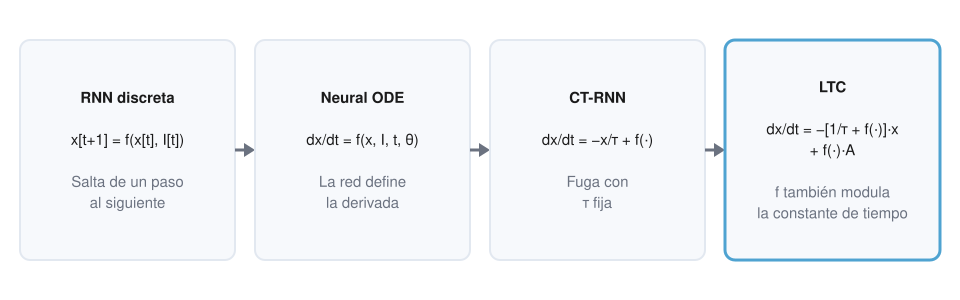
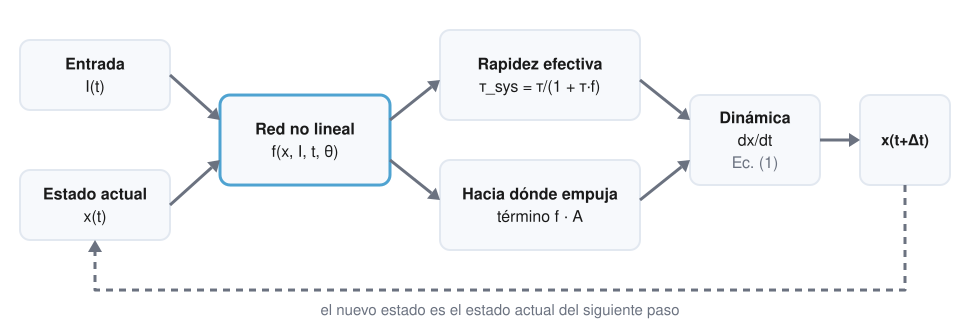
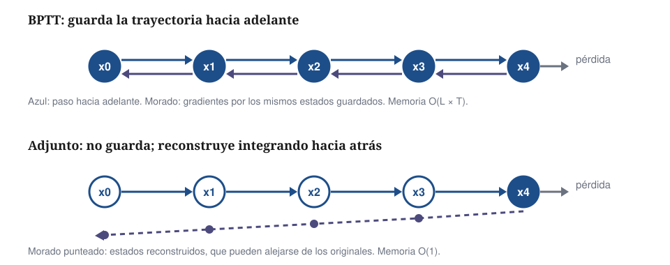
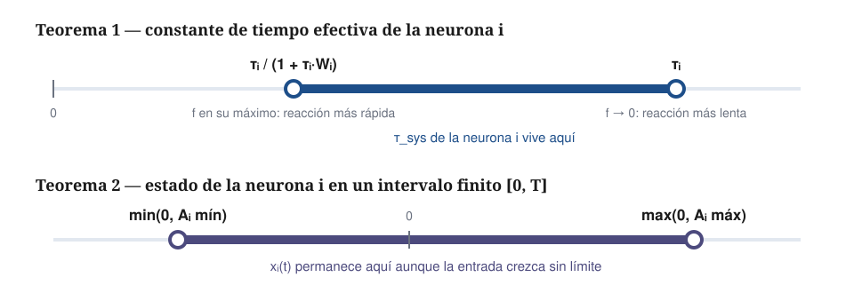
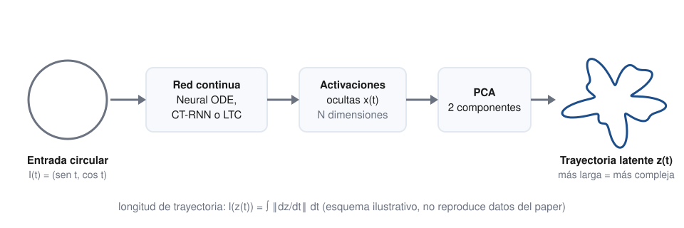
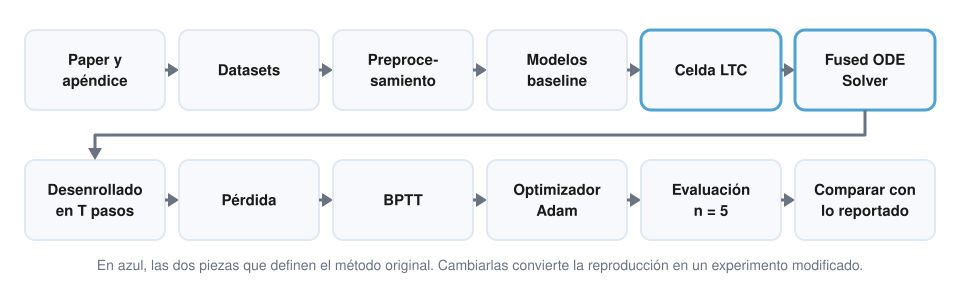

## Problema y contexto

:::: {.columns}
::: {.column width="55%"}
- Los datos secuenciales son observaciones de **sistemas dinámicos**
- Las Neural ODE definen la **derivada** del estado, no el estado
- Pregunta del paper: ¿cuán **expresivas** son y se puede mejorar su estructura?
:::
::: {.column width="45%"}
[**Propuesta** · una red continua cuya constante de tiempo varía con el estado y la entrada]{.lf-card}

[**Respaldo** · cotas teóricas + longitud de trayectoria + experimentos]{.lf-card .lf-card--ai}
:::
::::

## De RNN a modelos continuos

{fig-alt="RNN discreta, Neural ODE, CT-RNN y LTC con sus ecuaciones" fig-align="center"}

[Discreto: *¿cuál es el siguiente estado?* · Continuo: *¿a qué ritmo cambia ahora?*]{.lf-muted}

## Neural ODE y CT-RNN

:::: {.columns}
::: {.column width="50%"}
**Neural ODE**

$$\frac{d\mathbf{x}(t)}{dt} = f(\mathbf{x}(t), \mathbf{I}(t), t, \theta)$$

[La red **es** la derivada]{.lf-card}
:::
::: {.column width="50%"}
**CT-RNN**

$$\frac{d\mathbf{x}(t)}{dt} = -\frac{\mathbf{x}(t)}{\tau} + f(\cdot)$$

[Fuga con $\tau$ **fija**: grande → lento · pequeña → rápido]{.lf-card}
:::
::::

## Liquid Time-Constant: la idea

[Estado lineal con fuga: $\;d\mathbf{x}/dt = -\mathbf{x}/\tau + \mathbf{S}(t)$]{.lf-card}

[No linealidad como compuerta: $\;\mathbf{S}(t) = f(\mathbf{x}, \mathbf{I}, t, \theta)\,(A - \mathbf{x})$]{.lf-card}

[Inspiración **vaga** en la biología: membrana con fuga + sinapsis con saturación]{.lf-card .lf-card--limit}

<br>

**"Líquida"** = la escala temporal de cada neurona cambia mientras procesa la secuencia.

## La ecuación LTC

$$\frac{d\mathbf{x}(t)}{dt} = -\left[\frac{1}{\tau} + f(\mathbf{x}(t), \mathbf{I}(t), t, \theta)\right]\mathbf{x}(t) + f(\mathbf{x}(t), \mathbf{I}(t), t, \theta)\,A$$

[Ec. (1) del artículo]{.lf-muted}

| Símbolo | Significado |
|---|---|
| $\mathbf{x}(t)$, $\mathbf{I}(t)$ | Estado oculto y entrada |
| $\tau$ | Constante de tiempo base |
| $f$ | Red no lineal: aparece **dos veces** |
| $A$ | Valor hacia el que $f$ empuja al estado |

## $\tau_{sys}$ — intuición

:::: {.columns}
::: {.column width="62%"}
{fig-alt="La entrada y el estado alimentan f, que fija la rapidez efectiva y el destino"}
:::
::: {.column width="38%"}
$$\tau_{sys} = \frac{\tau}{1 + \tau f}$$

[$f$ grande → reacción **rápida**]{.lf-card}

[$f \to 0$ → vuelve a $\tau$]{.lf-card}

[Válido con $f \geq 0$]{.lf-card .lf-card--limit}
:::
::::

## Fused ODE Solver

:::: {.columns}
::: {.column width="45%"}
[**Explícito:** barato, inestable con pasos grandes]{.lf-card}

[**Implícito:** estable, exige resolver una ecuación]{.lf-card}

[**Fusionado:** $\mathbf{x}$ lineal en $t+\Delta t$; $f$ en $t$]{.lf-card .lf-card--ai}
:::
::: {.column width="55%"}
$$\mathbf{x}(t+\Delta t) = \frac{\mathbf{x}(t) + \Delta t\, f\, A}{1 + \Delta t\,(1/\tau + f)}$$

[Ec. (3): una fórmula cerrada por paso]{.lf-muted}

Coste: $O(L \times T)$
:::
::::

## Algorithm 1 — paper vs. implementación actual

:::: {.columns}
::: {.column width="42%"}
**Paper original**

[`FusedStep` + bucle `i = 1 … L`]{.lf-card .lf-card--paper}

[Experimentos: TensorFlow 1.14 · $L = 6$]{.lf-card .lf-card--paper}

[Misma matemática, software actual]{.lf-card .lf-card--today}

[Sigue la Ec. (3): **no** es la parametrización del repositorio oficial ni de `ncps`]{.lf-card .lf-card--limit .lf-small}
:::
::: {.column width="58%"}
**PyTorch 2.x**

```python
def fused_step(self, x, input_t):
    f_val = self.f(x, input_t)
    numerator = x + self.dt * f_val * self.A
    denominator = 1.0 + self.dt * (1.0 / self.tau + f_val)
    x_next = numerator / denominator
    return x_next

def forward(self, input_t, x):
    for _ in range(self.unfolds):
        x = self.fused_step(x, input_t)
    return x
```
:::
::::

## BPTT y diferenciación en modo inverso

:::: {.columns}
::: {.column width="58%"}
{fig-alt="BPTT guarda la trayectoria; el adjunto la reconstruye hacia atrás"}
:::
::: {.column width="42%"}
| | BPTT | Adjunto |
|---|---|---|
| Memoria | $O(L \times T)$ | $O(1)$ |
| Precisión hacia atrás | **Alta** | Baja |

[`loss.backward()` sobre un grafo desenrollado **es** BPTT]{.lf-card .lf-card--today}
:::
::::

## Estabilidad y dinámica acotada

{fig-alt="Intervalos de los Teoremas 1 y 2" fig-align="center"}

[Supuesto: $f$ sigmoidal en (0, 1). Acotado ≠ estabilidad asintótica ≠ gradientes estables.]{.lf-muted}

## Expresividad y longitud de trayectoria

:::: {.columns}
::: {.column width="58%"}
{fig-alt="Entrada circular, red continua, PCA y trayectoria latente"}

[Teorema 3: **existe** una LTC que aproxima la trayectoria; no compara arquitecturas]{.lf-card}
:::
::: {.column width="42%"}
**Profundidad computacional**

| Activación | N-ODE | CT-RNN | LTC |
|---|---|---|---|
| tanh | 0,56 | 4,13 | 9,19 |
| ReLU | 1,29 | 4,31 | 56,9 |
| Hard-tanh | 0,61 | 4,05 | 81,01 |

[Tabla 2 del paper · pesos aleatorios · indicador indirecto]{.lf-small .lf-muted}
:::
::::

## Metodología experimental

:::: {.columns}
::: {.column width="50%"}
| Elemento | Valor |
|---|---|
| Unidades ocultas | 32 |
| Minilote | 16 |
| Optimizador | Adam |
| BPTT | 32 pasos |
| Épocas | 200 |
| Solver | 6 pasos por entrada |
| Repeticiones | n = 5 |
:::
::: {.column width="50%"}
[**10 tareas:** 7 series de tiempo, 2 montajes de *Person activity*, Half-Cheetah]{.lf-card}

[**Baselines:** LSTM · CT-RNN · Neural ODE · CT-GRU]{.lf-card}

[Objetivo declarado: comparar expresividad, no batir récords]{.lf-card .lf-card--limit}
:::
::::

## Resultados

::: {.lf-tight}
| Dataset | Métrica | LSTM | CT-RNN | Neural ODE | CT-GRU | LTC |
|---|---|---|---|---|---|---|
| Gesture | exactitud ↑ | 64,57 % | 59,01 % | 46,97 % | 68,31 % | **69,55 %** |
| Occupancy | exactitud ↑ | 93,18 % | 94,54 % | 90,15 % | 91,44 % | **94,63 %** |
| Activity | exactitud ↑ | 95,85 % | 95,73 % | **97,26 %** | 96,16 % | 95,67 % |
| Seq. MNIST | exactitud ↑ | **98,41 %** | 96,73 % | 97,61 % | 98,27 % | 97,57 % |
| Traffic | error ↓ | 0,169 | 0,224 | 1,512 | 0,389 | **0,099** |
| Power | error ↓ | 0,628 | 0,742 | 1,254 | **0,586** | 0,642 |
| Ozone | F1 ↑ | 0,284 | 0,236 | 0,168 | 0,260 | **0,302** |
| Half-Cheetah | MSE ↓ | 2,500 | 2,838 | 3,805 | 3,014 | **2,308** |
:::

[Medias de n = 5 (Tablas 3 y 6), bajo esta configuración. LTC obtiene el mejor valor en 4 de 7 series de tiempo y **no** en las otras 3.]{.lf-muted}

## Reproducción actual

{fig-alt="Pipeline de reproducción en doce etapas" fig-align="center"}

[**A** misma matemática · **B** ingeniería · **C** experimento modificado (otro solver) · **D** modelo posterior (CfC, 2022: no es el Algorithm 1 actualizado)]{.lf-small .lf-muted}

## Limitaciones y conclusiones

:::: {.columns}
::: {.column width="50%"}
**Según los autores**

[Gradiente que se desvanece: no es la opción obvia para **largo plazo**]{.lf-card .lf-card--limit}

[Rendimiento muy ligado al **solver**]{.lf-card .lf-card--limit}

[Mayor coste de **tiempo y memoria**]{.lf-card .lf-card--limit}
:::
::: {.column width="50%"}
**Para llevarse**

- La misma $f$ fija el destino **y** la rapidez
- El solver fusionado da un paso estable en forma cerrada
- Mejor valor en 7 de 10 resultados, **no** en todos
- Reproducir ≠ modernizar ≠ extender
:::
::::

[Hasani R, Lechner M, Amini A, Rus D, Grosu R. *Liquid Time-constant Networks*. AAAI 2021;35(9):7657–7666. Diagramas originales basados en el artículo.]{.lf-source}
