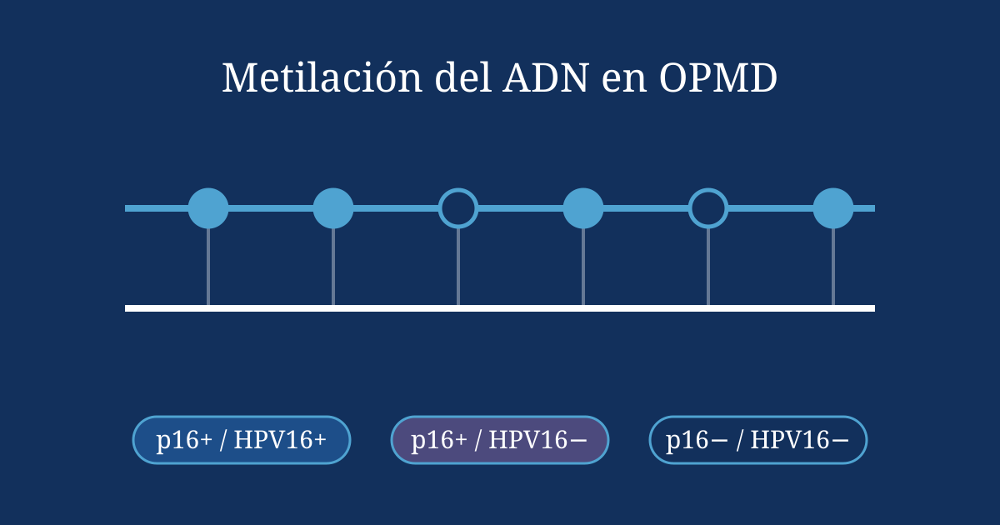
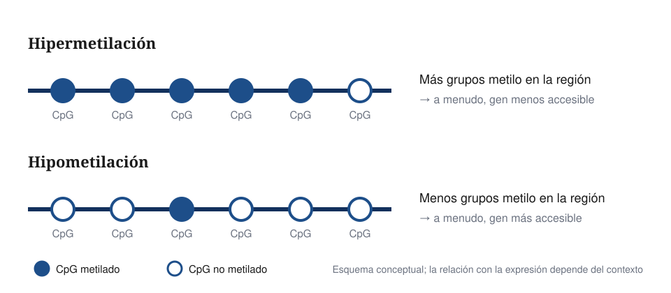
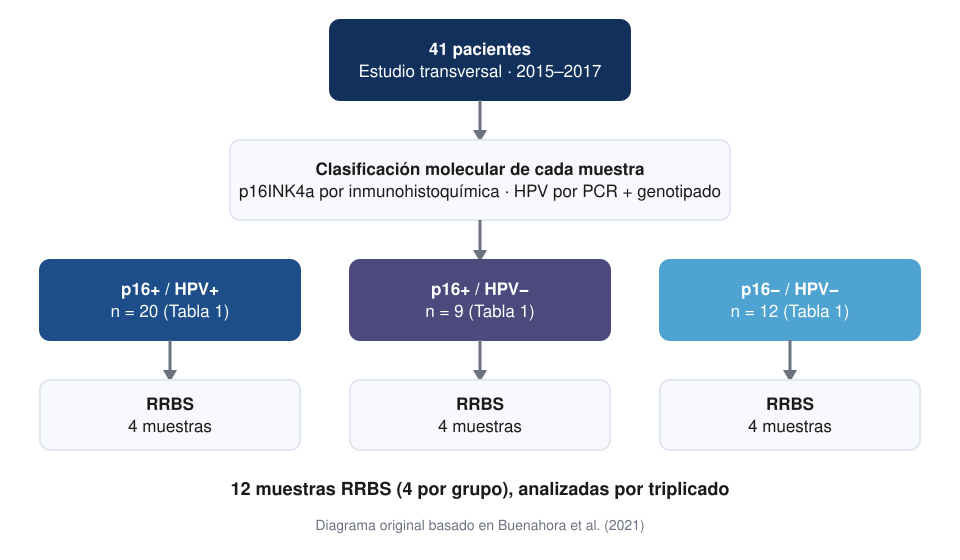
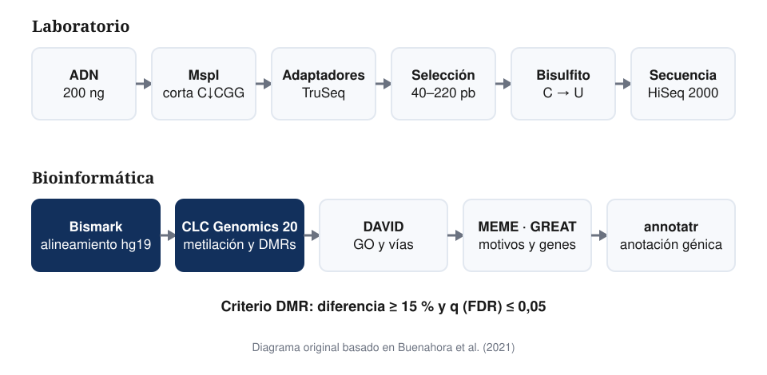
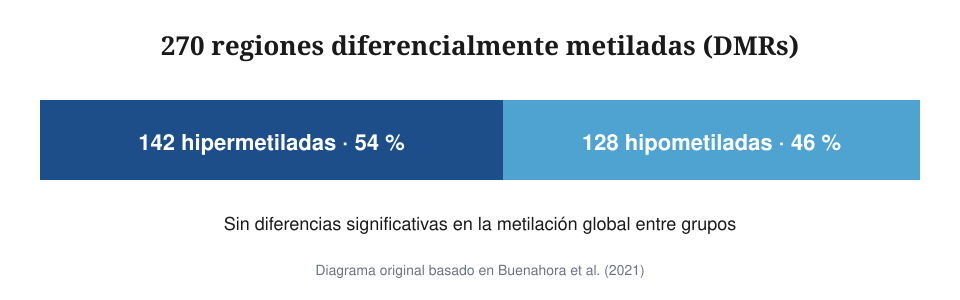
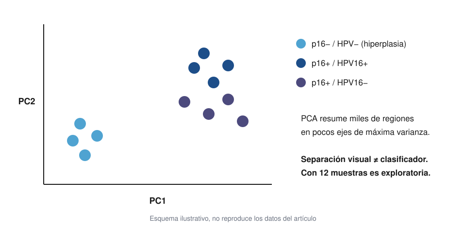
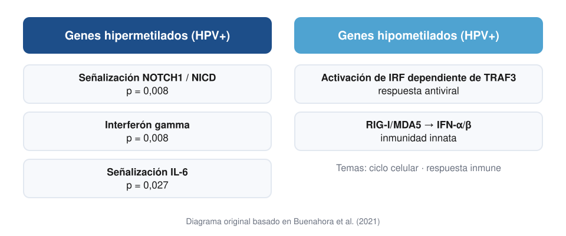

## ¿Por qué importa este problema?

:::: {.columns}
::: {.column width="55%"}
- Los **OPMD** no son cáncer, pero tienen **mayor riesgo** de transformación maligna
- Detectar cambios moleculares **tempranos** podría orientar futuros marcadores
- ¿Participan **HPV16** y **p16INK4a**?
:::
::: {.column width="45%"}
{fig-alt="Metilación del ADN en OPMD y tres grupos moleculares"}
:::
::::

## Conceptos: OPMD, HPV16, p16INK4a y metilación

:::: {.columns}
::: {.column width="50%"}
[**OPMD** · lesión oral de riesgo, con displasia]{.lf-card}

[**HPV16** · genotipo de alto riesgo]{.lf-card}

[**p16INK4a** · proteína del ciclo celular medida por IHC]{.lf-card}
:::
::: {.column width="50%"}
{fig-alt="Hipermetilación frente a hipometilación de sitios CpG"}
:::
::::

## Pregunta y objetivo

[¿Difieren los perfiles de **metilación del ADN** según el estado de **p16INK4a** y **HPV16** en OPMD?]{.lf-card}

 

**Objetivo:** evaluar una posible modulación epigenética mediada por HPV16–p16INK4a, con muestras p16−/HPV16− como control.

 

[Estudio epigenómico y bioinformático — **sin modelo predictivo de ML**]{.lf-card .lf-card--ai}

## Diseño del estudio

{fig-alt="Diseño: 41 pacientes, tres grupos y 12 muestras RRBS" fig-align="center"}

## Pacientes, muestras y grupos

:::: {.columns}
::: {.column width="50%"}
[41]{.lf-big}

**Cohorte clínica** · 2015–2017 · Universidad El Bosque, Bogotá

[Edad media 55,2 años · 63 % mujeres]{.lf-muted}
:::
::: {.column width="50%"}
[12]{.lf-big}

**Muestras RRBS** · por triplicado

- p16+ / HPV16+ · 4
- p16+ / HPV16− · 4
- p16− / HPV16− · 4 (hiperplasia)
:::
::::

## ¿Qué es RRBS?

:::: {.columns}
::: {.column width="50%"}
[**MspI** corta en C↓CGG → regiones ricas en CpG]{.lf-card}

[**Bisulfito:** C no metilada → T · C metilada → C]{.lf-card}

[Resolución de **una base** en una fracción del genoma]{.lf-card}
:::
::: {.column width="50%"}
| Paso | Valor |
|---|---|
| ADN | 200 ng |
| Fragmentos | 40–220 pb |
| PCR | 18 ciclos |
| Secuenciador | HiSeq 2000 |
| Lectura | 76 ciclos |
:::
::::

## Pipeline experimental y bioinformático

{fig-alt="Pipeline RRBS de laboratorio y bioinformática" fig-align="center"}

## Software y métodos estadísticos

:::: {.columns}
::: {.column width="50%"}
| Herramienta | Uso |
|---|---|
| Bismark | Alineamiento hg19 |
| CLC Genomics 20 | Metilación y DMRs |
| DAVID | GO y vías |
| MEME · GREAT | Motivos y genes |
| annotatr | Anotación |
| STATA 12 | Estadística |
:::
::: {.column width="50%"}
- χ² / Fisher · variables clínicas
- ANOVA · α = 0,05
- DMR: Δ ≥ 15 % y **FDR q ≤ 0,05**
- PCA y clustering jerárquico
:::
::::

## Resultados principales — DMRs

{fig-alt="270 DMRs: 142 hipermetiladas y 128 hipometiladas" fig-align="center"}

[43 % de las DMRs en promotores · sin diferencia en la metilación **global**]{.lf-muted}

## PCA y perfiles de metilación

:::: {.columns}
::: {.column width="60%"}
{fig-alt="Esquema ilustrativo de PCA"}
:::
::: {.column width="40%"}
[Hiperplasias **separadas** de las displasias]{.lf-card}

[PCA ≠ clasificador · n = 12 → exploratorio]{.lf-card .lf-card--limit}
:::
::::

## Genes y vías biológicas

{fig-alt="Vías asociadas a genes hiper e hipometilados en muestras HPV+" fig-align="center"}

## Fortalezas

[Separa **p16+** de **HPV16+** en lugar de asumirlos equivalentes]{.lf-card}

[RRBS con buen control técnico: conversión 98–99 % · réplicas r = 0,87–0,89]{.lf-card}

[Criterios explícitos de DMR con corrección **FDR**]{.lf-card}

[Interpretación multinivel: vías, motivos, anotación y redes]{.lf-card}

## Limitaciones y oportunidades con IA

:::: {.columns}
::: {.column width="50%"}
[n = 12 · control = hiperplasia]{.lf-card .lf-card--limit}

[Transversal: asociación ≠ causalidad]{.lf-card .lf-card--limit}

[DMR ≠ biomarcador validado]{.lf-card .lf-card--limit}
:::
::: {.column width="50%"}
[p ≫ n → selección **dentro** de la CV]{.lf-card .lf-card--ai}

[Modelos regularizados · permutación · estabilidad]{.lf-card .lf-card--ai}

[12 muestras **no** justifican Deep Learning]{.lf-card .lf-card--ai}
:::
::::

## Conclusiones y preguntas abiertas

- **270 DMRs** distinguen perfiles de metilación entre grupos p16/HPV16
- HPV en OPMD se asocia a genes de **respuesta inmune** y **ciclo celular**

 

**Preguntas abiertas**

- ¿Se replican estas DMRs en cohortes más grandes e independientes?
- ¿Predicen **progresión** a carcinoma con seguimiento longitudinal?

[Buenahora MR, Lafaurie GI, Perdomo SJ. *Epigenetics*. 2021;16(9):1016–1030. Diagramas originales basados en el artículo.]{.lf-source}
