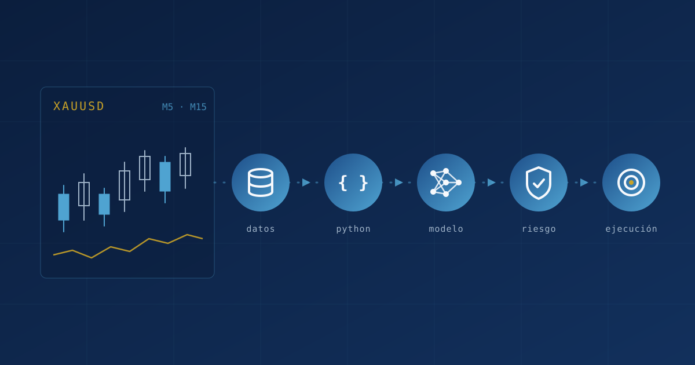

:::: {.trading-article}

::: {.trading-cover}
{fig-alt="Ilustración conceptual de velas de XAUUSD que fluyen hacia nodos de datos, Python, Machine Learning, gestión de riesgo y ejecución"}
:::

Durante los últimos meses he estado desarrollando un proyecto que combina varias áreas que me interesan especialmente: Python, análisis de datos, Machine Learning, automatización y mercados financieros. La idea comenzó con una pregunta relativamente sencilla:

> ¿Es posible construir un sistema que analice XAUUSD, aprenda de los datos históricos y ayude a identificar oportunidades de compra o venta de una manera reproducible y medible?

Con el tiempo, esa pregunta se volvió mucho más amplia. Ya no se trata simplemente de entrenar un modelo que diga `BUY` o `SELL`. La intención es construir, poco a poco, una arquitectura capaz de recibir información del mercado, procesarla, generar variables, ejecutar modelos, combinar señales, aplicar filtros, controlar el riesgo, registrar cada decisión y evaluar los resultados obtenidos. Detrás de todo el proyecto hay un principio que se ha vuelto central:

> Generar una señal no significa automáticamente ejecutar una operación.

Este artículo describe qué está construido hoy, qué se está evaluando y hacia dónde quiero llevar el proyecto. Intentaré separar con cuidado las tres cosas, porque en este tipo de proyectos es fácil confundir lo que existe con lo que se imagina.

## El activo: XAUUSD

XAUUSD es el precio del oro expresado en dólares estadounidenses: cuántos dólares cuesta una onza de oro en cada momento. Actualmente es el principal laboratorio experimental del proyecto.

El oro puede presentar movimientos rápidos, niveles de volatilidad muy distintos de un día a otro, cambios de régimen y comportamientos que dependen del contexto del mercado. Nada de eso lo hace un activo "fácil" ni inherentemente rentable; de hecho, lo hace difícil. Pero precisamente por esas características resulta interesante desde la perspectiva de las series temporales y de los sistemas cuantitativos: obliga a pensar en cómo un sistema debe comportarse cuando las condiciones cambian, y no solo cuando todo sale como se espera.

Por eso no quiero una estrategia basada en una regla del tipo "si ocurre X, comprar". La intención es que el sistema observe varios niveles de información antes de aceptar una operación.

## Mirar el mercado desde diferentes escalas

Un mismo mercado puede verse muy distinto según la escala temporal con la que se observe. En trading, esa escala se llama *timeframe* o temporalidad: en un gráfico de M5 cada vela resume cinco minutos de precio; en uno de M15, quince minutos. Lo que parece una subida fuerte en M5 puede ser solo un pequeño rebote dentro de una caída más amplia en M15.

Hoy el proyecto trabaja principalmente con dos temporalidades:

- **M5**, la temporalidad principal, sobre la cual se construyen las variables, se entrenan los modelos y se analizan las posibles entradas.
- **M15**, como capa adicional de contexto y confirmación, para evitar que una señal de corto plazo se acepte sin mirar lo que ocurre un poco más arriba.

La idea de fondo es que una señal generada en una escala pequeña no debería aceptarse sin considerar el contexto de escalas superiores. En esa línea, un siguiente paso natural sería incorporar temporalidades más altas, como H1 (una hora) o H4 (cuatro horas), como capas adicionales de contexto. El módulo que descarga datos desde MetaTrader 5 ya admite esos marcos, pero eso no significa que estén integrados en los modelos actuales: por ahora forman parte de la hoja de ruta.

Roadmap

H1 / H4<small>contexto superior (aún no integrado)</small>

↓

Actual

M15<small>contexto / confirmación</small>

↓

M5<small>análisis de entrada</small>

↓

Features

↓

Machine Learning

Línea continua: lo que existe hoy. Línea discontinua: evolución prevista.

### Timeframe no es lo mismo que horizonte de predicción

Además de las temporalidades del mercado, el proyecto experimenta con distintos **horizontes de predicción**. Un horizonte responde a otra pregunta: no "¿con qué escala miro el mercado?", sino "¿qué tan lejos en el futuro intento anticipar lo que ocurre?".

Dentro del código aparecen modelos con nombres como `train_m5_h1`, `train_m5_h2` y `train_m5_h3`. Aunque la notación se parece, aquí `h1`, `h2` y `h3` **no** se refieren a los timeframes H1, H2 o H3 de MetaTrader (una, dos o tres horas). Son variantes del modelo construidas sobre M5, cada una con un horizonte distinto: en la configuración actual, 3, 6 y 9 velas de M5 hacia adelante. Los tres modelos miran el mercado en M5; lo que cambia es la distancia a la que intentan anticipar el movimiento.

## De precios a variables

Un modelo de Machine Learning no aprende gran cosa si solo recibe el precio actual. Primero hay que transformar la serie temporal en **características** (*features*): números que resumen aspectos del comportamiento reciente del mercado. Dependiendo de la versión del pipeline, esas variables describen cosas como:

- el comportamiento reciente del precio y sus retornos;
- la tendencia;
- la volatilidad;
- el momentum;
- la estructura de las velas (cuerpos, mechas, rangos);
- el contexto temporal;
- relaciones con observaciones anteriores e indicadores derivados.

En la versión actual del experimento, las variantes del modelo utilizan entre aproximadamente 60 y 110 variables, aunque este conjunto continúa evolucionando y no debe entenderse como una arquitectura definitiva.

Uno de los problemas más importantes, y menos visibles, está en otra parte: las variables que el modelo ve durante el entrenamiento tienen que ser exactamente las mismas, calculadas de la misma forma y en el mismo orden, que las que recibe cuando se usa en tiempo real. Esto se conoce como **consistencia entre entrenamiento e inferencia** (*train-serving consistency*). Si durante el entrenamiento una media móvil se calculó con veinte velas y en producción se calcula con diecinueve, o si una columna cambia de posición, el modelo seguirá produciendo números con total tranquilidad, pero esos números ya no significarán lo mismo. Por eso el proyecto guarda la lista exacta de columnas usada por cada modelo y, antes de predecir, reordena las variables para que coincidan con ella. Aun así, este es un punto que sigue requiriendo vigilancia: si una variable falta y se rellena con un valor por defecto, el modelo no lo nota, y ese tipo de fallos silenciosos es justamente lo que una arquitectura más madura debería detectar.

## Machine Learning: más que predecir el siguiente precio

No planteo el problema como "¿cuál será exactamente el precio del oro dentro de unos minutos?". Adivinar un número exacto es tan difícil como poco útil. Resulta más razonable tratarlo como un problema de **clasificación de escenarios**:

### BUY

Existe evidencia compatible con un escenario potencial de compra.

### SELL

Existe evidencia compatible con un escenario potencial de venta.

### NO_TRADE

Las condiciones actuales no justifican una entrada.

Para esto se utilizan modelos supervisados, es decir, modelos que aprenden a partir de ejemplos históricos ya etiquetados. Hasta ahora he trabajado principalmente con **XGBoost**, un algoritmo basado en árboles de decisión que suele funcionar bien con datos tabulares. No lo considero el modelo definitivo: una de las metas es que la arquitectura permita comparar distintos modelos bajo las mismas condiciones, y que la elección dependa de la evidencia y no de la costumbre.

Tampoco voy a presentar aquí métricas como accuracy o precision. Todavía no tengo resultados consolidados que valga la pena publicar, y en este contexto una métrica de clasificación, por sí sola, dice muy poco sobre si una estrategia funciona.

## El modelo no toma la decisión final

Este es probablemente el punto más importante del proyecto. Una predicción de Machine Learning es solo una pieza dentro de una arquitectura más amplia. El flujo, de manera simplificada, es este:

MetaTrader 5

↓

Datos

↓

Feature Engineering

↓

Machine Learning

↓

Fusión de señales

↓

Reglas de entrada

↓

Gestión de riesgo

↓

Guardian

↓

Decisión

↓

Registro y evaluación

El modelo ocupa una sola capa. Después de él vienen varias capas que pueden bloquear la operación.

Cada capa posterior al modelo tiene la posibilidad de decir "no". La fusión combina las probabilidades de las variantes de distinto horizonte (hoy, `h1` y `h3`) con el contexto de M5 y M15; las reglas de entrada deciden si el momento es adecuado; la gestión de riesgo define niveles de salida y tamaño de la posición; Guardian añade una última revisión. Y todo, incluidas las decisiones de no operar, queda registrado para poder evaluarlo después.

## De una predicción a una decisión

Además de la clasificación del modelo, el sistema maneja estados operativos que describen qué hacer con esa clasificación:

NO_TRADE
No existen condiciones suficientemente sólidas para justificar una operación.

WAIT_PULLBACK
Puede existir una dirección interesante, pero el precio actual no es necesariamente un buen punto de entrada. El sistema puede esperar un retroceso, una mejor estructura o mejores condiciones.

EXECUTE
Las distintas capas han aprobado las condiciones necesarias para considerar la ejecución.

> Llegar a EXECUTE debe ser deliberadamente más difícil que generar una simple predicción del modelo.

Esa asimetría es intencional. Un modelo puede producir una predicción en cada vela; una operación debería requerir mucho más.

## Guardian: buscar razones para no operar

Guardian es una capa adicional de protección dentro del proyecto. Su filosofía se resume así:

> El objetivo de Guardian no es buscar razones para operar, sino identificar razones para no hacerlo cuando las condiciones no son suficientemente sólidas.

En la versión actual, Guardian aplica periodos de espera entre señales (*cooldown*), evita que una misma señal se repita una y otra vez, revisa si hay conflicto entre lo que dice el modelo y el contexto del mercado, y deja registrado cada bloqueo junto con su motivo.

Lo importante es la separación que introduce: una cosa es la **predicción del modelo** y otra la **decisión operativa**. El modelo puede estar muy seguro de una dirección y aun así Guardian puede bloquear la operación porque el contexto no acompaña. Guardian no garantiza evitar pérdidas ni es infalible; es una capa más de control, y su propio comportamiento también tiene que evaluarse.

## La dirección puede ser correcta y la entrada incorrecta

Incluso cuando el modelo identifica correctamente la dirección del mercado, una mala entrada puede convertir esa lectura en una operación perdedora. Si el precio ya se movió mucho en la dirección esperada, entrar tarde puede significar comprar justo antes de un retroceso que alcance el nivel de salida.

> Dirección correcta ≠ entrada correcta.

> Modelo correcto ≠ operación rentable automáticamente.

Una de las razones para experimentar con `WAIT_PULLBACK` es precisamente separar dos preguntas distintas: la **identificación de la oportunidad** ("¿hay una dirección interesante?") y el **momento de entrada** ("¿es este el punto adecuado para entrar?"). Si ambas preguntas se responden al mismo tiempo, es fácil confundirlas.

## Trabajar únicamente con información disponible

Uno de los errores más comunes y más peligrosos en proyectos de este tipo es usar, sin darse cuenta, información del futuro. Se conoce como **fuga de datos** (*data leakage*) o **sesgo de anticipación** (*look-ahead bias*): el modelo parece funcionar muy bien en los datos históricos porque, de alguna forma, estaba viendo información que en la realidad todavía no habría existido.

La regla es simple de enunciar y difícil de cumplir: cuando una señal se genera en un instante `t`, solo debería usar información disponible hasta ese instante. En la práctica, eso implica varias cosas:

- **Velas cerradas.** Una vela que todavía se está formando cambia hasta el último segundo. El sistema trabaja con la última vela ya cerrada, no con la vela en curso.
- **Orden temporal.** Los datos se entrenan y evalúan respetando el orden cronológico, sin mezclar aleatoriamente el pasado con el futuro.
- **Tiempo del servidor.** MetaTrader 5 reporta el tiempo según la zona horaria del broker, con cambios de horario de verano incluidos. Alinear correctamente esos tiempos es parte del problema, no un detalle menor.

## Validación temporal

En series temporales no basta con separar los datos al azar. La evaluación tiene que parecerse a la forma en que el sistema se usaría realmente: aprendiendo del pasado y enfrentándose a un futuro que no conoce.

### Backtesting

Simular cómo se habría comportado una estrategia utilizando datos históricos, aplicando las mismas reglas que se usarían en tiempo real.

### Out-of-sample

Evaluar el sistema en periodos que no se usaron para entrenar. Es la forma más directa de comprobar si el modelo aprendió algo generalizable o si simplemente memorizó el pasado.

### Walk-forward validation

Entrenar con un periodo pasado, evaluar en el periodo siguiente y avanzar progresivamente en el tiempo, repitiendo el proceso. Imita la forma en que el sistema tendría que reentrenarse y operar en la práctica. Hoy el proyecto utiliza separaciones temporales estrictas entre entrenamiento y prueba; aplicar walk-forward de manera sistemática es uno de los siguientes pasos.

## MetaTrader 5 dentro de la arquitectura

MetaTrader 5 funciona actualmente como el puente entre el mercado y el pipeline desarrollado en Python. A través de la [integración oficial de MetaTrader 5 para Python](https://www.mql5.com/en/docs/python_metatrader5) es posible consultar información de [símbolos](https://www.mql5.com/en/docs/python_metatrader5/mt5symbolinfo_py), [precios y velas](https://www.mql5.com/en/docs/python_metatrader5/mt5copyratesfrompos_py), [posiciones](https://www.mql5.com/en/docs/python_metatrader5/mt5positionsget_py), [órdenes](https://www.mql5.com/en/docs/python_metatrader5/mt5ordersget_py) e [información de la cuenta](https://www.mql5.com/en/docs/python_metatrader5/mt5accountinfo_py).

En este proyecto, MetaTrader 5 aporta sobre todo los datos de mercado y la conexión con el broker. El análisis, las variables, los modelos, las reglas y los registros viven en Python. Esa separación es deliberada: permite que el núcleo analítico no dependa por completo de una plataforma específica.

Este artículo no pretende ser un tutorial para enviar órdenes a una cuenta real. Su objetivo es explicar la arquitectura.

## ¿El sistema ya opera automáticamente?

**No.**

La prioridad actual está en la validación, la evaluación, la trazabilidad, el paper trading, el análisis de errores, la consistencia temporal, la gestión de riesgo y la calidad de las señales.

Antes de automatizar por completo la ejecución, hay muchas preguntas que responder con evidencia: el desempeño fuera de muestra, la estabilidad a lo largo del tiempo, el *drawdown* (la caída máxima desde un pico), la *expectancy* (lo que se espera ganar o perder en promedio por operación), el *profit factor*, el efecto del spread, del slippage y de los demás costos de ejecución, el comportamiento en distintos regímenes de mercado, la estabilidad de los modelos, la calidad de los filtros, la exposición y el riesgo total. Todavía no tengo resultados consolidados para esas métricas, y no voy a presentarlos hasta tenerlos.

## Paper trading

El **paper trading** es una etapa intermedia entre el backtesting y la ejecución con capital real. El sistema recibe datos actuales del mercado, toma sus decisiones y "opera" en una simulación, sin comprometer capital de la misma forma que una cuenta real. Permite observar cómo se comporta todo el pipeline en condiciones actuales, no en datos que ya se conocen.

Sin embargo, no reproduce perfectamente la ejecución real. En la versión actual, por ejemplo, la simulación asume de forma explícita spread, slippage y comisiones iguales a cero; es una simplificación optimista y documentada que habrá que revisar. El paper trading sirve para detectar errores y entender el comportamiento del sistema, no para demostrar que sea rentable.

## Hacia un sistema de trading de nivel institucional

El objetivo final de este proyecto va mucho más allá de construir un bot que genere señales de compra y venta en MetaTrader 5.

La visión es desarrollar progresivamente una **arquitectura de trading cuantitativo con estándares cercanos a los utilizados en entornos institucionales**, donde las decisiones no dependan de una predicción aislada, sino de un sistema completo de **datos + modelos + estrategia + riesgo + ejecución + monitoreo + auditoría**.

Hoy, MetaTrader 5 es la plataforma experimental y de conexión con el mercado, y Python es el núcleo analítico.

> MetaTrader 5 es actualmente el punto de partida experimental, no necesariamente el destino final de la arquitectura.

Una arquitectura de ese nivel puede requerir, de forma progresiva, componentes como estos:

<h4>Datos</h4>
<ul>
<li>adquisición estructurada de datos</li>
<li>almacenamiento histórico</li>
<li>control de calidad y datos faltantes</li>
<li>sincronización temporal</li>
<li>versionamiento de datasets</li>
</ul>

<h4>Feature Engineering</h4>
<ul>
<li>generación reproducible de features</li>
<li>feature store o mecanismo equivalente</li>
<li>versionamiento de variables</li>
<li>control de transformaciones</li>
<li>consistencia entre entrenamiento e inferencia</li>
</ul>

<h4>Machine Learning</h4>
<ul>
<li>entrenamiento reproducible</li>
<li>comparación de modelos y calibración</li>
<li>validación temporal</li>
<li>versionamiento de modelos</li>
<li>detección de <em>model drift</em> y monitoreo</li>
</ul>

<h4>Estrategia</h4>
<ul>
<li>generación y combinación de señales</li>
<li>detección de regímenes de mercado</li>
<li>reglas operativas y filtros de entrada</li>
<li><code>WAIT_PULLBACK</code></li>
<li>Guardian</li>
</ul>

<h4>Riesgo</h4>
<ul>
<li>position sizing</li>
<li>límites de pérdida y límites operativos</li>
<li>control de exposición</li>
<li>riesgo por estrategia y riesgo agregado</li>
<li>gestión dinámica del riesgo</li>
</ul>

<h4>Ejecución</h4>
<ul>
<li>motores de ejecución y administración de órdenes</li>
<li>spread, slippage y costos de transacción</li>
<li>manejo de errores y reconexiones</li>
<li>latencia</li>
<li>control de duplicación de órdenes</li>
</ul>

<h4>Evaluación</h4>
<ul>
<li>backtesting y walk-forward validation</li>
<li>paper trading</li>
<li>evaluación fuera de muestra</li>
<li>análisis de estabilidad</li>
<li>atribución de resultados</li>
</ul>

<h4>Monitoreo</h4>
<ul>
<li>métricas del sistema, de modelos y de estrategia</li>
<li>alertas</li>
<li>degradación de desempeño</li>
<li>detección de anomalías</li>
</ul>

<h4>Gobernanza y auditoría</h4>
<ul>
<li>trazabilidad y registro de decisiones</li>
<li>versionamiento y reproducibilidad</li>
<li>auditoría y control de cambios</li>
<li>gobernanza de modelos</li>
</ul>

::: {.trading-note}
Estos componentes constituyen una **hoja de ruta**. Algunos existen hoy en una versión inicial (el registro de decisiones, Guardian, `WAIT_PULLBACK`, el paper trading o la validación de datos), pero la mayoría todavía no está implementada, y ninguno ha alcanzado un nivel institucional.
:::

## Qué significaría realmente acercarse al trading institucional

Trading institucional no significa simplemente usar Machine Learning, acumular muchos indicadores, automatizar órdenes o ejecutar un Expert Advisor. Todo eso puede hacerse en una tarde y, aun así, estar muy lejos de un sistema profesional.

Lo que distingue a un sistema profesional es la infraestructura que rodea a los modelos: calidad de datos, reproducibilidad, una gestión de riesgo independiente del modelo, control de la exposición, monitoreo continuo, gobernanza, trazabilidad, una ejecución que tenga en cuenta costos reales, un manejo explícito de los fallos, auditoría y una gestión del capital coherente con todo lo anterior. En ese marco, el modelo es un componente importante, pero solo uno de muchos.

El proyecto todavía no cumple esos requisitos. Tenerlos presentes desde ahora sirve para algo concreto: tomar hoy decisiones de diseño que no haya que deshacer mañana.

Datos · capa transversal

Señales

↓

Modelos

↓

Estrategia

↓

Riesgo

↓

Ejecución

↓

Monitoreo

↓

Sistema cuantitativo

Experimento<small>etapa actual</small>

Sistema<small>roadmap</small>

Infraestructura cuantitativa<small>visión de largo plazo</small>

El proyecto está hoy en la primera etapa.

## Más ingeniería que predicción

Al comenzar un proyecto de este tipo, parece que el problema principal es encontrar el mejor algoritmo. Con el tiempo se descubre que gran parte del trabajo está en otra parte: en los datos, en la sincronización temporal, en el feature engineering, en la validación, en el riesgo, en la ejecución, en la trazabilidad y en el monitoreo. El modelo es la parte más visible, pero no necesariamente la más difícil.

> Un modelo de Machine Learning no es una estrategia de trading completa.

> Una estrategia tampoco es todavía una infraestructura de trading institucional.

## La siguiente etapa

Más que promesas, estos son los pasos que tengo previstos como hoja de ruta:

1. consolidar el paper trading;
2. mejorar la evaluación temporal;
3. analizar el comportamiento de `WAIT_PULLBACK`;
4. evaluar el efecto de Guardian;
5. fortalecer el backtesting;
6. aplicar walk-forward validation de forma sistemática;
7. medir el desempeño ajustado por riesgo;
8. comparar distintos modelos;
9. evaluar el comportamiento en diferentes regímenes de mercado;
10. fortalecer la gestión de riesgo;
11. estudiar mecanismos de ejecución más robustos;
12. mejorar la trazabilidad y el monitoreo;
13. avanzar progresivamente hacia una arquitectura más cercana a los sistemas cuantitativos profesionales.

## Un laboratorio de Machine Learning aplicado

Más allá del mercado, este proyecto se ha convertido en un laboratorio personal para aprender y aplicar Machine Learning, series temporales, clasificación, ingeniería de características, validación temporal, automatización, sistemas de decisión, gestión de riesgo, monitoreo de modelos, arquitectura de software y sistemas cuantitativos. Muchas de las lecciones, como la disciplina con el tiempo, la separación entre predicción y decisión o la obsesión por la trazabilidad, se trasladan directamente a otros problemas de datos.

El objetivo nunca fue simplemente "crear un robot que compre y venda oro". La pregunta central ha evolucionado hacia algo más amplio:

> ¿Cómo evolucionar desde un experimento de Machine Learning conectado a MetaTrader 5 hasta una arquitectura de trading cuantitativo robusta, auditable y preparada para operar con estándares institucionales?

Esa es precisamente la pregunta que quiero seguir explorando a medida que evoluciona este proyecto.

::: {.trading-disclaimer}
*Este proyecto tiene fines educativos, experimentales y de investigación. No constituye asesoría financiera ni una recomendación de inversión. Los mercados financieros implican riesgo y los resultados históricos o experimentales no garantizan resultados futuros.*
:::

::::
